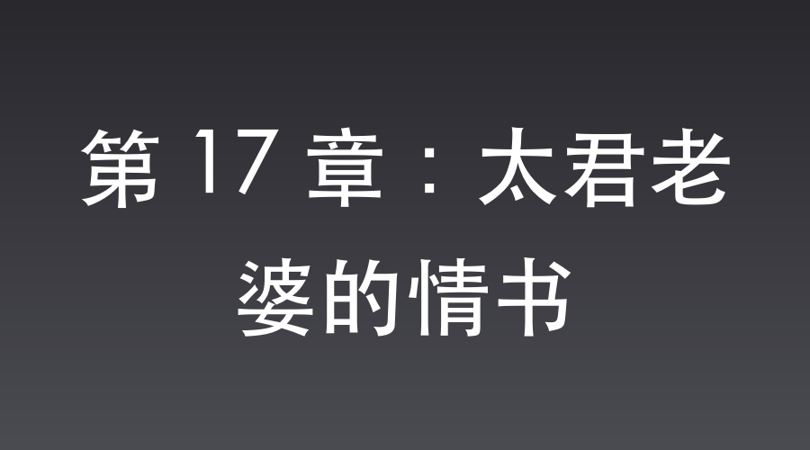

# 第 17 章：太君老婆的情书

次日，平安县城，特高课司令部。

武田少佐的办公室大门紧闭。

经历了昨天的风波，武田正将怒火发泄在案头的文件上。

桌上摊开着万家镇伪军骑兵营的收编换防计划，一旁还压着明日视察日军战俘营的行程表。

一墙之隔的司令部后院，却透着截然不同的气息。

武田太太惠子坐在梳妆台前。

她的指尖正轻轻摩挲着一个不起眼的圆形小铁盒。

铁盒冰凉，但一打开，那股淡淡的玫瑰香气便丝丝缕缕地钻进鼻腔。

昨夜武田回到房间后依然铁青着脸，摔门砸床，粗暴得像一头暴躁的野猪。

惠子闭着眼睛，脑海里浮现出的，却是那个中国翻译官微微侧过身，任由刀锋划过衣领，温柔地将铁盒放在茶盘边缘的画面。

那个在满洲冰冷寒风中递来温存的挺拔身影，成了她唯一的慰藉。

她拉开抽屉，取出一张粉色的信纸。

笔尖在纸上沙沙作响，写下的全是对丈夫的幽怨，以及对沈飞那份温柔的倾慕。

写完后，惠子将信纸折叠。

直接递送太过惹眼，她站起身，悄声走到武田的书房门外。

确认武田不在里面后，她溜进去，随手从书桌边缘的废纸篓旁抓起一个不起眼的牛皮纸文件袋，将情书塞了进去。

“来人。”

惠子走出书房，对着走廊的卫兵吩咐，“去叫沈翻译官，我要去正荣街买些绸缎，让他来带路。”

几分钟后，沈飞跟着惠子来到了司令部后院一处僻静的连廊拐角。

“惠子太太，您想买什么花色的绸缎？”沈飞微微欠身，金丝眼镜后的目光温润如水。

惠子不敢看他的眼睛。她涨红了脸，一把将那个牛皮纸文件袋塞进沈飞怀里。

“沈桑，这里面……有我想对你说的话。请务必看看。”

说完，她拽紧了和服的下摆，转身碎步跑开了。

沈飞抱着文件袋，嘴角勾起一抹掩饰不住的笑意。

他四下看了一眼，迅速溜进旁边一间堆放拖把的杂物间。

拉开文件袋的绕线，一张粉色的信纸滑了出来。

上面密密麻麻的日文，字字句句都透着一个深闺怨妇的春心荡漾。

就在沈飞读完信上最后一个字的瞬间，脑海深处传来了冰冷的机械提示音：

【盲盒系统检测到异国女性的诚挚表白，恭喜宿主，抽取资格已激活。】

【盲盒已自动开启。】

【恭喜宿主，获得：工业级强效巴豆提取液一瓶，特种高级润滑油一桶。】

沈飞看着系统空间里静静躺着的这两样东西，眼皮不受控制地狂跳。

巴豆提取液？高级润滑油？

这坑爹系统，给的东西怎么一次比一次下三滥？

“吱呀——”

杂物间的门被推开了一条缝。

沈老三一瘸一拐地挤了进来。

他刚才见惠子太太满脸通红地跑开，又见沈飞鬼鬼祟祟地钻进杂物间，立刻跟了过来。

“飞子，你躲这儿干啥呢？”

沈老三凑上前，一眼就看到了沈飞凭空“变”出来的那一大桶粘稠的润滑油和一小瓶褐色药水。

沈老三看不懂日文情书，但他认识油和药。

他的绿豆眼瞬间瞪得溜圆，倒抽了一口凉气。

“表、表弟……”沈老三吓得双腿打颤，指着那桶润滑油，“太君的娘们也太狂野了吧！她给你这桶油……我能理解是干啥用的，但她给你这瓶药水干啥？怕你干活没力气，给你喝的十全大补汤？”

沈飞黑着脸，抬起一脚踹在沈老三没受伤的大腿上。

“放屁！这是老子用来让人拉裤子、滑断腿的战略武器！你个满脑子下三滥的狗东西！”

沈老三捂着大腿，委屈地靠在墙上嘟囔：“泡太君老婆还带自带道具的……到底咱俩谁下三滥啊……”

沈飞懒得理他。

他转过头，正准备把那封情书塞回牛皮纸袋里。

就在手指探进袋子底部的瞬间，他触碰到了几页硬质的纸张。

惠子为了掩人耳目，是随手从武田书房里抓的袋子。

沈飞将那几页硬纸抽了出来。

只扫了一眼，他的目光便凝固了。

最上面的一页，赫然印着绝密级别的日文抬头：

“大日本皇军驻晋第一军：万家镇伪军第八混成骑兵营布防及换防时间表。”

在布防图下面，还夹着一张薄薄的公文，那是明天武田少佐视察青山战俘营的行程安排。

沈飞死死盯着这两份绝密文件，心潮起伏。

他想起了在苍云岭的废墟和死人堆里，那个惨死的女护士。

为了送出一份火炮坐标，她流尽了最后一滴血，那件破烂的血衣在风中紧紧贴着冰冷的身体。

在这个时代，那些在暗线中摸爬滚打的同志，哪一个不是九死一生，粉身碎骨才能换来一张情报？

而现在，自己仅仅是借着几句关西腔的调笑，送了一盒随手熬制的猪油玫瑰霜。

一份能改变晋西北局部战局的图纸，还有一份能决定战俘营生死的日程，就这样被武田少佐的太太，用粉色情书包裹着，荒谬地塞进了他的怀里。

这种强烈的对比，荒诞得让人想笑。

不过，青山战俘营里关着魏大勇和上百个战俘，那里由鬼子的特工队把守，强攻只会白白送命。

但这瓶刚抽出来的强效巴豆和那一桶高级润滑油，却能发挥出意想不到的威力。

只要找人明天混进战俘营，在鬼子的晚饭里下药，等药效发作，再在所有的通道、石阶上抹上润滑油。

拉到虚脱又站立不稳的鬼子，即便手里有枪，也只能成为待宰的羔羊。

到时候，魏大勇这只猛虎就能带着战俘们轻松杀出来。

沈飞缓缓摘下金丝眼镜，用衣角擦去镜片上泛起的雾气。

他重新戴上眼镜，眼底的寒芒一闪而逝。

李云龙啊李云龙，你要的骑兵营，还有战俘营里的那员猛将，老子都给你预备好了。

📅 2026年05月23日

