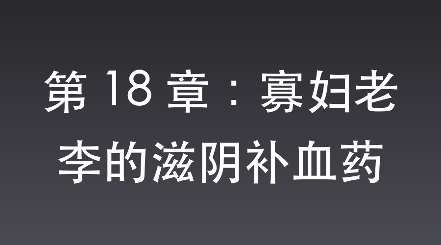

# 第 18 章：寡妇老李的滋阴补血药

平安县城，正荣街中药铺。

沈飞穿着笔挺的翻译官制服，在药铺掌柜敬畏的目光中，抓了几副女性专用的“滋阴补血药”。

明早他必须随武田去视察城外的日军战俘营，今晚是送出万家镇布防图的最后机会。

而特高课的爪牙一直如影随形。

他之所以大摇大摆地来抓妇科药，正是为了在特高课面前把“寄给寡妇老李”的谎言彻底砸实。

只要表现得足够荒诞，武田的多疑就会转化成智商上的轻蔑。这种明牌式的自我抹黑，比任何严密的隐藏都更安全。

药包里，万家镇的绝密布防图已被裁剪好，垫在了最里层。

浓烈刺鼻的当归和熟地黄气味，能掩盖任何微小的墨水味。

回到司令部外围，他把这几包散发着药味的东西，扔给了正蹲在墙根晒太阳的沈老三。

“去，找黑市的线人，把这个寄到八路军防区。”沈飞冷声吩咐。

沈老三吓得一哆嗦，像碰了烫手山芋一样赶紧捂住包裹：“表弟，老刘头昨天刚被太君抓了，你还要顶风作案？你真不怕死啊！”

沈飞一脚踢在他的好腿上。

“少废话！老刘头被抓了，你就去找老王头！寄件人写你的名字，收件人就写‘根据地的寡妇老李’。大声点嚷嚷，让特高课那些盯着我们的暗桩都听见，这药是给你表弟那个体虚的寡妇老相好补身子用的。要是这事儿办砸了，咱们俩今天晚上就得进宪兵队的地下室！”

被沈飞那句“进地下室”一激，沈老三脸色惨白，只能苦着脸，一瘸一拐地去了黑市。

于是，在特务们的暗中注视下，沈老三极其嚣张地把几包“寡妇专用滋阴补血药”交给了老王头，并且声泪俱下地描述了表弟那个乡下寡妇相好每个月都有多么“体虚气血不足”。

特务将原话汇报给了武田。

武田听完，脸上的肌肉痉挛了半天，最终只能咬牙切齿地吐出一句：“这对满脑子只有女人的蠢猪兄弟，简直是大日本皇军的耻辱！”

---

两天后，杨村，八路军独立团驻地。

李云龙背着手在院子里来回狂走，脸色黑得像锅底。

因为在杨村保卫战中指挥有方，他被上级从被服厂捞了出来，正式接手了这支因为遭遇山本特工队偷袭而士气降至冰点的独立团。

“发面团！简直就是发面团！”

李云龙指着刚训练完的二营，对着孔捷破口大骂，“孔二愣子，你他娘的是怎么带兵的？战士们一个个像霜打的茄子，手里拿的枪连膛线都磨平了，这怎么打仗？老子接手的是主力团，不是收容所！”

孔捷抽着旱烟，蹲在门槛上闷声不吭。

他心里憋屈，但独立团确实刚吃了败仗，现在极度缺乏武器装备，腰杆子硬不起来。

“团长！”

一名通讯员气喘吁吁地跑进院子，手里捧着几个用牛皮纸包得严严实实的中药包，“前沿哨所转交过来的包裹，说是黑市线人送来的。”

“什么东西？又是那个王八蛋寄的鞋垫？”李云龙眉头一拧。

“不……不是。”通讯员脸色古怪，憋着笑，一张脸涨得通红，“这上面写着……写着寄给‘寡妇老李’的‘滋阴补血药’，指名道姓说是给您调理月事用的。”

“噗——”

孔捷刚抽进去的一口烟直接喷了出来，呛得连连咳嗽。

院子里的几个营长想笑又不敢笑，一个个憋得浑身发抖。

李云龙的脸瞬间从黑变紫，又从紫变红。

“放他娘的狗臭屁！”

李云龙暴跳如雷，“锵”的一声拔出腰间的大刀，眼珠子瞪得溜圆，就要去砍那几包中药，“老子堂堂七尺男儿，独立团团长！那个不长眼的王八蛋叫老子寡妇？还他娘的让老子吃妇科药？！老子劈了这破药！”

“老李，老李你冷静点！”

孔捷赶紧扔了烟袋锅子，死死抱住李云龙的腰，“你就是再缺娘们，再嫌弃咱这烂摊子，你也不能对着几包草药发邪火啊！”

“滚蛋！放开老子！”

李云龙挣脱孔捷，气呼呼地一把抓过中药包。

但他举起的刀，并没有劈下去。

他的动作突然在半空中定住了。

一如苍云岭那块香皂，一如被服厂那包膏药。

他强忍着怒火，收刀回鞘，粗暴地撕开了外层的包装，把里面的中药渣子倒了一地。

“老李，你疯啦！这可都是好药啊！”孔捷看着一地的当归和枸杞直心疼。

李云龙没理他。

他小心翼翼地把最里面那一层沾满浓烈药味的牛皮纸展开。

只看了一眼。

李云龙那双充满怒火的铜铃大眼，瞬间凝固。

眼底的暴躁如同被浇了一盆冰水，瞬间熄灭，取而代之的是两道绿幽幽的、如同饿狼看到肥羊般的贪婪凶光。

牛皮纸的背面，用极其精细的炭笔，画着一张地形图。

是万家镇伪军第八混成骑兵营布防图及换防时间表！

整个院子死一般的寂静。

所有人都被这天上掉下来的馅饼砸懵了。

那可是一整个骑兵营的装备！

好几百匹东洋大洋马，还有崭新的马刀和步枪！

李云龙的喉结狠狠地滚动了一下。

他前一秒还在破口大骂自己被叫成了寡妇，下一秒，他直接把那张带着浓烈妇科中药味的牛皮纸紧紧抱在怀里，狠狠地亲了两口。

“吧唧！吧唧！”

亲完之后，李云龙兴奋地在院子里来回直搓手，嘴里发出一阵极其猥琐的狂笑。

“哈哈哈哈哈！发财了！老子发大财了！”

孔捷看着老李抱着妇科中药纸傻笑，抽了口旱烟，长长地叹了口气，一副看傻子的表情。

“老李啊。”孔捷语重心长地说，“我知道你接手咱们独立团缺装备，压力大，想立功想疯了。但你也不能乱吃药啊。这‘滋阴补血’是女人调理身子用的，你吃不出战斗力来的。”

李云龙一拍桌子，两眼放光地瞪着孔捷。

“你懂个屁！”

李云龙指着孔捷的鼻子，唾沫星子横飞，“老子这包药吃下去，不仅能吃出战斗力，还能吃出个骑兵营！传老子命令，张大彪！”

“有！”一营长张大彪立刻挺直腰板。

“集合一营所有能喘气儿的！带上家伙！”

李云龙一把抓起桌上的帽子扣在头上，豪气冲天，“老子今天带你们去万家镇，好好‘调理调理身子’！”

📅 2026年05月23日

