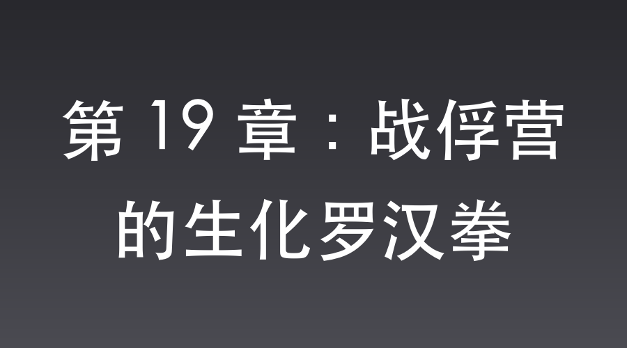

# 第 19 章：战俘营的生化罗汉拳

城外，日军战俘营。

秋风带着肃杀的寒意，卷起操场上的黄土。

武田少佐穿着笔挺的军装，坐在操场边缘的高台上，俯视着下方。

沈飞作为翻译官，恭敬地站在他身后半步。

“今天，让这些支那战俘见识一下，大日本帝国特种部队真正的徒手格斗术。”武田冷冷地对身旁的战俘营长官说道。

为了重振第一军在杨村惨败后受挫的士气，武田特意安排了这场极度残忍的实战演练。

规则很简单：几个最强壮的战俘，对战几名全副武装的日军特种兵。

赢了，活；输了，死。

几名瘦骨嶙峋却依然眼神桀骜的战俘被推上了操场。

其中一个身材高大、顶着一个大光头的汉子格外引人注目。

中央军第七十二师，少林武僧魏大勇，人称魏和尚。

沈飞推了推鼻梁上的金丝眼镜，目光落在那个光头汉子身上。

他很清楚，以魏大勇那股拼命的劲头，就算今天能徒手打死特种兵逃出去，也会被守卫用枪打成重伤，几乎是九死一生。

而他的计划，就是用最不讲理的现代物资，给这个未来的八路军猛将清扫障碍。

半个小时前，他借着帮武田去厨房催菜的名头，打发走了正在切肉的伙夫。

藏在袖子里的工业巴豆提取液，被他大半瓶全部倾倒进了给鬼子特种兵和看守加餐的猪肉汤锅里。这种经过提纯的液体无色无味，一旦和浓油赤酱的味增汤混合，根本察觉不出异样。

而在折返的路上，他打着寻找东洋茅厕的名义，刻意在靠近操场大门的几处水泥台阶、以及岗楼斜坡上停顿了几秒。

藏在皮靴边缘和公文包底的特种润滑油，以极细的油线洒在地面上。这种工业油黏度高，干涸得极慢，再撒上一层操场上随风飘散的黄土掩盖，从外表看与普通路面无异。

为了让自己频繁离队的举动显得合情合理，沈飞还一路上捂着肚子，用关西腔跟碰头的几个宪兵低声抱怨满洲的生冷食物让他肠胃不适。

所有的线都已埋好，就等鬼子入瓮了。

“沈桑，你在看什么？”武田似乎察觉到了沈飞的走神。

“回少佐阁下，我在欣赏皇军即将展现的雄姿。”沈飞立刻换上谄媚的笑脸，“那些战俘就像待宰的猪猡，怎么可能是帝国精锐的对手。”

武田满意地冷笑了一声，挥了挥戴着白手套的手。

演练开始。

一名身材魁梧的日本特种兵走到场中央，轻蔑地冲着魏大勇勾了勾手指。

魏大勇咬紧牙关，眼中喷吐着怒火。

他知道自己今天凶多吉少，但他宁愿战死，也绝不让鬼子看笑话。

“俺是少林寺出来的！”

魏大勇大喝一声，双脚猛地踏地，摆出了一个极其刚猛的罗汉拳起手式，准备和眼前这个鬼子拼命。

他浑身的肌肉绷紧，一记直拳带着风声，狠狠地向特种兵的面门砸去！

然而，就在他的拳头即将接触到特种兵鼻尖的瞬间，诡异的事情发生了。

那个原本气势汹汹的日本特种兵，脸色突然变成了惨绿色。

他瞪大了眼睛，五官因为极其诡异的痛楚而扭曲在了一起。

紧接着，一声极其响亮、犹如闷雷般的“噗——”声，在空旷的操场上炸响。

特种兵根本没来得及做出任何防御动作，他突然捂住肚子，双腿一软，直接当着所有人的面，稀里哗啦地拉了一裤子！

那股难以形容的生化恶臭瞬间弥漫开来。

魏大勇那一拳根本没打实，特种兵就已经像一滩烂泥一样瘫倒在地，捂着肚子满地打滚，嘴里发出痛苦的哀嚎。

魏大勇愣住了。

他看着自己悬在半空的拳头，又看了看地上拉得一塌糊涂的鬼子，整个人都傻了。

这算啥？

俺这罗汉拳，啥时候练出了隔山打牛带催屎的功能了？

看台上的武田少佐猛地站了起来，满脸不敢置信：“八嘎！他在干什么？！”

周围的几名特种兵见状，怒吼着拔出匕首，准备一起冲上去将魏大勇大卸八块。

但他们刚一迈步，肚子底下的肠道就像是被引爆了炸药包。

“噗！噗噗噗！”

一连串的闷响声中，冲上来的特种兵集体脸色煞白，捂着肚子软倒在地，屎尿齐流。

整个操场瞬间变成了极其惨烈的生化粪坑。

“还不快跑！”战俘群中不知道谁喊了一嗓子。

魏大勇这才从极度的懵逼中回过神来。

他来不及细想自己的武功为什么变得这么玄幻，借着鬼子拉裤子的混乱，转身就朝操场大门的方向狂奔！

“拦住他！开枪！”武田气急败坏地咆哮。

看守大门和岗楼的日军守卫立刻举起三八大盖，准备射击。

但就在他们举枪移动的瞬间。

那层被薄沙掩盖的特种高级润滑油，露出了獠牙。

走在最前面的两名日本看守刚跨出一步，脚底板便像是踩上了薄冰，整个人在空中猛地一划，伴随着韧带被生生扯断的惨叫，直挺挺地在水泥地上摔出了一个劈叉。

后面急着抢功的几个守卫刹车不及，接二连三地踏了上来。

“呲溜！稀里哗啦！”

十几名日本兵在润滑油的加持下变成了在冰面上打转的保龄球，枪支脱手，有人甚至一头撞在大门柱子上，当场磕掉了半嘴的门牙。

水泥地上的鲜血、黄土与油脂混成了一团，走火的三八大盖在半空中乱响。

魏大勇一路狂奔。

他跑得太快，加上脚底也沾到了润滑油。

在距离大门还有十几米的时候，他脚下一滑，整个人失去了控制。

但他毕竟是有武功底子的，在半空中强行扭转腰身，以一个极其荒诞的、四脚朝天却又快如闪电的滑跪姿势，朝着前方一扇看起来极其厚重的木门撞了过去！

“轰隆——！！”

那扇木门根本承受不住魏大勇滑飞过来的巨大动能，直接被撞得四分五裂！

魏大勇滑进门内，一头撞在几箱沉重的木条箱上才停了下来。

他晕乎乎地甩了甩脑袋，睁开眼睛一看。

周围没有守卫，只有堆积如山的三八大盖、子弹箱，以及几挺崭新的歪把子机枪。

这里，竟然是战俘营的秘密军火库！

由于大门被魏和尚以这种极其荒诞的方式撞开，原本上锁的军火库瞬间敞开在所有战俘面前。

看着外面满地打滚拉肚子的特种兵，和摔成一团的守卫，再看看眼前唾手可得的武器，战俘们先是愣了一秒，随后爆发出了震天的怒吼。

“抢枪！杀鬼子！”

战俘们如潮水般涌入被撞塌的军火库，抄起武器就开始反击。

魏大勇抱着一挺歪把子，依然坐在润滑油里，眼神中充满了迷茫和对自我认知的极度疑惑。

俺一拳把鬼子打拉稀了。

俺一滑跪，还自动寻宝撞开了军火库？

少林寺的方丈，可从来没教过俺这种玄门法术啊！

看台上。

武田少佐看着下方变成了粪坑和滑冰场的操场，看着那些平时引以为傲的特种兵像小丑一样满地打滚，浑身剧烈地颤抖着。

“八嘎……八嘎！！”

武田怒极攻心，猛地喷出了一口鲜血，两眼一黑，直挺挺地向后倒去。

沈飞眼疾手快地扶住了武田。

他躲在众人惊慌失措的视线死角，看着在乱局中毫发无损甚至还抢了机枪的魏和尚，嘴角勾起一抹深藏功与名的得意。

📅 2026年05月23日

