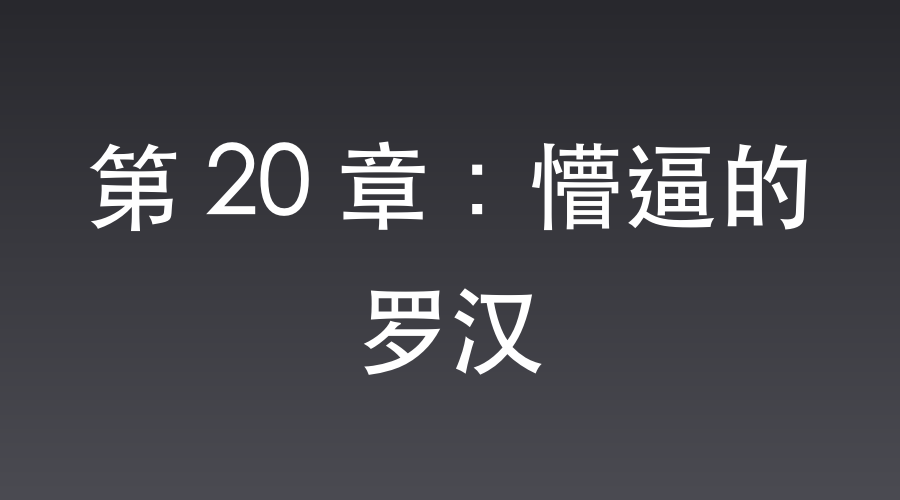

# 第 20 章：懵逼的罗汉

正午，万家镇外。

秋阳晃眼，土路上尘土飞扬。

李云龙跨在缴获的东洋大马背上，皮帽子歪戴着，嘴里漫不经心地哼着信天游，脸上的褶子快把眼睛挤没了。

他的身后，一营长张大彪正领着几百号战士，像看宝贝一样盯着队伍中间那三百多匹膘肥体壮的大洋马。

马背上驮满了崭新的马刀和步枪，沉甸甸的子弹箱压得马背直晃。

“团长，这仗打得老子心里发虚啊。”

张大彪紧紧攥着马缰绳，凑到李云龙跟前，压低声音，“咱们按着那张时间表摸进去，那帮伪军还在被窝里抠脚呢。连枪栓都没拉，一个营的马就全归咱们了。这情报……准得让俺后脊梁冒凉气。”

“你懂个屁！”

李云龙眼珠子一瞪，蒲扇般的大手重重拍在马脖子上，“这叫财神爷敲门，你就管开门接财！老子就说那包滋阴补血药是救命的仙丹，你看看这马，看看这刀！娘的，老子现在也是有骑兵营的人了！”

队伍正走着，前方的尖兵突然勒马急停，连滚带爬地跑回来：“团长！前面岔路口坐着个光头。穿着中央军的破烂衣裳，怀里居然抱着挺日军歪把子！”

“走，看看去。”李云龙来了兴致，“敢一个人抱挺机枪在路边发呆的，不是疯子就是猛将。”

岔路口，一个土坎子上。

一个身材魁梧得像铁塔一样的光头壮汉正蹲在那儿。

他两只骨节粗大的手死死抱着歪把子机枪，两眼发直，盯着脚下的一堆蚂蚁，嘴唇不停地哆嗦，不知在念叨什么经文。

“哪部分的？”李云龙翻身下马，靴子重重踩在黄土上，围着光头转了半圈，“怎么在这儿发愣？”

光头壮汉迟钝地抬起头，那双原本布满杀气的眼睛里，此时全是深深的迷茫。

“俺是中央军七十二师的，俺叫魏大勇……”

魏和尚声音发飘，眼神散乱地看着李云龙，“俺刚从鬼子的战俘营里……杀出来。”

“杀出来的？”张大彪眼睛一亮，伸手想摸摸那挺歪把子，“兄弟，特高课的特种兵守着那儿，你能带枪跑出来，身手不赖啊！”

魏大勇像是被烫着了一样，猛地往后一缩，脸色瞬间变得惨白。

“别碰俺！俺这身手……俺这身手出问题了！”

魏和尚长叹一口气，声音里带着哭腔，“俺在少林寺练了十年。俺一直以为俺练的是罗汉拳。可今天……俺有点摸不准了。”

李云龙和张大彪对视一眼，眉头皱了起来。

“什么意思？练功练傻了？”

魏和尚咽了口唾沫，指着自己的拳头，极其认真地看着李云龙，“长官，俺说实话你别抓俺。今天在战俘营，鬼子特种兵让俺比武。俺大喝一声，刚摆个罗汉拳的架势，拳头连鬼子的汗毛都没碰到——”

魏和尚的手比划出一个颤抖的弧度，“结果对面那个特种兵突然‘噗’地一声拉了一裤子稀，然后脚底下一滑，直接大劈叉滑出去，一头撞在墙上晕了。俺到现在都没想明白，俺这拳头怎么带催屎的功效了？”

独立团的战士们像被点穴了一样，死一般寂静。

“这还不算完！”

魏和尚越说越悲愤，甚至有些崩溃，“俺往外跑，后头几十个鬼子端着枪追俺。结果他们一上楼梯，集体像踩了西瓜皮一样，噼里啪啦摔了一地。俺自己也摔了一跤，结果一出溜，把鬼子军火库的大门撞飞了！俺爬起来顺了挺机枪就跑。长官，俺是不是招了什么不干净的东西了？俺现在都不敢出拳，怕一张手，这一条街的人都得拉裤子啊！”

全场鸦雀无声。

风吹过土路，卷起一片落叶。

三秒后。

“哈哈哈哈哈哈！”

李云龙突然爆发出极其狂野的笑声，笑得腰都直不起来，指着魏和尚的手都在打颤，“好！好！老子不管你练的是少林功夫还是催屎妖法，老子就缺个能让鬼子拉裤子的警卫员！”

张大彪憋得脸发紫，走上前：“兄弟，你这是立了功吓着的。来，咱们过两招，我看你这底盘稳得很。”

“别别别，长官，俺还没控制好力道，万一你这肚子……”魏和尚一边摆手，一边惊恐地后退。

“没事，来吧！”张大彪伸手就去抓魏大勇的肩膀。

魏大勇下意识地肩膀一抖，本能地使出一招少林擒拿。

“哎哟！”

张大彪只觉得肩膀像是被两把铁钳死死咬住，紧接着一股排山倒海的巨力传来，整个人瞬间腾空，在半空中转了半圈，重重地摔在远处的草垛子里。

张大彪灰头土脸地爬起来，满眼放光：“团长！是个硬茬子！没使妖法，是真功夫！”

李云龙大步跨上前，蒲扇般的大手“啪”地一声扇在魏和尚宽厚的肩膀上。

“和尚，以后就跟着我干吧！给我李云龙当警卫员！”

魏大勇听到“李云龙”三个字，眼珠子猛地一瞪：“您就是一炮干翻坂田的那个李云龙？”

“如假包换。”

魏大勇看着眼前这个不嫌弃他“会妖法”的长官，猛地挺起胸膛，立正敬礼：“长官看得起俺，俺这条命以后就是团长的了！”

“哈哈哈哈！”

李云龙得意地把破皮帽往后脑勺一推。

今天不仅白捡了一个骑兵营的马匹装备，还收服了这么一员虎将，真是赚大发了。

他猛地转过身，面向平安县城的方向。

在战士们和魏和尚错愕的目光中，李云龙表情突然变得无比虔诚，一把摘下帽子，对着县城方向躬身作揖，深深地拜了下去。

“菩萨保佑，苍天有眼啊！”

李云龙扯着脖子对空旷的荒野大喊，眼神炽热，“多谢大慈大悲的‘寡妇老李’仙姑！你就是俺老李的财神爷，独立团的再生父母！这天大的恩情，老子李云龙记在心里了！等打跑了日寇，老子一定亲自给你修庙塑金身，天天给你烧高香！”

魏大勇站在一旁，使劲挠着光溜溜的后脑勺，满脸不知所措。

寡妇老李？

这又是哪路能呼风唤雨的神仙？

难道俺能在战俘营死里逃生，也是这位仙姑显灵，在暗中施展了仙术？

📅 2026年05月23日

