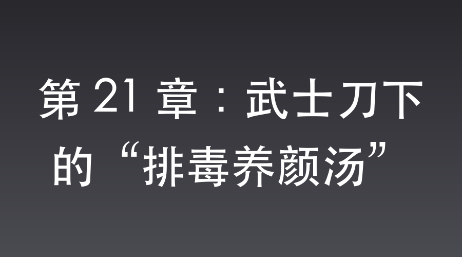

# 第 21 章：武士刀下的“排毒养颜汤”

平安县城，特高课司令部。

“咔嚓——！”

一只名贵的青花瓷茶杯在武田少佐的脚边摔成了粉末。

战俘营的实战演练已经成了一场传遍晋西北的笑话。

堂堂大日本帝国精锐特种兵，在格斗场上集体拉稀、踩着润滑油大劈叉、最后眼睁睁看着战俘撞开军火库扬长而去。

这是耻辱，更是死罪。

更让武田感到五雷轰顶的是军医送来的化验报告：排骨汤里被人下了极其猛烈的工业级致泻药。

有内鬼。

武田的眼眶里全是血丝，他在大门紧闭的办公室里来回暴走，粗重的呼吸像是一头被困住的野猪。

突然，他的脚步定住了。

他那阴鸷的目光穿过办公桌，死死地钉在了站在墙角、缩着脖子的沈飞身上。

在开饭前，只有这个翻译官借口“慰问辛苦的皇军”，拎着大包小包去过厨房！

“锵——”

武田没有任何废话，腰间的武士刀瞬间出鞘，带起一道令人胆寒的白光。

沈飞还没反应过来，冰冷的刀刃已经狠狠地压在了他的侧颈上，锋利的刀芒划破了皮肤，一道血线顺着领口缓缓淌下。

“沈桑。”

武田的声音低沉得可怕，像从地狱里爬出来的毒蛇，“你最好在我的耐心耗尽前，告诉我你到底在厨房里干了什么。为什么要给帝国精锐下毒？说！不然你的脑袋现在就会挂在城门口！”

沈飞的脖颈上渗出一颗血珠，冰凉的触感让他浑身汗毛倒竖。

这是真实的杀机。

他心里早有准备，武田哪怕没有真凭实据，也绝不会放过任何疑点。此时自乱阵脚或者试图用常规的谍战借口辩解，只会死得更快。

唯一的出路，就是把水搅浑，用一种比间谍破坏还要荒诞一万倍的理由，彻底把武田的头脑带进沟里。

昨晚他故意让惠子太太暗生情愫，就是为了在此时拉她做挡箭牌。

惠子在走廊上端着茶盘走来的细碎脚步声，他早就听得清清楚楚。

要想活命，还得趁机爆出系统奖励，就必须让门外的惠子产生更强烈的感动。

他得演一出苦肉计。

沈飞金丝眼镜下的眼底，闪过一丝近乎病态的冷静。

他脖子猛地一硬，竟然主动顺着刀锋往前凑了半寸，任由冰冷的铁刃在皮肉上划出一道更深的红线。他脸上浮现出悲愤委屈的神色，扯着嗓子大喊：

“少佐阁下！冤枉啊！那根本不是毒药！那是我花了两根金条，从黑市上给太太买回来的‘通便排毒驻颜偏方’啊！”

“八嘎！”

武田气得手都在发抖，化验报告被他捏成了纸团，“你管这种能让帝国精锐拉到脱水、连路都走不稳的毒药叫美容偏方？！”

“少佐阁下，您太不懂女人了！”

沈飞叹了口气，眼神里透着一股子“哀其不幸怒其不争”的深情，“这叫‘排毒养颜’。大仙说了，只要把肠道里的陈年宿便排干净了，太太的皮肤自然就跟剥了壳的鸡蛋一样。我本想悄悄在厨房熬制好了献给太太，结果炊事班那群蠢货肯定是当成大补的调料，一股脑全倒进了特种兵的锅里！”

“你还在胡说八道！”

武田目眦欲裂，握刀的手指骨节泛白，手腕猛地下沉，眼看就要切断沈飞的气管。

“住手——！”

就在这千钧一发之际，厚重的红木大门被猛地推开。

武田太太惠子端着一盘点心，满脸通红、眼带泪光地冲了进来。

她刚才在门外，把沈飞那番“深情独白”听得一字不落。

这个男人，为了让她变漂亮，竟然冒着杀头的危险在厨房偷偷给她熬药！

“惠子，你让开！这个支那人在撒谎！”武田咆哮着。

“他在撒谎？难道军医的化验报告也是假的吗？沈桑说那是排毒的，化验结果难道不是让人排便的药吗？”

惠子像头护犊子的母狮子，直接挡在沈飞面前，对着武田的鼻子厉声呵斥，“沈桑为了我的容颜煞费苦心，那是他的真心！你每天只知道杀人、流血，何曾关心过我一句？现在沈桑熬了药，你却因为手下的兵肠胃太娇贵、承受不住这顶级的排毒力度，就要杀人？！武田少佐，你简直太不解风情了！”

武田被这一通连珠炮打得整个人都木了。

肠胃太娇贵？

承受不住顶级的排毒力度？

武田看着惠子那副要跟他拼命的架势，再看看沈飞那副“我本将心照明月，奈何太君照沟渠”的凄凉做派，他只觉得太阳穴突突直跳，一种极其荒谬的无力感瞬间席卷了全身。

难道，这真的只是一个为了讨好女人的色中饿鬼搞出的一场荒唐乌龙？

“当啷。”

武士刀掉落在地。

武田引以为傲的间谍头子逻辑，在这一刻，被这荒诞的“排毒美容”论彻底干碎了。

就在武田闭上眼睛、痛苦捂脸的瞬间。

被惠子挡在身后的沈飞，脑海中传来了冰冷的机械提示音：

【盲盒系统检测到异国女性的极度感动，宿主抽取资格已激活。】

【盲盒已自动开启。】

【恭喜宿主，获得：高锰特制折叠铲一把，特制高爆黑泥面膜（高威力塑性炸药）一箱。】

沈飞垂下眼帘，在武田看不见的死角，嘴角勾起了一抹得逞的嚣张冷笑。

洛阳铲？黑泥炸药？

老李，你不是总嫌边区造的手榴弹像个冒烟的烧饼吗？

老子这就教教你，什么叫来自未来的“炸药神器”！

📅 2026年05月23日

