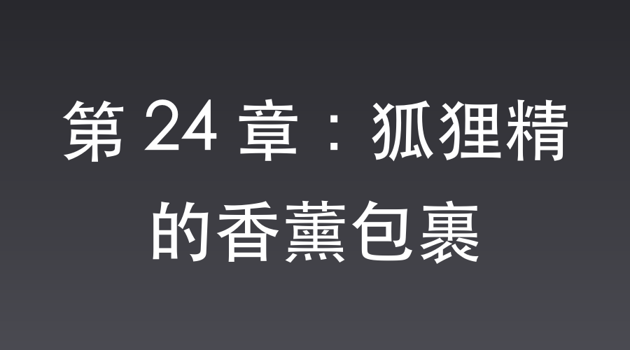

# 第 24 章：狐狸精的香薰包裹

平安县城，特高课司令部。

清晨的霜气还没散，整座县城已经变成了一个巨大的铁笼子。

武田少佐阴沉着脸站在地图前，由于山崎大队在李家坡陷入死战，第一军司令部下达了死命令：必须切断外界对八路军的一切物资和情报输送。

“封锁所有城门。”

武田的声音里透着彻骨的寒意，他缓缓扣上洁白的羊皮手套，“从现在起，不管是翻译官还是扫大街的，谁敢往外递一个线头，立刻就地正法。尤其是沈飞，给我死死盯住他！”

杀气腾腾的封锁令，将平安县城的压迫感推到了濒临爆发的沸点。

而在司令部后院的一树枯梅下，沈飞正背靠着树干，目光穿过木窗投向远方。

前线传来的密报很不好。

山崎大队在李家坡修筑了严密的工事，去当主攻的七七二团伤亡惨重。

沈飞很清楚，如果不把手里的这批高能C4炸药与李家坡的详尽地勘图送给李云龙，光靠边区造那粗制滥造的哑弹手榴弹，独立团上去也只能用人命填坑。

他一定要亲眼看看，这号称二战最坚固之一的环形工事，在现代特种高爆药的轰鸣下被气化时的场景。那是他精心筹划的爆破艺术。

但全城戒严，特高课的特务像是疯狗一样盯着他，只要他带上行李箱出城，武田绝对会亲自带人把他撕成碎片。

唯有特权。

沈飞低头看着手里那朵黑乎乎的、散发着刺鼻玫瑰香精味的黑色“泥花”。

这是他用系统之前抽到的C4面膜捏成的，虽然看上去是一滩烂泥，但只要插上雷管，其威力足以削平半个山头。

只要利用特权车，就能把这批炸药和那套折叠洛阳铲安全地送出去。

而司令部里，拥有出城特权、又最好利用的人，只有一个。

沈飞抬起头，目光锁定了前方——驻晋第一军的王牌女密码官，伊藤芳子少尉。

这位在本土受过严苛训练的女军官，此时正皱着眉头，有些傲慢地打量着四周。

只要把这位心高气傲的女密码官拿下，她的专车通行证就是最完美的运输工具。

沈飞揉了揉有些发僵的脸颊，嘴角的弧度重新变得温和无害。他整理了一下笔挺的制服，迈着优雅的步子走了过去。

“芳子少尉，如此美丽的清晨，若只用来思考那些冷冰冰的密码，实在是辜负了神明的恩赐。”

沈飞操着一口关西腔的慵懒日语，附在她耳边轻声低语。

伊藤芳子娇躯微颤。

她在这满是血腥味的要塞里，何曾听过如此温柔动听的乡音？

沈飞神色自然，将手里那朵黑漆漆玫瑰花递到了她鼻尖下。

“这是我用长白山的黑泥，混合了法式玫瑰精油亲手为您捏制的。”沈飞眼神里全是能溺死人的深情，“它不像真花那样容易凋零，就像您的才华一样，厚重而持久。我叫它……永恒的浪漫。”

伊藤芳子的心跳瞬间乱了节拍。

她看着眼前这个气度不凡的中国男人，脸颊竟破天荒地泛起了红晕。

“沈、沈桑……你真是一个有趣的人。”

“叮！检测到日军少尉之真心表白——【盲盒系统】触发！”

“恭喜宿主获得：李家坡精细微缩地质勘探图 ×1！定向次声波驱蚊器 ×1！”

沈飞心里狂喜。

成了！

他顺势露出一副忧郁的神情，叹息道：“只可惜，我那重病的表姑，恐怕是等不到我送去的衣物与这美容香薰了。全城戒严，我这翻译官真是无能为力。”

“就这点小事？”

被爱情冲昏头脑的伊藤芳子傲然一笑，“沈桑，我的专车有特高课通行证。你的包裹，我亲自替你送出去！”

一小时后，平安县城西城门。

武田少佐正背着手，带着几十名宪兵，阴森森地盯着每一个出城的活口。

“吱——嘎！”

一辆挂着“特”字牌照的黑色轿车被武田粗暴地拦下。

“武田少佐，连我的车也要查吗？”伊藤芳子摇下车窗，语气带着明显的不悦。

武田没说话，他像一头嗅到了猎物气味的狼，目光越过伊藤芳子，死死锁定了后座上那个被帆布裹得严严实实的大包裹。

“职责所在。少尉，请开门。”

武田直接拉开车门，动作粗鲁地扯开了包裹。

入眼处，是几截冰冷的折叠铁管，几张画满乱七八糟线条的白纸。

而最显眼的，是整整一箱子黑乎乎、软塌塌、散发着刺鼻异味的黑泥。

而包裹的最上面，赫然放着那朵捏得歪斜丑陋的黑泥玫瑰。

武田的眼角剧烈跳动了两下。

他拿起那朵黑泥玫瑰，凑到鼻子底下闻了闻。

那股由现代化学炸药混合了劣质玫瑰香精的味道，冲得他一阵头晕目眩，胃里翻滚。

“芳子少尉！你知不知道你车上装的是什么？！”武田怒吼。

伊藤芳子一把夺过那朵玫瑰，像护崽的老母鸡一样瞪着武田：“少佐阁下，这是沈桑送给我的满洲香薰！是浪漫！您这种只懂杀人的粗人，当然不会明白！如果您敢弄坏沈桑的一片心意，我会直接向司令部投诉您对皇军同僚的无礼骚扰！”

武田被喷了一脸唾沫星子，气得满脸通红。

他看着那一箱子在他眼里如同粪便一样恶心、手感极差、连火柴都点不着的烂泥，还有那几根不知干啥用的铁管子。

在1937年的认知里，这分明就是一堆毫无价值的垃圾与美容偏方。

“八嘎！滚！滚出去！”

武田嫌恶地疯狂甩动着手指，像是沾到了什么不洁的晦气。

他掏出白手帕，一边狠狠擦手，一边面露厌恶地挥手示意。

“开门！放行！”

黑色轿车发出一声轰鸣，在武田冷笑的注视中，大摇大摆地冲出了城门。

武田站在漫天尘土里，嫌恶地将那块沾了“C4面膜”味道的手帕丢进路边的脏水沟。

在他眼里，那个叫沈飞的翻译官不过是个只会巴结日本女人、靠兜售烂泥护肤品度日的懦弱之徒，根本不值得多浪费一丝精力。

而此时，在西城门不远处的茶楼二层，沈飞推了推鼻梁上的金丝眼镜。

他看着绝尘而去的军车，眼底的冷漠在碎光中一闪而逝。

那箱被武田嫌弃的“烂泥”，很快就会在几十里外的李家坡，化作一朵开在山崎大队头顶的最狂暴的蘑菇云。

📅 2026年05月23日

