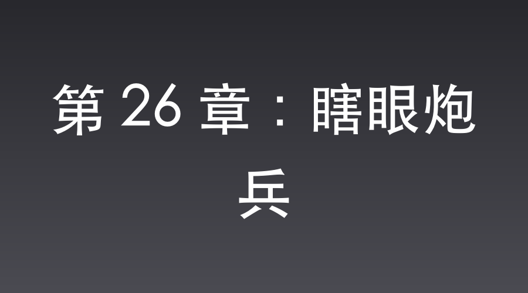

# 第 26 章：瞎眼炮兵

李家坡，山顶工事。

山崎治平中佐正倒背着手，目光阴鸷地盯着望远镜。

半山坡上，那些原本像无头苍蝇一样乱撞的土八路，此时竟全趴在地上，化身为几百只疯狂倒腾爪子的穿山甲，挥舞着铁锹，死命地往山顶刨土。

“愚蠢，地老鼠永远是地老鼠。”

山崎轻蔑地吐出一口浓痰，“在这个距离，皇军的每一挺重机枪都是死神的镰刀。既然他们想给自己挖坟，那就成全他们！开火！”

“哒哒哒哒哒！”

九二式重机枪喷出的长长火舌，像血红的长鞭，在半山坡横扫而过。

可让山崎难以置信的是，那些灰蒙蒙的壕沟竟像长了眼睛，借着斜坡上起伏的碎石屏障，刁钻地向前游走，正好避开了所有重火力的射击死角。

“八嘎！这不可能！难道他们能看穿地层？！”

山崎怒吼一声，眼底的轻蔑瞬间被寒意取代。

土工作业正一寸寸逼近他的防线。

烈日下，焦黑的泥土散发着令人作呕的血腥气，李家坡山头的空气仿佛凝固了。

几里外的高地上，武田少佐正黑着脸督战。

“少佐阁下，八路军的掘进速度快得离谱。”一名军官低声道，“不出半小时，他们就能把手榴弹扔进山崎中佐的被窝里，得用炮！”

“还用你废话？”

武田猛地合上望远镜，转头对着通讯兵咆哮，“命令山崎！立刻动用九七式迫击炮，把那几条像毒蛇一样的壕沟，给我一截一截炸成土灰！老子不看挖土戏，老子要看支那人被炸上天！”

命令瞬间传达。

山顶阵地上，三门迫击炮迅速调整诸元，漆黑的炮口像黑白无常的招魂幡，高高指向苍穹。

死亡的阴云，死死锁定了正在壕沟里埋头苦干的李云龙。

沈飞站在武田身后，金丝眼镜后的瞳孔微微缩紧。

他极度盼着这场战斗的最高潮——李云龙用那箱所谓的“玫瑰面膜”，也就是跨时代的C4高爆药，将整个山崎大队彻底送上天的艺术画面。

如果这三门迫击炮把独立团压死在壕沟里，那场他精心策划的高爆大秀就根本没有上演的机会。他决不能让这几门迫击炮毁了他的局。

他大衣口袋里放着的，是先前伊藤芳子表白时从【盲盒系统】中抽出来的【定向次声波驱蚊器】。这东西虽然叫驱蚊器，实际上却能通过调谐空气微震动，对生物脑神经产生强烈干扰。

沈飞微眯双眼，飞速估算着此地与山顶阵地的距离、炮手的方位。只要将频段调至人体前庭系统的共振区间，再以大衣里的钢制外壳定向发射，就足够让那些微调弹道的炮兵瞬间视线重影、耳鸣目眩。

他用身体挡住武田的视线，佯装害怕地耸肩低头，右手却在大衣口袋里迅速拧动旋钮，将功率指针直接压进了过载区。

没有任何声音。

但山顶阵地上的迫击炮手们，却在那一瞬间感到了世界在崩塌。

就像是一万只苍蝇在脑子里蹦迪，整个视角画面疯狂跳帧，天和地在他们眼里倒了个个儿，强烈的呕吐感冲得他们连站都站不稳。

“开炮！”山崎大声嘶吼。

“咚！咚！咚！”

三发炮弹带着凄厉的哨音划破长空。

下一秒。

“轰！轰！轰！”

三团巨大的火球，“精准”地砸在了距离壕沟足足十几米外的……空草地上。

除了掀飞了几块陈年老土和几只受惊的兔子，连老李的一根汗毛都没伤着。

壕沟里，正抱着头等死的李云龙愣了一下，他探出半个脑袋，瞅着那偏到姥姥家的弹着点，先是一愣，随即拍着大腿狂笑出声：

“哈哈哈哈！兄弟们！这帮小鬼子是集体害了眼疾，还是出门没洗脸？这炮打得，连他娘的兔子都炸不着！继续给老子挖！”

高地上，武田少佐的脸已经由黑转紫，又由紫转青。

他抓着望远镜的手都在咯吱作响。

“八嘎！谁能告诉我！山崎那个混蛋是不是把炮兵全换成了烧饭的伙夫？！那么近的距离！他们是想用炮声给八路军送葬吗？！”

武田气得胸膛起伏，眼看就要拔刀去劈传令兵。

“啪啪啪！”

死寂的空气中，一串清脆的掌声突兀地响起。

沈飞满脸惊叹，对着远处炸开的碎土堆拼命鼓掌：

“妙！打得太妙了！少佐阁下，您看出来了吗？这就是传说中的‘气浪摧折术’啊！”

武田僵硬地转过脸，像看疯子一样盯着沈飞。

“少佐阁下，山崎大队长真乃帝国名将！”

沈飞扶了扶眼镜，一本正经地解释，“故意把炮弹打在壕沟旁边十几米，是为了产生强劲的气流破坏八路军的大脑系统，以期从精神上摧毁他们！这种看似打偏实则杀人诛心的招数，真乃帝国战术神笔！”

武田的嘴角猛烈抽搐了两下。

他只觉得喉头微甜，脑中发昏。

“气浪摧折？战术神笔？”

武田看着那几发偏到爪哇国的炮弹，再看看沈飞那副由衷赞叹的笑脸，他猛地捂住胸口，发出一声低沉的闷哼。

“沈桑……你要是再敢说一个字的废话……给我闭嘴！”

武田身形晃了晃，幸得副官扶住，才没当场瘫倒。

而此时，独立团的壕沟，已经悄无声息地掘进了山崎大队阵地的最后三十米。

📅 2026年05月23日

