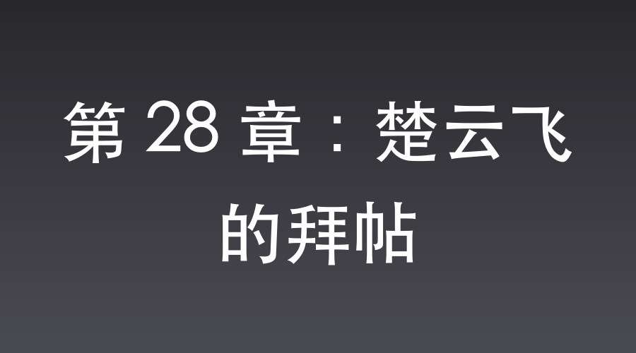

# 第 28 章：楚云飞的拜帖

晋西北，杨村。

李家坡战役的余温还没散，独立团的灶火已经烧得通红。

不可一世的山崎大队在C4炸药的轰鸣下化为了齑粉，这种超越时代的毁灭性打击，让李云龙的名声在一夜之间捅破了晋西北的天。

李云龙正撅着屁股蹲在院当间，手里攥着块满是油污的破布，跟伺候祖宗似的擦着那把微缩折叠洛阳铲。

“团长！”

张大彪兴冲冲地撞进大门，手里高举着一张红得烫眼的帖子，“晋绥军三五八团团长楚云飞送来的！说是仰慕团长神威，非要来咱们独立团‘切磋切磋’！”

“切磋？”

李云龙眼珠子一转，冷哼道，“那阔少爷是眼红咱们发财，想来摸摸老子的底！老子偏不让他失望。”

李云龙一边掂着手里的铲子，一边得意地看向一旁的赵刚：“老赵，等楚云飞来了，老子得让他开开眼！这铲子，这黑泥……老子非得让他知道知道什么叫‘高科技’！那小子手里有美械又咋样？在老子的魔法黑泥面前，统统都是烧火棍！”

李云龙越说越带劲，腰杆子挺得比标杆还直，整个人的情绪已经飞到了云端。

可还没等他显摆完，赵刚的一张脸就沉到了底。

赵刚猛地夺过洛阳铲，眼神严肃：“李云龙！你少在这儿烧包！你知不知道这铲子是怎么来的？那是那位深入敌营的女英雄，在鬼子特高课的心脏里，拿命给咱们换回来的！那是革命先烈的血！你拿这个去跟晋绥军显摆，是在往那位姑娘的脖子上架刀！”

李云龙脸上的笑容瞬间僵住了。

他瞅着赵刚那发红的眼圈，又看了看那把沾着泥土的铁铲，原本得意的劲头瞬间被赵刚这番话浇得冰凉。

“老赵……你说得对。”李云龙声音低了下去，重重拍了大腿一记，“是老子混蛋了。这玩意儿，得藏好，当传家宝供着！”

与此同时，平安县城。

武田少佐已经从吐血昏迷中苏醒。

他死死盯着办公桌上一张模糊的战场照片，手里的武士刀划过空气，发出一声令人牙酸的尖啸。

“咔嚓！”

厚实的红木办公桌被他一刀劈出了一道惊心动魄的裂痕。

“黑泥……香薰面膜……我竟然亲自放行了毁灭皇军的炸药！”

武田的声音嘶哑得如同破风箱。

他不再咆哮，而是在死寂中下达了最冷酷的命令：“封锁司令部。查！把这三天内所有进出的车牌号，一个一个给我对！少一个字，你们全部切腹！”

压抑到窒息的空气，在特高课办公室内凝固。

一份名单被送到了武田面前。

武田屏住呼吸，手指一张张滑过。

最终，他的目光像钉子一样死死钉在了一条记录上。

武田抓起一支红笔，由于用力过度，笔尖在划圈的瞬间“撕拉”一声刺穿了纸张。

那个鲜红的圆圈，死死圈住了伊藤芳子的特权专车。

而在司令部后院一间幽静的茶室里，一男二女正在饮茶。

沈飞正惬意地靠在榻榻米上，品尝着惠子刚沏好的清茶。

对面，伊藤芳子脸颊微红，正为他剥着橘子。

“沈桑，茶的味道如何？”惠子低声问。

“只要是太太泡的，白水也是人间极品。”沈飞笑吟吟地回了一句。

可就在他端起茶杯的瞬间，眼角余光扫过窗外，指尖不由得停顿了刹那。

金丝眼镜后的镜片掠过院子。

原本只有两个宪兵巡逻的后院，此刻竟多出了八名荷枪实弹的卫兵，正急匆匆地往各个出口守去。

武田果然查到了车牌。

沈飞缓缓放下茶杯，嘴角笑意渐冷。

极压的危机临头，他非但没有慌乱，反而感到一种在刀尖起舞的亢奋。

一旦武田的怀疑落定，他将面临灭顶之灾。必须在对手发难前，彻底解决这个麻烦。

刚抽到的萨满符咒与脑中的语言伪装技能，正好排上用场。

他打算在司令部布下一场“天谴邪祟”的荒诞电报迷局，用伪造的京都大社神职声线，将跨时代C4炸药的威力强行曲解为“李家坡地脉煞气引发的邪术反噬”。

只要用这神鬼大戏把本就迷信的武田彻底忽悠瘸，武田为了不被上峰责罚，自然会主动把出城记录烧个干净。

不仅如此，李云龙那边传来的关于楚云飞拜帖的消息，同样让他兴奋。

晋绥军的楚少爷要来切磋，而华北日军的高级军官观摩团也开始朝晋西北集结。

既然局势越来越大，那接下来的对手与战场，自然也该更加盛大。

沈飞指尖轻叩茶盏，视线落向窗外的阴影。

太原机场，高级军官观摩团……在接下来的新风暴里，他要把这一出大戏，唱得比李家坡更狂暴更刺激。

📅 2026年05月23日

