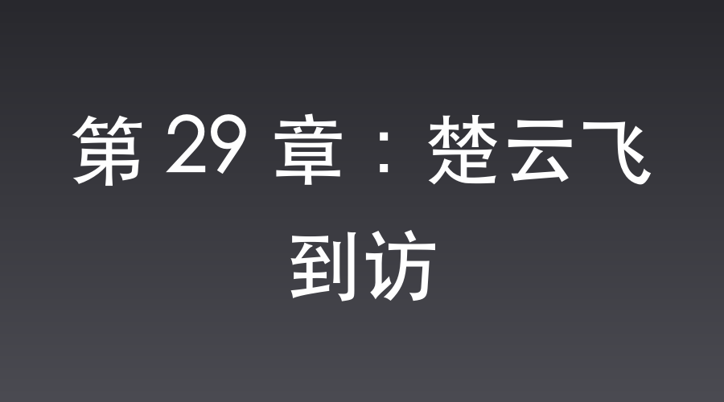

# 第 29 章：楚云飞到访

平安县城，特高课司令部。

办公室的门死死紧闭着，两名荷枪实弹的宪兵像木桩一样守在门外。

屋内，空气压抑得仿佛能凝出水来。

武田少佐坐在宽大的办公桌后，桌上放着那张被他劈成两半的战场照片，和一柄擦得雪亮的南部十四式手枪。

他死死盯着面前站着的两个人：密码官伊藤芳子，以及翻译官沈飞。

沈飞眼帘低垂，脸庞上浮现着恰到好处的惶恐。

然而，在那副微微歪斜的金丝眼镜后，他的思维却冷静非常。

这一场极其危险的当面质问，本就在他的推演之中。

他送出高能黑泥时，就没指望能彻底瞒过这群疯狗。

在晋西北这方狭小的池塘里，他的处理已经十分凶险，唯有用一场无可挑剔的“尽忠殉国”，在烈火锋刃中“假死”，才能彻底洗清嫌疑。

眼前的狂风暴雨，不过是这出大戏的开场。

“李家坡的爆破现场，化验室连夜做出了分析。不是黑火药，也不是我们已知的任何军用炸药。”武田的声音极低，却透着彻骨的寒意，“伊藤少尉。三天前，你动用特权专车运出城的那一箱‘香薰黑泥’，到底是什么？！”

“咔哒。”

武田拉开了手枪的保险，枪口直接对准了沈飞的眉心。

“少佐阁下！”伊藤芳子脸色惨白，但依然咬着牙上前一步，挡在沈飞半个身子前，“我用大日本帝国军官的荣誉起誓，那绝对只是沈桑送给他患病表姑的换洗衣物和香薰！”

“荣誉？你的荣誉已经被这个支那男人的花言巧语狗吃了吗！”

武田猛地站起身，一把推开伊藤芳子，枪口死死顶在沈飞的脑门上，冰冷的枪管在沈飞皮肤上压出一个红印。

“沈飞。你是个聪明的翻译。但你把我看成了蠢猪。”武田眼球充血，手指已经扣在了扳机上，声音嘶哑得可怕，“那种能把山头炸平的高能炸药，你告诉我那是香薰？说！你把大日本皇军的情报卖给了谁？那个‘寡妇老李’到底是谁！我数十声。不说，我就打烂你的脑袋。十、九、八……”

枪管的压迫感越来越重。

伊藤芳子急得眼泪都快掉下来了，她拼命去拉武田的胳膊，却被武田一脚踹开。

沈飞的额头上渗出了一层细密的冷汗，金丝眼镜后的瞳孔剧烈收缩。

这绝不是演戏，武田是真的起了杀心，只要倒数结束，他绝对会开枪。

要想活命并让计划顺利落子，就必须用最快的速度彻底把水搅浑。

对付自命不凡的日本军官，唯一的办法，就是用他们深信不疑的偏见去引导。

武田骨子里认定中国人贪财迷信。只要表现得足够荒诞，把这场军工炸药的泄密危机，降维成一出愚昧的萨满巫术闹剧，武田那多疑的脑筋就会自己拐弯，将他定位成一个无害的贪财蠢货。

“三、二……”武田的食指开始发力。

“太君！我招！我全招了！”

沈飞突然像崩溃了一般，发出一声极其凄厉的哭喊，“扑通”一声双膝重重地砸在地板上。

武田的嘴角勾起一抹残忍的冷笑。

果然，只要枪口顶在脑门上，再高明的人也会……

沈飞一把抱住武田的军靴，一边嚎啕大哭，一边颤抖着从怀里掏出一张皱巴巴、画满朱砂符咒的黄纸。

“太君，那真不是炸药啊！那是我老家表姑得了绝症，我花了两根金条，从长白山一个萨满大仙那里求来的‘太岁续命偏方’啊！”

武田脸上的冷笑瞬间凝固了，他低头看了一眼那张鬼画符。

“少佐阁下，您有所不知啊！”

沈飞猛地从地上窜了起来，动作之大甚至撞歪了武田的手枪。

在武田和伊藤芳子极度错愕的目光中，沈飞如同触电一般，疯狂地扭动着胯骨，双脚在办公桌前踩着一种荒诞诡异的步伐，开始了一场极其辣眼睛的“萨满跳大神”表演！

“哎嗨哟！太上老君急急如律令啊！”

沈飞一边像个抽风的蛤蟆一样乱蹦，一边扯着嗓子大喊，“太君，大仙说了！那黑泥是千年的太岁肉！必须配合那根带螺纹的洛阳铲，深深地插进土里，才能把地下阎王爷的阴气抽出来，糊在表姑的脸上续命啊！这可是大仙亲口传的法术，少一道工序都不灵啊！”

办公室里死一般的寂静。

只有沈飞跳大神时脚底板摩擦地板的“吧嗒”声。

武田握着手枪的胳膊悬在半空，整个人如同被雷劈了一样僵硬。

他看着眼前这个口吐白沫、疯狂扭动胯骨、嘴里念叨着“阎王爷阴气”的翻译官。

额头上的青筋一根根暴起，眼角的肌肉像触电一样剧烈地抽搐。

他那引以为傲的特工逻辑，他那严丝合缝的审讯气场，在这一刻，被这种纯粹到极致的、毫不做作的封建愚昧，轰然碾成了粉末。

“呕——”

结合之前城门口对那堆散发着劣质香精味的“臭泥”的记忆，武田只觉得胃里一阵翻江倒海，一种极其荒谬的恶心感涌上心头。

“滚！”

武田气得浑身发抖，一脚将正在“跳大神”的沈飞踹飞到了门上。

“大日本皇军的特高课，绝不允许出现这种卑俗的封建迷信！马上给我滚出去！”

沈飞连滚带爬地逃出了办公室。

武田颓然地坐回椅子上，认定是伊藤芳子被这个蠢货的男色蒙蔽，被当成了运送迷信物品的工具。

他挥手让伊藤芳子退下，暂停了对沈飞的直接审查，但依然下令宪兵在暗中布控。

与此同时，杨村，八路军独立团驻地。

两匹高头大马停在了团部门口。

晋绥军三五八团团长楚云飞，穿着笔挺的将官服，戴着雪白的羊皮手套，在副官孙铭的陪同下，正式拜访独立团。

楚云飞这次来，本着“探底”的心态。

他深知李家坡之战的惨烈，故意搬出黄埔军校极其专业的阵地战理论，试图看这位泥腿子团长如何应答。

然而，李云龙一反常态，丝毫没有拿武器装备哭穷。

老李不仅用从“寡妇老李”那里学来的“土工作业”和“反斜面战术”把楚云飞驳得哑口无言，还故意带着楚云飞，来到了后院一堆从山崎大队阵地上捡回来的黑色残渣面前。

“楚团长，你看看这个。”

李云龙极其得意地指着地上那点黑乎乎的硬块，“这是咱们八路军自己研发的高级魔法黑泥！山崎那个老小子，就是被这玩意儿送上天的！”

楚云飞眉头微挑，眼神中闪过一丝极难察觉的轻蔑。

八路军连子弹都造不齐，还能研发高级炸药？

他用戴着白手套的手指捏起一点黑泥残渣，放在鼻尖闻了闻。

没有火药的硝烟味，只有一股劣质香精味。

“云龙兄。”楚云飞轻轻拍了拍手上的灰尘，语气带着黄埔精英特有的居高临下，“楚某在黄埔时，也算精通爆破。这东西既无硫磺气味，又无硝酸特征，分明就是普通的河泥掺了些杂质。云龙兄就算是吹牛，也要符合基本的化学常识，泥巴怎么可能当炸药？”

副官孙铭也在一旁强忍着笑意。

李云龙撇了撇嘴：“楚团长，你别不信，这玩意儿可比你们晋绥军那些洋玩意儿厉害多了。不信？老子给你验验货！”

老李也不废话，他抓起一块拳头大小的完整黑泥，直接让张大彪插上一根缴获的日军雷管，转身走到后院一堵半米厚、用来防弹的废弃青砖墙前。

他把黑泥随便糊在墙上，点燃引信，拉着楚云飞就往后退。

“轰——！”

一声极其沉闷、震得人胸口发慌的巨响。

楚云飞感觉脚下的地面猛地抖动了一下。

他甚至没有看到剧烈的火光，只看到那堵半米厚的实心青砖墙，在黑泥爆炸的瞬间，没有任何抵抗余地地化作了一团极其均匀的粉末！

烟尘散去。

楚云飞看着那堆粉末，整个人僵在原地，脸上的那抹轻蔑瞬间凝固了。

他那属于黄埔精英的傲慢认知，在这几块不起眼的黑泥面前，被按在黄土坡上疯狂摩擦。

“这……这到底是什么东西？”楚云飞的声音发涩，眼珠子都红了，他死死地盯着李云龙，“云龙兄，这绝不是泥巴！这是超越了当今世界军工水平的绝密炸药！”

李云龙咧嘴一笑，露出一口黄牙：“我都说了，这是咱们八路军的魔法黑泥。楚团长，服不服？”

楚云飞尴尬地干咳了两声，掏出雪白的手帕擦了擦脸上的灰，“鄙人服了，心服口服！”

📅 2026年05月23日

