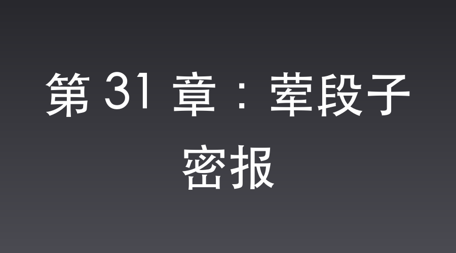

# 第 31 章：荤段子密报

平安县城，正荣街。

夜幕低垂。

武田下达的宵禁令像一块吸满水的黑布，死死捂住了整座县城。

街上连条野狗都看不见，唯独正荣街尽头的“百花楼”却挑着几盏红灯笼，浓烈的脂粉味和劣质水粉香顺着门缝往外渗。

沈飞穿着笔挺的翻译官制服，皮鞋踩在青石板上嘎哒作响，大摇大摆地跨进了百花楼的门槛。

在他的身后，半步不离地跟着两名穿着便衣的特高课宪兵。

这两人腰间鼓囊囊的，眼神阴冷得像两只在暗夜里觅食的野猫。

这是武田亲自为“观摩团首席生活买办”挑选的保镖，名义上是护卫，实则是两把随时准备切断沈飞脖子的铡刀。

只要沈飞敢在这风月场里向外递哪怕一个字的情报，这两把黑枪立刻就会在他后脑勺上开孔。

“哎哟，沈爷！您可算来了！”

百花楼的龟公老王头满脸堆笑地迎了上来，腰弯得几乎折断，“楼上最清静的雅间儿都给太君预备好了。咱们这儿的姑娘……”

“少废话！”

沈飞极其嚣张地一把推开老王头，大耳刮子毫不客气地在老王头那张油腻的脸上拍得啪啪作响，“后天，大日本帝国华北观摩团的大人们就要到了。武田少佐可是下了死命令，要最好的姑娘，最顶级的招待！要是出了半点差池，老子活剥了你的皮！”

“是是是！沈爷您说，您说！”老王头吓得连连点头，像条哈巴狗一样在前面引路。

两名宪兵冷哼了一声，跟着上了楼。

到了雅间，沈飞大大咧咧地坐在主位上。

两名宪兵却根本不进屋，一左一右像两尊门神一样守在雅间门口。

雅间的门虚掩着。两双毒蛇般的眼睛，透过门缝，死死地钉在沈飞的嘴唇上。

屋内，沈飞顺手搂过两名战战兢兢的姑娘，端起酒杯一饮而尽，那双金丝眼镜后的眼睛里，却透着一股不带半点温度的清明。

他在粗糙的红纸上提笔，大刺刺地写下了一副再寻常不过的脾胃理气药方。

沈飞太清楚特高课的难缠，这封信在出城时极可能会被关卡的伪军或宪兵拆检，因此纸上绝不能留下任何机密字迹。

他将这次伏击视作金蝉脱壳的绝佳舞台，李云龙攻得越狠，他的假死戏码就越逼真。

他必须将自己置于最险恶的暴风眼，唯有如此，日后重生的身份才最无瑕可击。

沈飞将信纸信手对折，塞入大红信封，又用油灯上的红蜡将封口彻底滴死。在红蜡尚未凝固时，他用右手尾戒在上面狠狠印下了一道细微的双环暗记。

只要此信出城，李云龙一见这象征最高危机的双环印记，必会知晓这是十万火急的紧急军情，定会断然起兵设伏。这种手法是他听一位交通员私下讲的。

“啪！”

沈飞将信封狠狠拍在桌上，探手摸出两块亮晃晃的现大洋，清脆地拍在信封旁。

他的声音故意拉高，公鸭嗓在雅间内分外刺耳：“老王头！把这药方送去乡下表姑家！我表姑常年胃寒，老子特地请名医开了这副偏方，你出城时让王聋子加急送去！还有，表姑家那俩老姐们儿可想老子了，你帮老子捎个口信——”

沈飞突然倾身向前。

门外两名宪兵眼神骤寒，其中一人右手极快地摸向腰间，手指已然搭在了冰冷的扳机上。

只要沈飞接下来的声音稍有低沉，或是动作露出一丝破绽，特务便会瞬间踹门而入，用子弹击碎他的喉咙。

压抑感在这一秒攀升到了顶点，窒息得令人喘不过气。

“后天上午九点准时去吃席！”

就在宪兵即将拔枪的瞬间，沈飞极其粗鄙的咆哮声震得茶杯乱颤。他脸上挂着令人作呕的淫笑，唾沫星子乱飞：

“老子特地物色了两个三十来岁、活儿好的大脚老妈子在头前带路，后面还跟着六个没出过阁的黄花大丫头！后天早上九点，就在卧虎沟的大杨树底下等着接老子！要是一个人都对不上，耽误了老子的春宵美事，回来老子砸了你的王八楼，让皇军活剥了你！”

老王头眼珠子死死盯着大洋，手里的汗巾子被攥出了水，连连鞠躬：“明白！明白！俩老妈子打头阵，六个黄花闺女在卧虎沟候着，一准儿误不了沈爷的好事！”

门外宪兵紧绷的手指缓缓松开。

他们鄙夷地对视，用日语低声啐道：“真是个荒淫无耻的支那色鬼，满脑子都是女人。盯着点，别让他喝醉了生事。”

足以改变整个晋西北战局的绝密军情，就这样，在特高课最精锐特工的眼皮底下，以一段下流俗套的口信形式，被贪财的龟公带出了城。

---

第二天傍晚，杨村，八路军独立团指挥所。

桌上平铺着一封大红的信封，旁边还放着一张记满了粗俗俚语的纸条。

这是城外地下交通站拼死送进来的密报。

起初，李云龙看着纸条上关于“大脚老妈子在前带路，黄花大丫头在后跟着，九点在卧虎沟等他吃席”的字眼，气得直瞪眼：“这狗汉奸送封信，怎么还捎带了一段下流口信？什么两个大脚老妈子、六个黄花丫头，九点在卧虎沟等着他吃席？这他娘的唱的哪一出？”

但燕京大学出身的赵刚反复端详着空无一字的普通药方，又盯着那枚信封上极淡的双环印记，极其敏锐地识破了这荒诞口信背后的军事逻辑：

“老李，这绝不是什么吃席的荤段子！药方信只是掩人耳目，用以通过敌人的岗哨。真正的机密是这一行口信！你想想，‘两个大脚老妈子在前带路，六个黄花大丫头在后跟着’，这说的不就是排成一列纵队的行军序列吗？

两个老的，六个小的。我们之前得到情报，日军华北观摩团即将来平安县城视察。观摩团的人数规格，恰恰是两名老牌少将带队，六名大佐军官随行！

‘后天上午九点，卧虎沟’。时间、地点、人数，全都对上了！这是一份包裹着荒唐外衣的绝密军情！”

这份披着粗俗荤段子外衣的绝密军情，在这位高材生政委严密的逻辑推理下被完全破译。

屋里的气氛压抑得仿佛能滴出水来。

李云龙正撅着屁股趴在土炕上，死死盯着铺开的军事地图，眉头拧成了一个死疙瘩。

“老李！”

政委赵刚急匆匆地冲进指挥所，手里死死攥着一份电报，脸色铁青。

“旅部最新急电！日军几个师团正在集结，准备对我根据地展开史无前例的大扫荡。旅长严令，所有主力部队必须在天黑前撤出杨村，向二线阵地收缩，避开鬼子的合围锋芒！”

“撤？撤他娘的蛋！”

李云龙像被踩了尾巴的老虎，猛地转过头，指着桌上那份刚破译出来的情报，“肥肉都送到嗓子眼了，两个少将、六个大佐！你让老子撤？”

“老李！这是军令！”

赵刚一步跨上前，死死挡在李云龙面前，眼眶通红地大吼，“你知不知道你在干什么？违抗军令，那是杀头的死罪！就算你想打，就凭咱们独立团这点人马，一旦被日军合围，全团几千号兄弟今天就得全部交代在虎亭据点！我作为政委，绝不允许你拿全团的命去赌博！”

李云龙被赵刚逼得连退两步，胸膛剧烈起伏，眼珠子渐渐变得通红。

“叮铃铃——！”

就在两人剑拔弩张、几乎要拔枪相向时，桌上的摇把子电话像催命鬼一样响了起来。

李云龙一把抓起听筒。

“李云龙！你少给老子装死！”旅长那极度愤怒的咆哮声从听筒里炸响，震得整个屋子都在嗡嗡作响，“我命令你，立刻！马上！带着独立团撤退！晚一分钟，老子枪毙了你！”

旅长的咆哮、赵刚的死战劝阻、日军合围的压力。

这三座大山死死地压在李云龙的肩膀上，将这间小小的指挥所逼到了几乎要爆炸的窒息极点。

李云龙听着电话那头的吼声，拿着听筒的手背上青筋根根暴起。

他的目光从赵刚那张愤怒的脸上移开，死死地盯住了桌上那张记满了“大脚老妈子”、“黄花大丫头”等极其下流俚语的纸条。

他咬紧了牙关，腮帮子上的肌肉剧烈地抽搐着。

“去他娘的军令！”

李云龙猛地拔出腰间的大刀。

“咔嚓”一声巨响，锋利的刀刃直接将桌上的电话机连同电话线劈成了两半！

“老子抗命了！”

李云龙一脚踢翻了桌子，声音如滚雷般在独立团驻地炸响，“张大彪！给老子集合部队！明天一早，目标虎亭据点！咱们去接那几个‘大佐级的雏儿’！天王老子来了，这群肥猪老子也杀定了！”

而在李云龙身后。

原本准备拼死阻拦的赵刚，紧紧攥着那份被破译出来的绝密情报，看着纸上那些粗俗不堪的字眼。

这位一向把军令看得比命还重的燕京大学高材生，眼角的泪花终于忍不住滚落下来。

“老李！”

赵刚猛地抬起头，一把抹去眼角的眼泪，镜片后的目光竟然变得和李云龙一样狂热且决绝，“你一个人抗命，算什么独立团的团长！这军令，老子今天陪你一起违抗！”

李云龙猛地回头，满眼错愕地看着这位白面书生政委。

“名伶同志一介弱女子，在敌人的心脏里生存是何等艰难！为了送出这份情报，她不惜在特务眼皮子底下伪装成荒唐下流的汉奸色鬼，编出这等自污名节的荤段子！名誉与清白，她统统不要了！”

赵刚的声音颤抖，却如钢铁般掷地有声，“这情报上沾着交通站同志的血！如果咱们今天退了，如何对得起她的隐忍付出！张大彪，还愣着干什么？政委的命令也是命令！去卧虎沟设伏，宰了那群畜生，绝不辜负她的期望！”

李云龙定定地看了赵刚两秒，突然畅快地大笑起来。

“好！老赵！对脾气！不过老赵啊……”李云龙话锋一转，打趣道，“你这细皮嫩肉的白面书生，要是真见到了那位名伶同志，怕不是要连魂儿都被勾走了吧？”

赵刚正气凛然地红着脸反驳：“扯淡！我那是纯洁的革命战友之情！”

两人的目光在破败的指挥所里碰撞，一支狂暴的抗命之师，在此刻彻底挣脱了枷锁。

一直坐在一旁的楚云飞，早已看呆了。

他那双戴着白手套的手微微发抖。

在黄埔军校的教条里，长官下令撤退却公然抗命，那是死路一条的兵家大忌。

但看着眼前这两个眼珠血红、像亡命徒一样的八路军团长和政委，楚云飞非但没有嘲笑，反而感到了一阵深深的震撼与战栗。

“疯子……真是一群不要命的疯子。”

楚云飞喃喃自语，随即猛地站起身，眼中燃起了前所未有的狂热，“云龙兄！既然你们敢豁出命去咬下这块肥肉，我楚云飞也不能当缩头乌龟。明天这场伏击战，算我一个！”

📅 2026年05月23日

