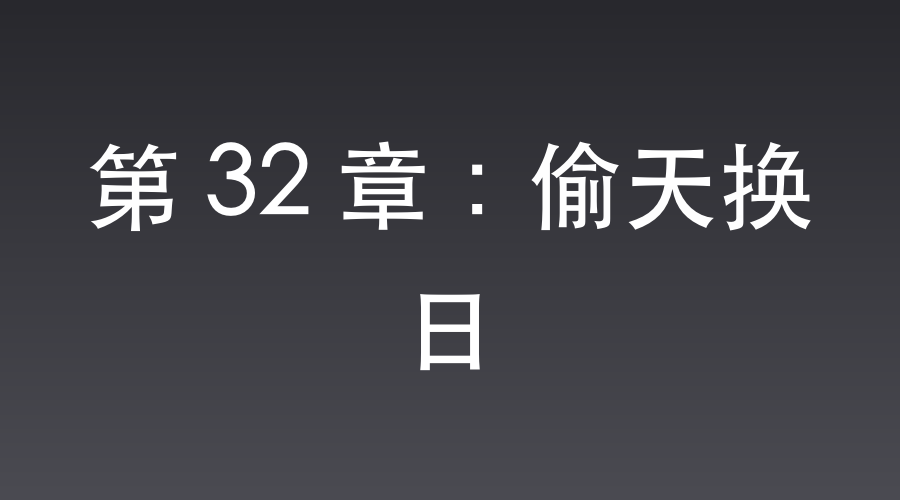

# 第 32 章：偷天换日

虎亭据点外围，卧虎沟。

秋风如同钝刀子一般，刮过光秃秃的山脊。

公路两侧的荒草丛中，趴着几百名八路军独立团的战士。

空气里只有粗重的喘息声以及拉动枪栓时轻微的金属摩擦。

楚云飞趴在李云龙身旁，举着蔡司望远镜，手心里沤出了一层冷汗。

在公路的尽头，一支庞大的日军车队正掀起漫天黄尘。

清一色的防弹装甲车在前面开路，外围紧跟着足足两个中队的精锐宪兵。

九二式重机枪和迫击炮在卡车车斗里架得密不透风，黑洞洞的枪口直指两侧山坡。

“云龙兄！”

楚云飞猛地放下望远镜，压低的声音里透着抑制不住的焦灼，“敌人的护卫兵力远超预期！不仅有装甲车，还有大批重火力！就凭独立团这点人马，在平缓地形伏击，连塞牙缝都不够！立刻下令撤退！留得青山在，不怕没柴烧！”

李云龙趴在泥窝里，死死盯着越来越近的车队，连看都没看楚云飞一眼。

他那双铜铃般的大眼睛里布满了血丝。

他缓缓从腰间拔出了大刀，刀背在深秋的阳光下闪过一抹森冷的寒光。

“撤？老子字典里就没这个字！”

李云龙咬着后槽牙，喉咙里发出滚雷般的低吼，“他火力再猛，能挡得住老子贴身肉搏吗？传令下去！全体上刺刀！等车队一进包围圈，手榴弹开路，直接给老子冲下去打白刃战！谁敢后退半步，老子活劈了他！”

楚云飞倒吸了一口凉气，握着勃朗宁手枪的手指骨节泛白，死死盯着身旁这个眼珠血红的团长。

与此同时，车队中央。

一辆黑色重装防弹车内，气氛沉闷。

日军少将服部直臣正襟危坐，怀里紧紧抱着一个黑色的高级牛皮公文包。

坐在副驾驶上的，是密码官伊藤芳子。

与服部少将并排坐在后座的，是本次观摩团的首席生活买办，沈飞。

沈飞推了推金丝眼镜，目光快速扫过车窗外越来越陡峭的山路。

乱石密布，荒草丛生。卧虎沟快到了。

他放在膝盖上的双手不知不觉地攥紧，掌心浸出了一层滑腻的冷汗。

焦虑，前所未有的焦虑，几乎将他淹没。

半小时前，在县城宪兵队大楼外集结出发时，他本想提前拿到保命的底牌。

那时，他主动接近伊藤芳子，借着帮她将行李拎上车的机会，用极其暧昧的语调低声试探：“芳子少尉，今天这一路想必凶险难料，若是能侥幸归来，不知我是否有幸能听你亲口说一句中意我？”

然而，当时大楼门前戒备森严，宪兵列队，武田大佐在不远处大声呼喝，少将的两名随身保镖更是如鹰隼般盯着四周。

在那种极度压抑的肃杀气氛下，伊藤芳子不仅没有动容，反而羞恼地避开，用冰冷得没有温度的声音低声喝道：“沈翻译官，请认清你的身份。这是皇军的军事行动，请你自重！”

调情失败。

脑海里的【盲盒系统】没有发出半点提示音。

这也就意味着，他现在手里没有任何底牌。

沈飞暗暗咬了咬牙，背部泛起一阵恶寒。

李云龙那个疯子正带着几百号嗷嗷叫的八路军在前面设伏。炮火钢刀可不长眼睛，一旦战斗打响，流弹飞溅，若是没有系统的防弹盾护身，他稍微运气不好，就得当场交代在这个鬼地方。

感受着车速越来越慢，车外山势愈发险峻，沈飞的喉咙有些发干。

死神的脚步在逼近，他别无选择。他必须在车子进入伏击圈的这短短几分钟里，背水一战，再次尝试。

他的视线死死锁在前面伊藤芳子的后颈上，脖颈上的青筋因为紧绷而隐隐暴起。

“嘎噔！”

黑色轿车的右前轮突然碾过了一个巨大的弹坑，整个车身猛地向左剧烈倾斜。

毫无防备的服部直臣脑袋重重地磕在了车窗玻璃上，发出一声闷响。他疼得低哼一声，本能地闭上眼睛，整个人伏下身子，使劲揉着额头。

沈飞在这一瞬间抛弃了所有儒雅的伪装，猛地前倾身体，一把死死攥住了前排伊藤芳子搭在座椅靠背上的手腕。

“你——”

伊藤芳子吓得浑身一抖，正要转头怒斥，却在后视镜里撞上了沈飞的眼睛。

那是一双因为极度焦虑而布满血丝、隐隐泛着疯狂赤红的眼睛。

沈飞死死掐着她的手腕，力道大得有些惊人。

他凑到她耳边，声音微颤却带着不容拒绝的决绝：“芳子……前面有八路的伏兵，今天我们可能都要死在这！我只想在死前听你亲口说一句中意我，快！否则我这就惊动将军，大家现在就一起死！”

听到“伏兵”二字，又对上沈飞那近乎同归于尽的焦虑神态，伊藤芳子吓得脸色惨白。

后座的服部直臣正捂着额头，随时都会直起身来。在如此狭窄的车厢里，这种动作一旦被发现，她的军旅生涯就彻底毁了。

极致的恐慌压垮了她最后一丝理智，泪水在眼眶里打转。

为了安抚这个几乎失控的疯子，她只能咬紧牙关，用极细微、带着哭腔的声音飞快地说：

“沈桑……我中意你！我喜欢你！求你别说了……”

话音刚落，服部直臣揉着额头重新坐直了身子。

“叮！”

沈飞的脑海中终于爆开一声清脆的天籁：

“检测到日军少尉伊藤芳子恐慌之下的违心表白——【盲盒系统】触发！”

“恭喜宿主获得：高级防弹微型龟甲盾 ×1！极速微型照相机 ×1！完美复制的空白日军密码本 ×1！”

沈飞在脑海中看着系统空间里静静躺着的几件道具，一直悬在嗓子眼的心脏终于落回了胸腔。

他缓缓放开手，坐回原位。

直到这时，他才发现自己浑身冷汗，背部湿透的衣衫黏糊糊地贴在皮肤上，被车窗缝里渗进的凉风一吹，激起一阵寒意。

底牌到手了。

防弹龟甲盾随时能够护住全身，只要他意念一动就能激活。

剩下的，就是静静等待风暴降临。

服部直臣坐直身子后，狐疑地扫视着前面脸色惨白、身体微颤的伊藤芳子，接着冷眼瞧了瞧旁边神色平静、推着金丝眼镜的沈飞。

虽然觉得车里的气氛有些怪异，但有任务在身，少将并没有细想。他收敛了心神，厌恶地扫了沈飞一眼，用日语对前排的副官冷哼道：“武田那个蠢货，怎么找了这么个看到女人连路都走不动的废物来当随行翻译？简直是皇军的耻辱！”

沈飞听懂了，但他只是轻轻推了推金丝眼镜，看着车窗外那片死寂的荒草，嘴角勾起一抹不易察觉的冷笑。

废物？

等会儿李云龙的大刀砍进你脖子的时候。

你就会知道，谁才是真正的废物了。

📅 2026年05月23日

