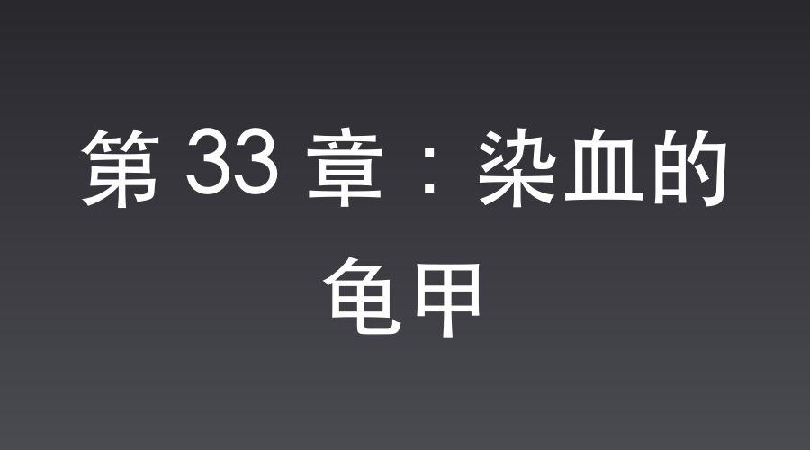

# 第 33 章：染血的龟甲

虎亭据点外围，卧虎沟。

“轰！”

一声巨响震塌了半边山崖。

埋设在公路中央的集束手榴弹被拉响，打头的装甲车瞬间被炸翻，滚滚浓烟直冲云霄。

“打——！”

李云龙一声狂吼，埋伏在公路两侧的独立团战士如猛虎下山，挺着雪亮刺刀，如潮水般涌向被截停的日军车队。

白刃战骤然爆发。

利刃透骨，凄厉的惨叫、刺耳的铁器撞击在谷地骤然炸开。

车队中央的豪华防弹轿车被两枚手榴弹炸得剧烈摇晃，车窗玻璃碎了一地。

“保护将军阁下！”

副官刚拔出王八盒子，就被车窗外递进的一柄刺刀扎透胸膛。

服部直臣少将脸色难看，但他久经沙场，死死抱住装有密码本的牛皮公文包，另一只手抽出将官刀，负隅顽抗。

车身震颤，后座角落里的沈飞在爆炸刹那，按下口袋里的【高级防弹微型龟甲盾】开关。

一层防尘薄膜般的光晕瞬间覆盖全身。

沈飞脑海中的思路无比清晰：真正的密码本一旦落入八路军手中，日军为了保密，一定会直接废除并更换整套密码系统。这样一来，他拍到的密码就会彻底成为废纸。

唯有在日军面前将真正的密码本公开烧毁，假造密码册已被彻底销毁的迹象，大本营才会坚信密码并未泄露，从而继续使用。如此，他用微型相机拍存的密码图样才拥有无上价值。

车身倾斜，少将仓皇失措。沈飞趁势欺身而上，隐蔽地一记手刀精准切在服部少将手腕麻筋。

少将手腕吃痛，五指一松。

指尖刚触及牛皮公文包中真密码本的硬壳，沈飞袖口中已然握住了那部系统抽出的【极速微型照相机】。

他用指腹夹住相机，顺着密码本的边缘轻轻一划。这款系统出品的照相机瞬间启动了超高速透视快门，在一秒内完成了对整本密码本的透视拍摄，将所有防伪暗记、密码图样尽数拍下。

随后，他手腕微不可察地一抖，施展残影般的手速，将怀里那本【完美复制的空白日军密码本】滑入少将怀中的公文包夹层。同时，他把真正的密码本塞进自己内侧口袋，仅将照相机心念一动收回了系统空间。

一秒不到，神鬼不觉。

“杀！”

魏大勇一脚踹开车门，光头溅满鲜血，大吼着冲入车厢。

服部直臣挥刀便砍，魏和尚不退反进，一记罗汉拳重重轰在少将肋下。

骨裂声中，服部少将口吐鲜血瘫软下去。

紧接着，一个高大魁梧的身影提着大刀大步跨了过来。

正是李云龙。

“和尚，让开！老子亲自剁了这条老狗！”

李云龙眼珠子通红，宽背大刀带起刺耳的恶风，咔嚓一声，服部直臣连肩带胸被劈成两半。

李云龙一击得手，正俯身去拽服部少将死死抱在怀里的公文包。

跟在后面的张大彪身形一闪冲了上来，目光一扫，一眼就看到了躲在后座角落里、戴着金丝眼镜的沈飞。

“还有一个漏网的狗汉奸！”

张大彪怒火中烧。

他没见过沈飞，只知道这豪华车厢里坐着的绝对是个死心塌地给鬼子当狗的翻译官。

“老子今天超度了你！”

张大彪大喝一声，手中的宽背钢刀卷着狂风，朝沈飞脖颈狂劈而来。

刀锋未至，刺骨的寒风已经刮痛了沈飞的面孔。

沈飞镜片后的眼神非但没有恐慌，反而带着一抹近乎病态的冷彻。这凄厉的血色、这几近斩首的致命一击，是他为自己在日军第一军司令部铺就的黄金阶梯。

只有置之死地，方能换取日军坚不可摧的绝对信任。

他借着视线死角，猛地将伊藤芳子推进车底的狭小空间里。与此同时，他迎着劈落的刀光，挺身主动撞了上去！

他脸色狰狞，声嘶力竭地用日语咆哮：“芳子！保护密码本……快跑！”

“当！”

张大彪的大刀狠狠劈在沈飞的侧颈。

微型龟甲盾的防护罩死死扛住了这一击，阻隔了大部分震力，空中隐约传来一声沉闷的金石撞击。

即便如此，强横的余威依然震裂了表皮，拉出一道血肉翻卷的骇人伤口，鲜血如喷泉般飚飞出来。

鲜血染红了他身上的西装，他脖子上的伤口深可见骨，血肉模糊，但还不致命。

伊藤芳子躲在车底夹缝里，透过缝隙，眼睁睁地看着沈飞倒下。那一瞬间，她热泪盈眶。

谷地里的枪炮声已经开始减弱，独立团开始高呼撤退。

倒在血泊中的沈飞并没有直接昏厥。他必须把这场戏彻底演足！

他躺在地上，面容因为剧痛而极度扭曲，嘴里不断吐出带血的泡沫。他用颤抖的双手，极吃力地探入衣襟，将那本真正的机密密码本摸了出来。

他的眼神中充满了绝望的不甘。他用尽全身仅剩的力量，在布满碎石的公路上吃力地爬行，用身体拖出了一条刺眼的长长血迹。

“密……密码本……”沈飞用日语微弱、沙哑地呢喃着，断断续续，“绝对……不能……落入支那人手里……”

他死死盯着旁边一辆正熊熊燃烧的日军卡车残骸。

李云龙和张大彪等人正拎着战利品往外冲，并没有注意到血泊中这个将死之人的举动。

就在李云龙跑出谷口的瞬间，沈飞用指甲死死抓着地面，拼死往前猛地一挣，用尽最后一丝气力扬起右手，将那本沾满了他鲜血的机密密码本，准确地扔进了卡车漏油起火的油箱废墟里！

“轰！”

火苗窜起几米高，密码册在眨眼间被狂暴的烈火彻底吞噬，在伊藤芳子的注视下化为一片焦黑的飞灰。

做完这一切，沈飞仿佛耗尽了生命中的残存光亮。

他虚弱地用双手扒着地面，将自己那具鲜血淋漓的身体强行挪动，正好死死横在车底边缘的空隙外侧，如同一堵血肉之墙，死死护住了伊藤芳子藏身的安全区域。

随后，他脑袋一歪，彻底“气绝身亡”。

车底的伊藤芳子死死捂着嘴，眼泪夺眶而出。

在她眼中，这个平日里贪财好色的翻译官，在生命的最后一秒，不仅用血肉之躯为她挡下了致命一刀，更是拼尽最后一口气，将核心密码本付之一炬，甚至死后还要用身体为她挡住外面所有的危险！

这是何等惊天动地的忠烈！

“他娘的，”李云龙把抢来的牛皮公文包往怀里一揣，斜眼瞅了瞅倒在车外血泊里、已经“死透”的沈飞，重重啐了一口。

李云龙脑子里转得飞快。

先前沈飞给他送过绝密情报和黑火药，可他心里跟明镜似的——真正拼了性命送情报的，绝对是那位潜伏在太原城的女地下党“名伶”同志。

沈飞是个什么货色？整个太原城谁不知道这小子贪财好色，瞧见女人连骨头都酥了。

保不齐，就是“名伶”同志为了国家大义，不得不忍辱负重去迎合这狗日的，甚至很可能连清白身子都失给了这个色中恶鬼，这才哄得这小人迷失方向，在不知情的情况下把情报顺带捎了过来。

一想到咱们忠贞不屈的女同志竟然被眼前这个狗杂碎占了便宜，李云龙胸口就憋着一股无名火。

更何况，这小子平日里仗着鬼子的势祸害百姓，身上背了不知道多少血债。

这种铁了心给鬼子当狗的叛徒，就算误打误撞帮了一回忙，也绝不能相抵，大彪这一刀送他上路，纯属替天行道，死得不冤。

李云龙看着沈飞临死前拼命把怀中一本本扔进大火的姿态，眼神冰冷，啐道：“呸，狗日的东西，临死还朝火堆里扔书，倒真是一条对鬼子死心塌地的哈巴狗。

就算你小子误打误撞捎过一次情报，就凭你干的这些丧天良的恶行，老子今天也饶不得你！”

“大彪，干得利索！和尚，撤！鬼子的增援马上就到了！”李云龙一挥手，带着战士们如疾风般朝谷外撤退。

谷地重新安静下来，只剩下大火燃烧的噼啪声。

被李云龙当成死尸的沈飞，在死人堆里悄然舒了一口气。

在刺鼻的焦黑硝烟中，沈飞闭着双眼，脑海中查看存入系统空间的照相机照片，那份密码图样清晰得很。

这一关，借着张大彪那一刀，以及在大火中化为灰烬的密码本，总算是把日军第一军司令部的怀疑彻底洗净。

📅 2026年05月23日

