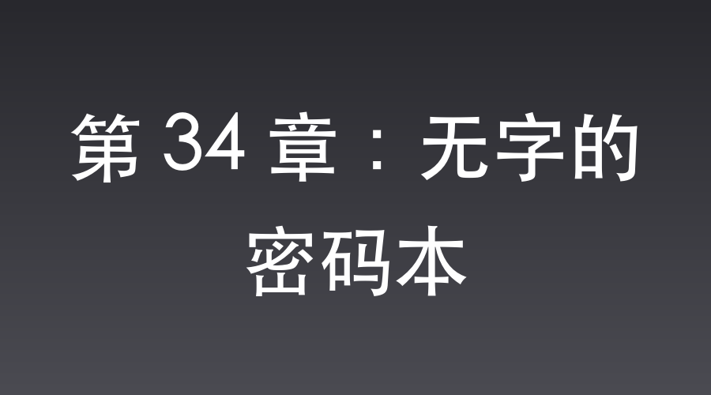

# 第 34 章：无字的密码本

虎亭据点外围，峡谷。

硝烟尚未散尽，浓烈的血腥味引来了成群的乌鸦。

漫山遍野，横七竖八地躺满了穿着黄呢子军服的日军尸体。

华北战地观摩团，包括一名少将和六名大佐在内的一百多名日军高级军官，被独立团斩杀干净，无一生还。

楚云飞站在血水横流的峡谷中央。

他原本以为李云龙只是打个秋风，捞点便宜就走。

但他万万没想到，这个疯子竟然带着几百人，硬生生地把日军华北方面军的心脏给活活掏了出来。

楚云飞看着脚下一具肩膀上扛着金星的日军少将尸体。

他缓缓摘下洁白的羊皮手套，脱下军帽，对着独立团打扫战场的方向，深深地躬下身去。

这一躬，敬李云龙那亡命的战术魄力，也敬那位送出情报的“神秘女英雄”。

不远处，被炸得面目全非的黑色轿车旁。

“团长！捞到大鱼了！”

张大彪满脸是血地跑过来，手里拎着一个黑色高级牛皮公文包，“服部那老鬼子，到死双手都像铁钳一样抠着这玩意儿！俺掰折了他两根手指头才拽出来！”

李云龙直勾勾地盯着那个公文包，兴奋地直搓手。

公文包上挂着一把精密的铜锁。

李云龙抽出大刀，刀背狠狠砸下，“咔嚓”一声，铜锁粉碎。

他粗糙的手指拉开拉链，从里面捧出一个厚厚的高级保密封皮笔记本。

周围的赵刚、孔捷等人全围了上来，连大气都不敢喘。

李云龙咽了口唾沫，双手捏住封皮，猛地翻开了第一页。

他脸上的狂喜瞬间僵住。

第一页，干干净净，一个墨点都没有。

李云龙不信邪，以为是扉页，他沾了点唾沫，手指飞快地往后哗啦啦连翻了十几页。

全是一片刺眼的空白纸。

峡谷里只有秋风吹过书页的沙沙声。

“这……这是个啥玩意儿？”

李云龙拿着那个“无字密码本”在半空中甩了甩，脸都憋绿了，猛地把本子摔在张大彪怀里：

“娘的！这鬼子少将出门带个空本子，还死死抱在怀里当祖宗供着？老子还以为缴获了什么绝密宝贝，原来是个空本子，真他娘的晦气！”

赵刚走过来，一把接过本子，借着微弱的光线仔细端详。

他摸着封皮上特殊的保密金属压边，又迎着光看了看内页中只有军用纸张才有的精细防伪水印。

“老李，不对！这绝不是普通的空本子！”赵刚的呼吸突然急促起来，镜片后的双眼射出激动的亮光，“你仔细看，这本子的规格、封皮和暗记，完全是日军最高级别的保密日志。这本子是真的，但里面的内容，在战斗打响前就被人掉包了！”

一旁的孔捷凑过来，砸吧着旱烟：“我说老赵，掉包？这荒郊野岭的，鬼子少将自己能把本子给调成白纸？”

“鬼子少将当然不会，但如果是我们那位潜伏在敌营的‘名伶’同志呢？”赵刚压低声音，语气中带着由衷的赞叹，“这是神级微操啊！你们想想，如果我们当场缴获了真的密码本，鬼子事后知道密码本丢失，会怎么做？”

李云龙眼珠子一转：“那鬼子肯定得像火烧屁股一样，连夜把所有的密码都给换了！那我们缴获的本子就成废纸了！”

“对！”赵刚猛地一拍大腿，眼眶泛红，“所以，‘名伶’同志为了保住这份情报的长期价值，早已神不知鬼不觉地掉包了少将公文包里的真密码本，换成了这本无字的白纸日志！不仅如此，她还利用了那个狗汉奸沈飞！”

“沈飞？那小子不是刚才被大彪一刀劈死了吗？”李云龙摸了摸下巴。

“就是因为他死了，局才做得天衣无缝！”赵刚眼中闪烁着由衷的钦佩，“沈飞那狗汉奸贪财好色、对鬼子死心塌地。他根本不知道公文包里的密码本早已被名伶同志掉包了。他拼了命替鬼子挡刀，又在临死前把名伶同志故意留下的真本子扔进大火烧毁，以为自己为天皇立了奇功。”

赵刚深吸一口气，感慨万千：“可他哪里知道，自己不过是‘名伶’同志局里的一枚棋子！他这一烧，活下来的鬼子都会亲眼见证，密码本已经烧成了灰。日军大本营绝不会怀疑密码泄露，更不会更换系统！而真正的密码，一定在‘名伶’同志手里，她迟早会通过秘密通道送达总部！”

李云龙倒吸一口凉气，宽背大刀往地上一插，由衷地骂道：

“他娘的！老赵你这么一说，老子全琢磨过来了！这名伶同志真神了，把鬼子和汉奸沈飞全当猴耍呢！沈飞那狗杂碎挨了咱大彪一刀，临死还屁颠屁颠地去烧个空本子，到死都觉得自己立了天大的功劳，简直是滑天下之大稽！”

李云龙揉了揉鼻子，恨恨地啐了一口：“不过那汉奸沈飞死了倒也干净！这狗东西在平安县城没少干坏事，名伶同志不知道受了他多少委屈。大彪这一刀，算是给名伶同志报了仇，也出了一口恶气！”

“是啊。”孔捷也是叹服不已，“沈飞这个甘当犬马的狗汉奸死了，鬼子还以为他殉国了；而‘名伶’同志神不知鬼不觉地拿到了真密码，等她把密码送过来，咱们在晋西北可就真能单向透明盯着鬼子了！这招瞒天过海，真乃当世奇谋！”

赵刚庄重地将那空白本子抱在怀里，眼眶通红：“大彪，把这本子当成特级绝密收好！这是战友的名誉，也是我们战胜日寇的丰碑！”

就在独立团为一本无字天书叹服时，太原城内，一场风暴已经波及了第一军中枢。

太原，日军驻山西第一军司令部。

“啪！”

一套名贵的九谷烧茶具被狠狠地砸碎在地板上。

第一军司令官筱冢义男中将双目赤红，猛地抽出指挥刀，一刀将面前的茶几劈成了两半。

“奇耻大辱！这是大日本皇军自建军以来从未有过的奇耻大辱！”筱冢义男咆哮着，“整个华北观摩团，被一群连军服都不统一的土八路全歼！为什么他们的行踪会被泄露得如此彻底？！”

筱冢义男猛地转过头，对着电话怒吼：

“接平安县特高课！告诉武田！三天之内，如果找不到泄密的内鬼，特高课全体人员剖腹谢罪！同时，立刻命令各师团集结，我要对晋西北展开史无前例的铁壁合围，彻底碾碎这群支那军队！”

而此时，虎亭峡谷。

接到死命令的武田少佐，正带着大批宪兵，面如死灰地走在峡谷的尸骸中。

三天。

筱冢将军只给了他三天时间。

如果找不到那个泄露行踪的内鬼，整个特高课都要切腹。

武田每走一步，心底的惧意就重一分。他甚至做好了把整个县城杀绝的准备。

他走到那辆被炸翻的防弹轿车旁。

当看到服部少将连人带刀被狂暴地一刀劈成两半的惨状时，武田的呼吸彻底停滞了。

那是八路军大刀的痕迹。

到底是谁？

“少佐阁下！这里还有活口！”一名宪兵在轿车外侧的死人堆里呼喊。

武田拔出腰间的南部十四式手枪，大步冲了过去。

无论活口是谁，他也必须把内鬼的名字撬出来。

武田推开宪兵，发现几个满身是血的帝国士兵正互相搀扶着从死人堆里爬出来，其中还有左臂骨折的密码官伊藤芳子。

“伊藤少尉！告诉我，内鬼到底是谁？是不是翻译官沈飞？！”武田厉声喝问。

伊藤芳子脸色惨白，抓着武田的衣袖大哭：

“少佐阁下！您错怪沈桑了！八路军冲锋时，那个拿大刀的八路将领冲进车厢砍杀过来！我们全吓得动弹不得，是沈桑大喊着‘芳子快跑’，硬生生用那单薄的躯体迎着钢刀扑了上去，替我挡下了那致命的一刀啊！”

旁边的幸存士兵也连连点头作证：“少佐阁下，伊藤少尉说得没错！翻译官阁下为了保护车里的人，被八路劈飞了出去！他是大日本帝国真正的勇士！”

武田浑身一震：“那少将的密码本呢？”

伊藤芳子抽泣着，眼中满是劫后余生的惊恐以及对沈飞深切的敬佩：

“少将阁下当场玉碎。沈桑在车厢里就抢先一步，将密码本贴身藏入怀中保护。在被劈飞滚落车外的最后一秒，他在彻底昏死过去前，拼尽最后力气把怀里的真密码本掏了出来，甩进了旁边熊熊大火的卡车废墟中！我亲眼看见，那本密码本瞬间在大火中化为了灰烬！八路军只抢到了少将身边那个装有空白本的公文包！”

武田听完，瞳孔猛地收缩。

此时，去搜查起火卡车废墟的宪兵跑了过来，递上一块焦黑的残片：“报告少佐！我们在起火的卡车油箱废墟里，确实发现了笔记本封皮被烧焦的金属包边残片，与保密本规格完全一致。看样子，里面的书页确实全部烧毁了。”

武田闭上眼睛，长长地呼出一口气。

这意味着，虽然观摩团全军覆没，但大日本帝国最核心的密码本并没有落入八路军的手中，而是跟着那场大火彻底消失了。

既然密码本被彻底销毁，那么现有的密码系统就是安全的。

太原方面军司令部不需要耗费巨资、耗费庞大精力来更换华北的全部密码，这保住了特高课的差使。

而这一切，全靠沈飞拼死将本子抛入火海！

武田低头看去，陷入昏迷的正是翻译官沈飞。

那是一道长达十几厘米、皮肉外翻的恐怖刀痕，暗红色的血块糊满了半个身子，连那副金丝眼镜都被劈碎了半边。

从伤口看，这绝对是八路军最凶悍的白刃劈砍，只差不到半寸就会砍断脖子。

宪兵队长又送上一份截获的情报：“报告，据说八路军那边传出消息，李云龙已经发了悬赏，要拿沈飞的项上人头祭旗，说他替鬼子将领挡刀，罪大恶极。”

武田握枪的手指彻底松开了。

这个平时听到枪声都会哆嗦的翻译官，竟然在生死关头，硬生生替少将挡了这致命的一刀，甚至引来了整个八路军的通缉！

他那多疑的特工逻辑，在这些证据面前，被击得粉碎。

他缓缓褪下了常年佩戴的雪白羊皮手套，伸出手指轻轻放在沈飞的鼻尖下。

感受到那微弱但顽强的呼吸，武田的眼眶湿润了。

“沈桑……”

武田声音剧烈地发颤，带着深深的自责，“我真是一个瞎了眼的蠢货……我一直怀疑你，防备你。可你虽然好色，贪财，胆小，但在忠诚面前，你胜过所有人！你是帝国的忠臣！”

他转过头，厉声下令：“快！用我的专车，把沈桑送往平安县城最好的陆军医院！告诉医生，如果救不活沈桑，他们也别活了！”

几天后，平安县城，日本陆军医院。

阳光透过白色的窗帘，洒在高级病房的床榻上。

沈飞缓缓睁开眼，首先看到的是武田那张写满关切的脸，以及一旁手臂缠着绷带的伊藤芳子。

“沈桑！你终于醒了！”武田惊喜地喊道，快步走上前。

伊藤芳子激动得流下了眼泪，双手呈上一副崭新的金框眼镜：“沈桑，这是我特意为您挑选的德国高档眼镜，请您一定要收下。如果不是您替我推开那一刀，我早已成了刀下魂。”

沈飞戴上新眼镜，视野瞬间清晰起来。

他装作虚弱的样子摸了摸脖子上的厚厚绷带，语气焦急地问：“少佐阁下，少将的密码本……保住了吗？”

武田抓着沈飞的手，动容道：“沈桑，放心吧，密码本已经跟着大火化为灰烬，绝对没有落入支那军队的手中。筱冢将军已经知道你的忠义之举，特意晋升你为特高课首席翻译官兼华北情报分析室副主任。从今天起，你就是太原司令部重点培养的人才了！”

沈飞戴上新眼镜，视野重新变得清晰冷冽。

筱冢义男中将的愤怒、武田少佐的提拔，全都在他精心编织的蛛网中落了地。

他费尽心机下这盘以命相搏的险棋，不仅仅是为了度过难关，更是为了将手伸向更庞大的太原中枢。

落入老李手中的是空白本，而真正的密码，正安安稳稳地存放于【盲盒系统】空间中。

只要他通过隐秘渠道把照片送出去，整个华北的日军情报网对独立团来说，都将变得单向透明。

更妙的是，日军笃定密码本已在大火中燃尽，绝不会耗资费力地更换密码，这才是最致命的打击。

“多谢少佐阁下栽培！沈飞发誓效忠帝国！”他捂着脖颈上的厚重绷带，嘴唇颤抖着，装出一副死里逃生的狂热。

武田连连按住他，动情地劝慰：“沈桑养伤要紧。现在晋西北局势严峻，筱冢将军正调集精锐，准备对八路军进行铁壁合围大扫荡。太原的第一军司令部也将迎来高级将领的全面更替。未来，特高课在太原的任务会更重，我需要你尽快康复，随我一同前往太原。”

📅 2026年05月23日

