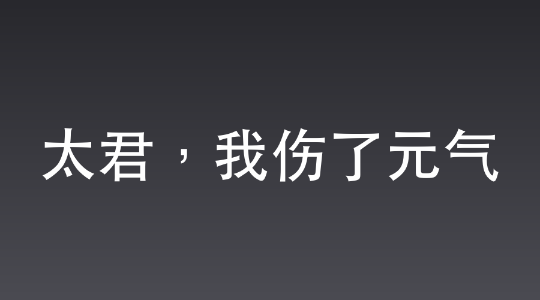

# 太君，我伤了元气

大雪压城，1942年深秋的刺骨寒风，剥离了晋西北大地的生机。

平安县城，日军陆军总医院，前清老衙门改建的西洋式主楼。

走廊里，浓烈刺鼻的来苏水味，盖不住伤口化脓的腐臭。担架胶轮在水磨石地面上碾出沉闷的震动，伴随着伤兵绝望的嚎叫，像锯条般拉扯着人的耳膜。

在这座医院最深处的特级病房里，却是一片荒诞的景象。

本来，按照特高课少佐武田之前的部署，沈飞在观摩团覆灭一役中替少将“挡刀”重伤，伤愈后应该直接随行前往太原第一军司令部，加入更大的情报机构工作。

然而，战地观摩团全军覆没的消息彻底激怒了华北方面军司令部。

代号“铁壁合围”的残酷大扫荡提前打响，整个晋西北瞬间被划为最核心的铁桶包围圈。作为前线特工主脑的武田少佐不得不推迟前往太原的日程，留守平安县城。

这也给了沈飞最关键的苟延残喘之机。

此刻，沈飞半躺在病床上，从脖颈一直到肩膀被厚厚的白纱布裹得像个木乃伊。

只要吞咽肌肉微弱一动，伤口深处那险些被切断的颈动脉，就会在纱布外层渗出一丝血迹。

病床边，皇协军大队长沈老三，正趴在床沿边扯着破锣嗓子大声干嚎。

“表弟啊——我苦命的表弟啊！你可千万不能两腿一蹬就这么走啦！你要是咽了气，留下老哥哥我可怎么活啊！”

沈老三嚎得惊天动地，粗糙的手在满是横肉的脸上乱抹，把五官拧出凄惨的褶皱。

然而，他那双眨巴的绿豆眼里，连一星半点的眼泪都没有。

沈老三的眼珠在病房里飞快扫视，甚至用手指去抠摸木床架的材质，在心里疯狂打着盘算。

表弟这大半年来在太君面前红得发紫，捞的油水绝对是个天文数字。

城东那套三进大宅子的房契到底藏哪了？床底下那块翘起的青砖下面，是不是埋着金条？

他甚至在脑中权衡着一个极其严重的问题：如果表弟真的成了废人，自己要不要花十块大洋买通日本医生，在换药的时候“失手”结束了他的性命？

死掉的表弟留下来的遗产，比一个活着的废人可要香得多。

但转念一想，这次惨烈的大扫荡让城里的汉奸们都人心惶惶。没了沈飞这个能直接跟武田少佐说上话的靠山，自己这伪军大队长的油水位置也坐不稳。

“唉，还是活着好，活着能继续当摇钱树。”沈老三在心里叹了口气，随即加大了干嚎的音量，“表弟啊！你快睁开眼看看哥啊！”

就在沈老三的干嚎声达到高潮时，病房那扇沉重的包铁隔音门，被缓慢地推开了。

门外巡视的宪兵立刻立正，皮靴发出响亮的合拢声。

武田少佐跨步走入。

今天，武田没有穿平时那身沾满血腥的常服，而是罕见地换上了一套笔挺的帝国陆军少佐礼服，胸前佩戴着绶带。

他双手没有戴象征审讯的黑皮手套，而是换上了一双纤尘不染的雪白礼仪手套，郑重地捧着一个黑色丝绒托盘。

托盘中央，静静躺着一枚闪烁金属冷光的——大日本帝国陆军武勇勋章。

病床边跪着的沈老三眼珠子瞬间直了。他张大嘴巴，口水在嘴角亮晶晶地拉成了一条细丝，视线死死黏在那枚黄澄澄、亮闪闪的勋章上面，在心底疯狂地打着金算盘：

“我的娘咧……这得有二两金子吧？瞧太君这阔绰的做派，纯金无疑啊！表弟这脖子挨得可太值了。要是天天能替太君挨这么一刀，咱沈家都能直接在太原城开金铺了！不行，待会儿表弟咽气……呸，伤重不行的时候，我得想办法把这勋章顺走，到当铺里打两副金耳环送给翠花，翠花还不得让我死在她炕上……”

沈飞躺在病床上，虽然闭着眼，但听到沈老三因为极度贪婪而发出的粗重喘息声，眼角忍不住疯狂抽动。他用尽全力才克制住当场一拐棍打死这头蠢猪的欲望。

这几天，观摩团覆灭的巨大耻辱，以及对高层内鬼的排查，让武田几乎没有合眼。但当他的目光落在病床上奄奄一息的沈飞身上时，这位冷酷多疑的特务头子，眼神中竟罕见地流露出一抹愧疚。

在幸存者的证词和那道几乎切断脖子的骇人刀伤面前，武田特工生涯中所有对沈飞的怀疑都被击得粉碎。

“沈桑。”

武田走到病床前，双腿并拢，皮靴发出沉闷的碰撞声。他俯下身，看着沈飞脖子上缠得里三层外三层的厚厚绷带，语气里少有地带着几分温和：

“沈桑，你脖子上的伤口，听军医说险些切断了气管。如今感觉如何？能说出话来吗？”

沈飞喉结微动，由于伤势严重，他所有的动作都显得极其迟缓、僵硬。他极慢地挪动右手，似乎想要向武田少佐敬礼，却因为牵扯到脖颈的肌肉而痛得眉头扭曲，口中只能发出极其沙哑、微弱的抽气声。

武田抬手轻轻按住沈飞的肩膀，制止了他这艰难而迟缓的动作。武田将托盘放在床头柜上，白手套抚过勋章边缘。

“这枚武勇勋章，是你作为帝国忠臣应得的荣耀。司令部决议，等你伤愈之后，委以绝对的重任。机密情报部门需要你这样忠诚的人。”

病房里的空气，在这一刻压抑得令人窒息。

然而，躺在病床上的沈飞，看着那枚近在咫尺、闪烁着金属冷光的武勇勋章，刚刚睁开的眼睛里，在瞬间掠过了一抹极其强烈的危机感。

只有他自己知道，当初在太原观摩团遇难的那个战场上，所谓的“用血肉之躯替少将挡刀”到底是怎么回事。他脖子上的恐怖刀伤，是一场被算计到极致的假死脱身，根本不是什么效忠太君。

沈飞在脑海里疯狂地打着算盘，默默地权衡着眼前的利弊。

这枚武勇勋章看似是至高无上的荣耀，实则是一道套在脖子上的铁枷锁。

一旦被武田彻底当成“帝国功臣”拉入特高课的核心圈，等待他的，必定是二十四小时无死角的明哨暗哨监控。在这种高压的蛛网下，他作为卧底将彻底失去活动的自由，更别说帮八路军传递情报。

他这一刻脑袋清晰无比——他必须搞到大批治疗疟疾的特效药奎宁，送出城去拯救即将面临断药绝境的独立团。

但在戒严状态下，全城的西药行都已被特高课的刺刀查封。若想大张旗鼓地去黑市收购那些被管制的药方和药物，以一个“正人君子”的英雄身份去，肯定会引来无数只眼睛的盯梢。

除非……他变成一个为了下半身欲望而彻底发狂的无耻之徒。

一个卑劣下作、满脑子只有裤裆里那点传宗接代破事的人渣走狗，谁会在意他为什么天天往黑市里钻、四处高价搜罗虎鞭和偏方？

武田生性孤傲冷酷，甚至带着日本贵族特有的精神洁癖。只要沈飞展现出极度粗鄙、恶俗的阳痿姿态，武田不仅不会怀疑，反而会出于嫌恶，主动避开对他隐私的盘查，甚至可能会给他大开绿灯！

沈飞下定决心，他必须亲手砸碎武田给他戴上的这顶高尚的“英雄”桂冠！

就在武田少佐满脸大度，准备替沈飞佩戴勋章时，下一秒。

“太君啊！！！”

一声尖锐的嚎叫瞬间在死寂的病房里炸响！

原本奄奄一息的沈飞突然诈尸般从病床上挣扎着弹了起来。他根本不管脖子上刚刚结痂的伤口瞬间崩裂、鲜血立刻染红了纱布，整个人直接扑出床沿，双手死死锁住了武田少佐那条笔挺的军裤大腿。

“呜呜呜……太君！我没法活了！我彻底废了啊！”

沈飞仰着头，扯着破锣嗓子嚎啕大哭。伤口撕裂的剧痛让他生理性地狂飙眼泪，大量的鼻涕脓血，一股脑儿全蹭在了武田那一尘不染的马裤上。

武田瞳孔巨震，整个人如遭雷击，捧着勋章的手僵在半空中。

“沈、沈桑……你这是……”

“不是脖子啊太君！”

沈飞哭得捶胸顿足，毫无尊严地把脸贴在武田的裤腿上蹭着，指着自己的下半身悲愤欲绝：“是下面啊！当时那八路的大刀片子带着煞气砍过来，我往地上一摔……那一下摔得太重了啊！我这两天一点感觉都没有了，我这下半身的元气全散了啊！我老沈家……要绝后了啊太君！”

沈飞哭得像个在集市上撒泼打滚的无赖。

武田少佐眼角的肌肉，开始以一种肉眼可见的频率疯狂抽搐。

他低头看着自己被血污弄得肮脏、甚至散发着腥臭的裤腿，再抬起头，看着面前这个为了裤裆里那点事而把武勇勋章视如粪土的恶心男人。

那一瞬间，军国主义高尚的“武士道滤镜”如遭万锤重击，碎了一地。

“沈桑，你这卑微的灵魂，比这下水道里的老鼠还要令人作呕。”

武田死死攥着拳头，胃部翻江倒海，用最嫌恶的目光俯视着沈飞。他缓慢地拉下那只沾满鼻涕血污的白手套，像丢弃恶臭的生化垃圾一样，扔在了沈老三身前的水磨石地板上。

“告诉你，皇军即将展开史无前例的‘铁壁合围’大扫荡。从明天起，整个晋西北将进入最高级别的军事封锁。连一只蚊子，都别想飞进八路军的根据地。”

武田冷冷地抛下最后一句话：“至于你说的那些下三滥的偏方，你让这个蠢货去黑市随便买。只要不是军需违禁品，你就算把黑市的虎鞭全部搬空，我也绝不过问。不要再拿你裤裆里那点破事，来污染司令部的空气！”

说罢，武田咬牙切齿地拂袖而去，金属皮靴将地板踩得震天响。

“砰”的一声铁门重重关上。

沈飞缓缓缩回被子里，擦了擦眼角的眼泪，刚刚嚎哭撕裂的脖颈伤口还隐隐抽痛。

但他眼镜后的目光，却在一瞬间恢复了清明冷彻。

武田那厌恶到了极点的眼神，换来的是一张特许采购的通行绿卡。只要借着寻访偏方、重振雄风的由头，他就能在黑市上大张旗鼓地收购奎宁等急救药物。

接下来的铁壁大扫荡中，李云龙和独立团那几千名发摆子的战士，终于有了救命的退烧特效药。

他捂着脖子，在被子里微不可察地笑了。

一旁的沈老三对这一幕都看傻了，表弟这又是唱的哪一出啊。

📅 2026年05月23日

