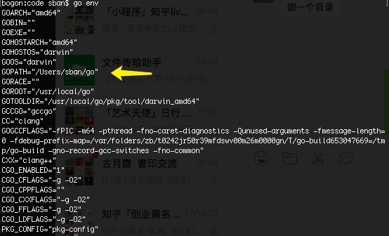
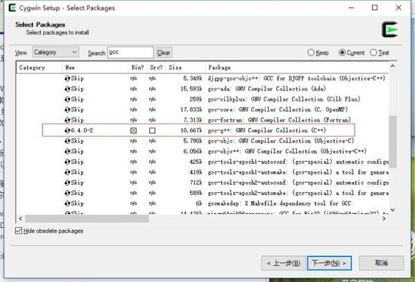
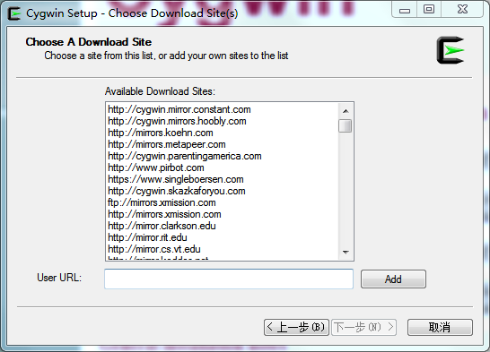
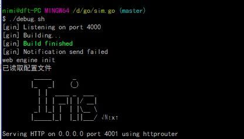
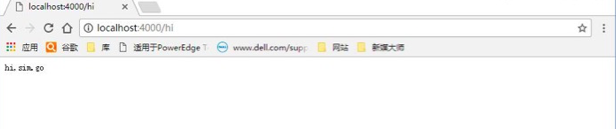
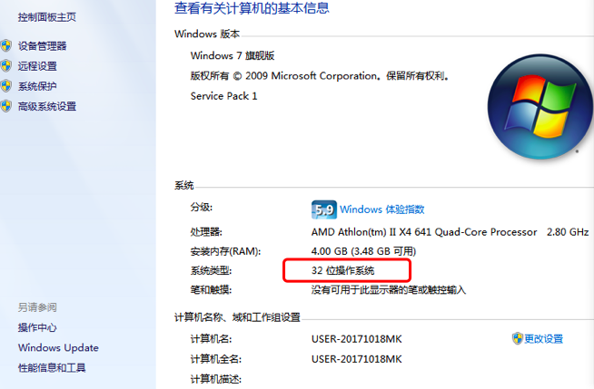
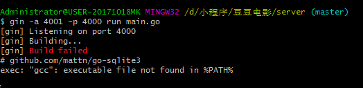
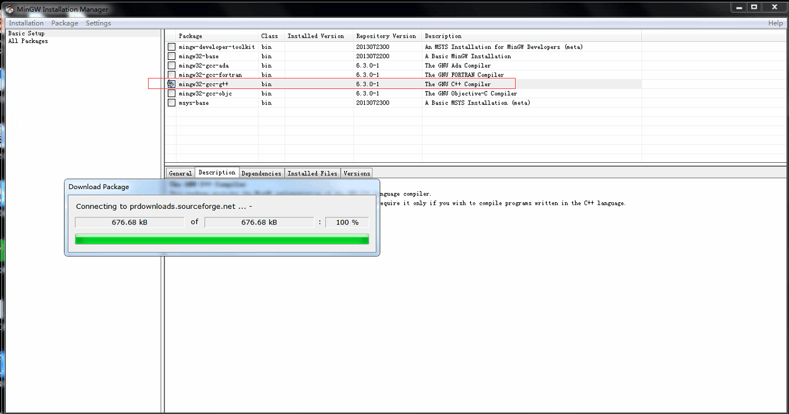
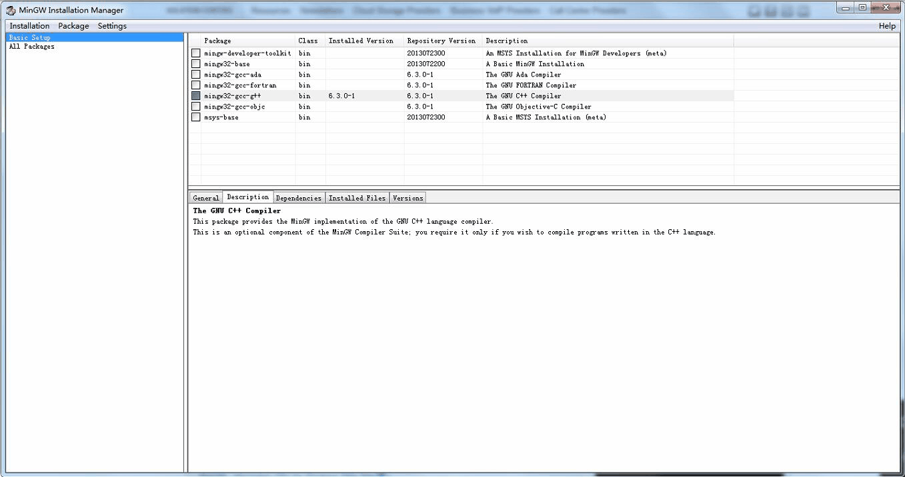
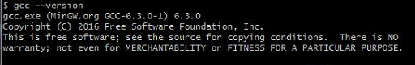

# 小程序从0到1：第一次在windows机器上使用sim.go需要注意的问题总结

在win系统上安装gcc分两种情况，一种系统是win10，另一种是win7。如果是后者，请跳到子目录7查看。

作者在写书的过程中，所有demo均是基于mac系统构建。使用mac电脑学习的读者，不存在以下问题，可以略过了。

因为windows系统默认不安装gcc，而在sim.go中使用了sqlite3类库，该类库间接使用了cgo，在编译的过程中需要gcc编译器，因此有了这篇教程。

## **1，使用git bash代替cmd**

windows读者按照书上第96页，第7.1.2小节“安装仓库管理工具git”的说明，完成了git的安装之后，就不要再使用系统自带的终端工具cmd了，要使用git bash。在任何目录空白处，右键单击，就可以看到“Git Bash Here”的菜单。

使用git bash代替cmd有哪些好处呢？

1）首先，cd更加方面

如果在当前的项目目录打开git bash，会直接定位到当前目录，免去了cd的麻烦。在git bash中，/c/代表c:/，/d/代替d:/，使用习惯是类linux的。

2）其次，避免将sim.go误判为文件

## **2，golang.org/x类库无法下载的问题**

这是一个读者遇到的问题：

> C:\Users\Administrator>go get github.com/rixingyike/sim.go package golang.org/x/net/context: unrecognized import path "golang.org/x/net/context" (https fetch: Get https://golang.org/x/net/context?go-get=1: dial tcp 216.239.37.1:443: connectex: A connection attempt failed because the connected party did not properly respond after a period of time, or established connection failed because connected host has failed to respond.)

因为被墙，国内没有办法直接下载这个Google官方的类库。解决方法：

1）手动下载x类库

```
git clone https://github.com/rixingyike/golang.org-x
```

2）将clone下来的x目录放至$GOPATH/src/golang.org目录下

解决了上述问题之后，别忘记再次运行“go get github.com/rixingyike/sim.go”

## **3，如何找到$GOPATH/src/golang.org目录？**

在终端中执行：

```
go env
```

查看GOPATH所在的目录



在windows上cmd中执行go env，可能输出是这样的：


如果没有在src目录下找到golang.org目录，新建一个。

## **4，安装gin工具**

正常情况下，启动服务端后，在浏览器访问localhost:4000/hi，会看到文本的输出。

这是一位读者看到的：


服务尚未启动。需要检查是否在当前项目的后端目录下，执行了debug.sh脚本。

如果执行debug.sh脚本，终端未被阻塞，可能脚本未执行成功。此时在终端里输入：

gin

查看有没有输出。如果输出：


则说明gin尚未安装成功。如果已经按书上第96页的步骤，安装了gin工具。出现这种问题，是因为没有把GOPATH/bin目录添加进windows系统变量PATH中。在windows机器上，右键单击“计算机”，选择“属性”->“高级系统设置”->“系统变量”，在当前用户下找到PATH变量，在尾部添加目录。

安装并设置环境后，再次执行gin指令，如果输出：


说明安装成功了。

## **5，如何更新sim.go**

go get -u github.com/rixingyike/sim.go

使用以上脚本更新sim.go类库，如果出现了以下输出：


不用管它，不影响继续征程。

## **6，在windows10上安装gcc**

启动服务后，访问http://localhost:4000/hi，有读者遇到这样的错误：


这是因为没有安装gcc编译器。win10解决方法：

1）去https://cygwin.com/install.html，下载setup-x86_64.exe

2，下载后，选择网络安装。等列表加载后，在顶部的搜索框里输入gcc。


在Devel这一组下选择gcc-g++:



往后就一路默认安装。

完成安装后，在终端内输入gcc，会看到有内容输出。

至于下载时选择哪个镜像地址：



一般选择前面的，下载会比较快。

gcc安装后，在git bash里再次执行debug.sh（sh文件在windows系统的git bash里也是认的）。输出像这个样子：



浏览器访问http://localhost:4000/hi，是这样的：



作者用win10作了测试，以上安装gcc的流程可以跑通。

## **7，在win7系统上安装gcc**



如果是win7 32位系统，按照上面的方法安装，可能会出现以下问题：



这是一位读者遇到的问题，作者也是第一次遇到。为了解决该问题，作者请读者在电脑上安装了远程工具teamviewer：https://www.teamviewer.com/zhCN/

作者在这位读者的电脑上进行远程操作。解决方法是：

1）首先，将系统变量里的cygwin去掉

2）然后，如果是win7 32位系统，去这里https://sourceforge.net/projects/mingw/，下载Minimalist GNU for Windows，并安装之；如果是win7 64系统，去这里https://sourceforge.net/projects/mingw-w64，下载最新版本并安装。

3）安装以后，仍然是类似的方法，选择gcc-g++package安装



安装方法是选择后，再选择菜单里的apply change。选择后如下所示：



在终端里输入gcc --version，正常的输出：

