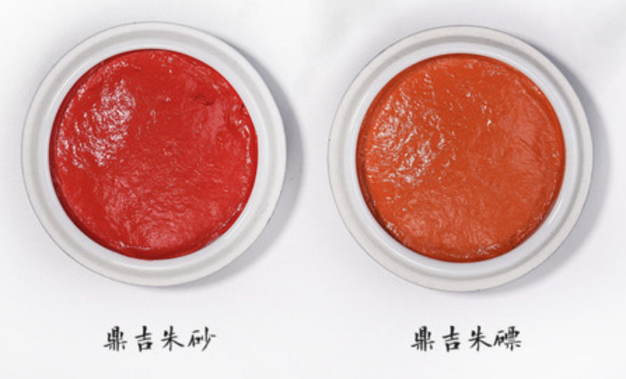
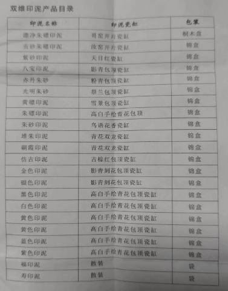
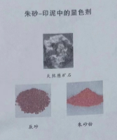
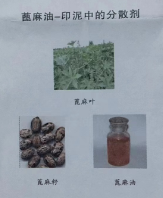
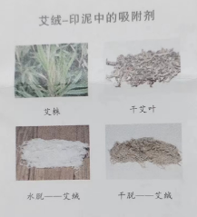

# 印泥的种类、起源、使用与保养

你好，今天聊一下鱼汤，不是，是印泥。

## 种类

种类繁多，以下是双维印泥厂子生产的品类。我用过的有堆朱、朱砂、朱磦（piao）、黄磦印泥，它们颜色的亮度也是按我给出的顺序依次拔高的，其中黄磦印泥最喜欢，目前主要使用的也是这一款。

## 印泥的起源

据考古和史书记载，印泥的发展已有两千多年的历史。

早在春秋期就已经出现了印泥。不过那时候的印泥和现在不同，它是用由多种物质配制的黏土做的，平时搓成泥丸子，临用时用水湿透。因为当时的公文和书信是用漆书写在竹简木牍上的，为了防上泄密或传递过程中的私拆，在写好了的简牍外面加上一块挖有方槽的木块，再用绳子把它们捆在一起，然后把绳结放入方槽内，加上一丸湿泥封上，再用铜印章铃上印记，作为封检的标记发出去。这种泥丸称为“封泥”可以视为印泥的始祖，这种封泥工艺一直沿用到了魏晋南北朝。

随着造纸术的诞生和发展，纸张逐渐取代简牍成为人们日常生活中的必需品，公私书信一律改用纸张，用泥封信的陈旧做法也不再适用。于是人们又改用清水，调制朱砂于印面，再印在纸上，称之为“濡朱”，这就是现代印泥的雏形。所谓“濡朱”，就是把朱砂与胶水或蜂蜜之类的黏液体调和后，涂在印文上，然后盖在纺织品或纸张上。

但水或蜂蜜调和的印泥容易脱落不能长久保存。为解决朱砂易落的问题，长期以来人们尝试不同的方法对此进行改进，终于发现用油调朱砂不容易脱落，这成为印泥发展的又一个重要转折，印泥由此也开始进入艺术领域。这个时间点大概在元末明初王冕生活的年代，以花乳石为章料，以刻刀为工具，以篆字入印的篆刻开始兴起，印泥同时也得到了广泛的使用。

现代印泥除了办公盖戳办的印泥，书画用的印泥，沿用的仍然是老制作工艺。材料主要有以下三种。

### 朱砂

朱砂是印泥中的显色剂，先由天然原矿石碎成辰砂，最后磨成朱砂粉。

### 蓖麻油

蓖麻油是印泥中的分散剂，由蓖麻叶、蓖麻籽炸出蓖麻油。

### 艾绒

艾绒是印泥中的吸附剂，从艾株上采下干艾叶，制成艾绒，最后干脱，制成印泥用的干艾绒。

## 使用说明

下面说一下使用，先调泥，接着蘸泥，最后盖印。如果经常使用，第一步调泥是可以省略的。

调泥：

1、入缸：先将印泥盛装于瓷或玉的印泥盒中。金属盒不可用，因朱砂会产生缓慢的化学反应，导致颜色改变。

2、调堆：印泥使用前，用印筋将置于印泥盒内的印泥上下翻动。

3、同时顺势沿同一个方向环转搓压，转动印缸，另换挑拨位置状，反复多次，直至印泥堆成一个顶部球。

蘸泥：

1、一手持稳印缸，一手持章，使印面触打堆好的印泥顶上的圆光处。

2、轻触轻打，边打边转动印章，使印章四边、中间均匀上色，

铃印：

1，铃印时，用力要均匀、平稳，宜轻宜慢，防止晃动。

2、起印时，时间不宜过长，见色透底即起，呈现完美的印蜕。

## 保养

印泥的保养

许多人认为书画篆刻印泥同普通办公印泥一样无需保养，其实是大错特错了。越是好的印泥越是需要人们对它呵护。以下我们介绍一些最主要的保养方法，以供大家参考。

1、慎收贮一一容器采用旧瓷器最好，水晶玉器亦可，不宜开铜物于金属，取总用漆器木器陶器，以及犀象等动物骨骼容器。使用金属器，容易同印泥产生化学反应，使印泥变黑变硬。而漆器木器陶器等容器，由于其结构疏松，孔隙较大，印泥中的油分容易散失，会影响其长期正常使用。如果一定要使用上述忌用器具，可在容器内壁加涂一层薄膜，隔离其间，就无大碍。

2、宜翻晒一一春冬日暖，宜晒一时；夏秋日烈，宜晒一刻。久而不动，印色自坏。

3、远污垢一一盖章用毕必净章面，盖好印缸，毋使灰落，有损印泥质量。

4、慎霜湿一一芒种后霜概宜尚阁，冀北风尚，防其灰入，南山烟雨，斥卤卑湿，高藏慎密，又宜常晒。

5、勤翻调一一印泥存放时间长久之后，砂体沉下，油性浮上，会产生分层现象。所以，须经常翻调至均，和其体性。一般十日半月就需翻调一次。

书画印泥是用油调制的，不怕晒。它也不怕翻动，时间久了油少了，还可以往里面添点蓖麻油。

