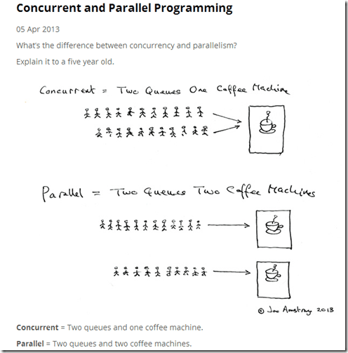

# Rust学习笔记4：智能指针、引用和并发

## Drop特征

使用drop方法可以回收所有权，释放内存。drop方法不需要程序员手动调用，编译器会为我们自动插入drop代码并在变量退出作用域时调用之。调用顺序是：

- 先声明的后调用，后声明的先调用；
- 在结构体内，结构体的drop先调用，继而按照字段的定义顺序调用字段的drop方法。

对于下面这个示例：

```rust
// 定义一个简单的结构体
struct Resource {
    name: String,
}

// 为 Resource 实现 Drop trait
impl Drop for Resource {
    fn drop(&mut self) {
        println!("Dropping resource: {}", self.name);
    }
}

fn main() {
    // 创建两个 Resource 实例
    let resource1 = Resource {
        name: "Resource 1".to_string(),
    };
    let resource2 = Resource {
        name: "Resource 2".to_string(),
    };

    // 创建一个作用域
    {
        let resource3 = Resource {
            name: "Resource 3".to_string(),
        };
        println!("Resource 3 is in scope");
    } // resource3 离开作用域，drop 方法被调用

    println!("End of main function");
    // resource1 和 resource2 离开作用域，drop 方法被调用
}
```

输出顺序为：

> Resource 3 is in scope
> Dropping resource: Resource 3
> End of main function
> Dropping resource: Resource 2
> Dropping resource: Resource 1

这个顺序验证了上面所讲的drop次序。

## 引用计数智能指针Rc与Arc

Rc是reference counting的缩写，是引用计数的意思，当我们使用它时，Rust会自动统计、管理引用记数，并在记数为0的时候自动将对象回收。我们可以通用Rc::clone复制对象——复制的仅仅是引用，同时让引用记数加1；可以通过Rc::string_count随时查看引用计数。

无论是Rc还是Arc，都是不可变记数引用，都不能对数据进行修改。两者在使用上没有区别，唯一的区别在于前者用于单线程内，后者用于多线程内。下面看一个Rc的示例：

```rust
use std::rc::Rc;

fn main() {
    // 创建一个 Rc 实例，引用计数为 1
    let data = Rc::new(42);

    // 克隆 Rc，引用计数增加
    let _data_clone1 = Rc::clone(&data);
    let _data_clone2 = Rc::clone(&data);

    // 打印引用计数
    println!("Reference count after cloning: {}", Rc::strong_count(&data));

    // 离开作用域，引用计数减少
    {
        let _data_clone3 = Rc::clone(&data);
        println!("Reference count inside inner scope: {}", Rc::strong_count(&data));
    }

    // 离开作用域后，引用计数恢复
    println!("Reference count after inner scope: {}", Rc::strong_count(&data));

    // 离开 main 函数，引用计数降为零，数据被清理
}
```

在这个示例中，第17行，当离开一个作用域时，引用自动减少了。记数为零时，对象即被清理。

输出结果为：

> Reference count after cloning: 3
> Reference count inside inner scope: 4
> Reference count after inner scope: 3 

再看一个Arc示例：

```rust
use std::sync::Arc;
use std::thread;

fn main() {
    // 创建一个 Arc 实例，引用计数为 1
    let data = Arc::new(42);

    // 克隆 Arc，引用计数增加
    let data_clone1 = Arc::clone(&data);
    let data_clone2 = Arc::clone(&data);

    // 打印引用计数
    println!("Reference count after cloning: {}", Arc::strong_count(&data));

    // 创建线程
    let handle1 = thread::spawn(move || {
        println!("Thread 1: Data = {}", data_clone1);
    });

    let handle2 = thread::spawn(move || {
        println!("Thread 2: Data = {}", data_clone2);
    });

    // 等待线程完成
    handle1.join().unwrap();
    handle2.join().unwrap();

    // 打印引用计数
    println!("Reference count after threads: {}", Arc::strong_count(&data));

    // 离开 main 函数，引用计数降为零，数据被清理
}
```

Arc智能指针允许移动对象进入线程内，多个线程的引用消耗会自动同步。

## Cell与RefCell

Cell充许在获取值的同时，还对值进行修改，这跳过了Rust的所有权规则。不过Cell仅针对实现了Copy的数据类型。示例：

```rust
use std::cell::Cell;

fn main() {
    // 创建一个 Cell，存储一个整数
    let value = Cell::new(42);

    // 获取 Cell 中的值（通过复制）
    println!("Initial value: {}", value.get());

    // 修改 Cell 中的值
    value.set(100);

    // 再次获取 Cell 中的值
    println!("Updated value: {}", value.get());

    // 通过 `get` 和 `set` 方法修改值
    let old_value = value.replace(200);
    println!("Replaced value: {}, Old value: {}", value.get(), old_value);

    // 使用 `into_inner` 获取 Cell 中的值（消耗 Cell）
    let final_value = value.into_inner();
    println!("Final value: {}", final_value);
}
```

这个示例会让Rust初学者感到疑惑，怎么，所有权规则不起作用了吗，一个值同时既可以获取又可以修改吗？但这种Cell仅针对实现了Copy特征的基本类型，例如上面的i32，实际上像i32这样的简单类型一般是没有必要使用Cell的。

输出为：

> Initial value: 42
> Updated value: 100
> Replaced value: 200, Old value: 100
> Final value: 200

Cell像一个世外桃园盒子，可以往里面存数据，也可以取数据，貌似还不受Rust所有权规则的约束。

RefCell用于没有实现Copy特征的，在它内部没有发生Copy，内存还是那一块内存，它只是将Rust编译器在编译时的警告延后了，如果在运行时违反了Rust规则，仍然会有panic异常。示例：

```rust
use std::cell::RefCell;

fn main() {
    // 创建一个 RefCell，存储一个 String
    let message = RefCell::new(String::from("Hello"));

    // 获取 RefCell 中的不可变引用
    {
        let msg = message.borrow();
        println!("Initial message: {}", *msg);
    } // 不可变引用离开作用域，释放借用

    // 获取 RefCell 中的可变引用并修改值
    {
        let mut msg = message.borrow_mut();
        msg.push_str(", world!");
    } // 可变引用离开作用域，释放借用

    // 再次获取 RefCell 中的不可变引用
    let msg = message.borrow();
    println!("Updated message: {}", *msg);

    // 尝试违反借用规则（会导致 panic）
    // let mut invalid_borrow = message.borrow_mut(); // 这里会 panic，因为已经有一个不可变引用
}
```

第24行，因为在第20行已经有一个不可变引用，所以这里不能再有一个可变引用，但这个错误不会在编译期报出来，只会在运行时报出来。第15行有一个可变借用，没有关系，因为到第17行它就释放了。这是使用RefCell的好处，可以跳过编译期严格的检查。

最终输出为：

> Initial message: Hello
> Updated message: Hello, world!

RefCell可以方便地实现内部可变性，当我们不方便修改第三方特征签名的时候，用RefCell的borrow_mut方法，这样可以修改数据。

Rc+RefCell可以结合起来，实现多个变量都能获得可变引用，并进行数据修改的代码。示例：

```rust
use std::rc::Rc;
use std::cell::RefCell;

fn main() {
    // 创建一个 Rc<RefCell<String>>，存储一个 String
    let data = Rc::new(RefCell::new(String::from("Hello")));

    // 克隆 Rc，增加引用计数
    let data_clone1 = Rc::clone(&data);
    let data_clone2 = Rc::clone(&data);

    // 修改 data_clone1 中的数据
    {
        let mut borrowed_data = data_clone1.borrow_mut();
        borrowed_data.push_str(", world!");
    } // 可变引用离开作用域，释放借用

    // 修改 data_clone2 中的数据
    {
        let mut borrowed_data = data_clone2.borrow_mut();
        borrowed_data.push_str(" How are you?");
    } // 可变引用离开作用域，释放借用

    // 打印最终的数据
    println!("Final data: {}", data.borrow());
}
```

Rust为了实现内存安全，在各个方向上围堵程序员的错误可能性，在实在没有办法的场景，仍然开放了像C++那样信任程序员的方法，给予了程序员自由。

## Weak弱引用

`Rc<T>`中的T仍然受记数约束，只要记数不为0，它就不能被回收。`Weak<T>`不同，它不影响回收，它只是被动地使用，这种弱化的引用特别适合用于结构体中的自引用。对于`Rc<T>`，调用downgrade，可以得到一个`Weak<T>`，在`Weak<T>`上面调用upgrade方法，又可以得到一个`Option<Rc<T>>`，它可能是一个`Rc<T>`，也可以是None。

下面是一个使用了Weak弱引用的例子：

```rust
use std::rc::Rc;
use std::rc::Weak;
use std::cell::RefCell;

// 学生
struct Student {
    name: String,
    friends: RefCell<Vec<Weak<Student>>>,
}

impl Student {
    fn new(name: &str) -> Rc<Student> {
        Rc::new(Student {
            name: name.to_string(),
            friends: RefCell::new(Vec::new()),
        })
    }

    fn add_friend(&self, friend: &Rc<Student>) -> &Student {
        self.friends.borrow_mut().push(Rc::downgrade(friend));
        self
    }
}

fn main() {
    // 创建三个学生
    let xiaoli = &Student::new("小李");
    let xiaowang = &Student::new("小王");
    let xiaoming = &Student::new("小明");

    // 建立朋友关系
    xiaoli.add_friend(xiaoming).add_friend(xiaowang);
    xiaowang.add_friend(xiaoli).add_friend(xiaoming);
    xiaoming.add_friend(xiaoli).add_friend(xiaowang);

    // 打印每个学生的朋友
    let students = [xiaoli, xiaowang, xiaoming];
    for student in students.iter() {
        println!("{} 的朋友有:", student.name);
        for friend_opt in student.friends.borrow().iter() {
            if let Some(friend) = friend_opt.upgrade() {
                println!("  - {}", friend.name);
            } else {
                println!("  - <已删除的朋友>");
            }
        }
    }

    // 在 main 函数的最后，xiaoli, xiaowang, xiaoming 都会被销毁
    // 由于使用了 Weak<T>，避免了循环引用问题
}
```

第20行通过downgrade拿到了`Weak<Studnet>`。

最终输出为：

```
小李 的朋友有:
  - 小明
  - 小王
小王 的朋友有:
  - 小李
  - 小明
小明 的朋友有:
  - 小李
  - 小王
```

## 用裸指针实现结构体的自引用

下面是一个简单的示例，但却无法通过编译：

```rust
struct SelfRef<'a> {
    value: String,
    pointer_to_value: &'a str,
}

fn main() {
    let value = String::from("Hello, world!");
    let self_ref = SelfRef {
        value: value,
        pointer_to_value: &value[0..5],
    };
    println!("value: {}", self_ref.value);
    println!("pointer_to_value: {}", self_ref.pointer_to_value);
}
```

第9行，我们将value的所有权转移到了结构体SelfRef内，第10行，我们又企图用引用的方法划取value中的一部分，既有转移，又有引用，这在其他语言中是很平常的事情，在Rust中无法通过编译。

怎么解决？最简单的方法是在第9行上，给value加一个clone的尾巴。但今天我们不要这样做，示例：

```rust
struct SelfRef {
    value: String,
    pointer_to_value: *const String,
}

impl SelfRef {
    fn new(value: String) -> Self {
        let pointer_to_value = &value as *const String;
        Self {
            value,
            pointer_to_value,
        }
    }

    fn get_pointer_to_value(&self) -> &str {
        unsafe {
            &*self.pointer_to_value
        }
    }
}

fn main() {
    let mut self_ref = SelfRef::new("Hello,".to_string());
    println!("value: {}", self_ref.value);
    println!("pointer_to_value: {}", self_ref.get_pointer_to_value());
    self_ref.value.push_str("World!");
    println!("value: {}", self_ref.value);
    println!("pointer_to_value: {}", self_ref.get_pointer_to_value());
}
```

第8行，pointer_to_value是一个裸指针。第17行，使用unsafe修饰符将它指向的字符串返回。

输出：

> value: Hello,
> pointer_to_value: Hello,
> value: Hello,World!
> pointer_to_value: Hello,

使用裸指针是实现有自引用字段的结构体的最简单、最优雅了方法了。

## 并发与并行的区别



如果将计算机的CPU比做咖啡的话，并发是计算机任务排成两个队或多个队，每个队轮流喝咖啡。而并行是排成两个队还多个队，每个队同时喝咖啡。

这是两个相似的概念，很容易搞混，英语单词也有所不同，并发是Concurrent，并行是 Parallel。

## 操作系统中的并发与并行

如果允许多个任务同时并发存在，那么这个系统就是并发系统；如果允许多个任务并行执行，那么这个系统就是并行系统。现代计算机往往有多个核心，同时现代操作系统也基本都允许多线程并发，线程与操作系统的核心构成了`M:N`的关系，表面上无论有多少M个任务在并发，实际上，在每一时刻，真正并行的只有N个。

## 运行时大小与三种并发模型

除了汇编语言，每种语言在编译成二进制文件的时候都有运行时，只是或大或小的问题。即使是Rust语言，它也有自己的运行时。运行时比较大的像Go语言，因为它本身实现了协程和GC，所以它的运行时比其它高级语言还更大一些。我们即使用Go语言实现一个只有`Hello Word`打印这样很小一个功能的程序，它发布的二进制包也不会很小。

高级语言在实现线程并发的方案上大致分为三种：

第一种像Rust，是一比一的实现，Rust里边的线程对应的就是操作系统里边的线程，是一比一的关系。

第二种是`M:N`的关系。代表语言是Go语言，这里的M要比N大，这是一种在语言层面实现的多线程，或者是称之为协程，或绿色线程。它的目的是为了用更小的系统资源实现更多的线程并发。

第三种是用Actor实现多线程，线程之间用信息同步。代表语言是Erlang。

Go语言采用协程的方式实现线程，是为了方便开发者。快速实现县城并发。并且是高效的实现。Ru没有采用，那是因为right的他想以更小的代价。恩，最小的占用运行时的这样一种方式。去实现多线程。并且像够远的那种。携程的实现方式在ru里面也有第三方库五实现了啊，叫Tokyo，开发者呢，其实是可以自行选择和使用的。包括类似于long around a模型啊，也是可以选择和使用的。


2025年03月11日