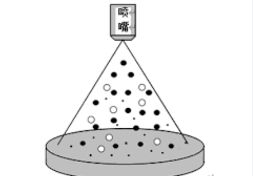

# 奇异点是一个能量喷嘴

现代宇宙大爆炸学说认为，所有一切，整个宇宙都是很久以前从奇异点炸开的，开始是星云，后来逐渐形成恒星、行星和彗星。地球大概是在46亿年前，由太阳的碎片形成的。在宇宙大爆炸的初期，由于天体离得比较近，相互发生碰撞的概率大，太阳大概是在这个时期被其他天体撞击、点燃，然后分化出地球的。整个太阳系都是太阳的孩子。

那个诞生宇宙的奇异点，据说是一个体积无限小、密度无限大的点。也有一种可能，这个奇异点是一个喷嘴，它喷射出能量，然后能量冷却，汇聚成物质，物质自然凝聚又形成天体，天体旋转凝聚形成星系。

