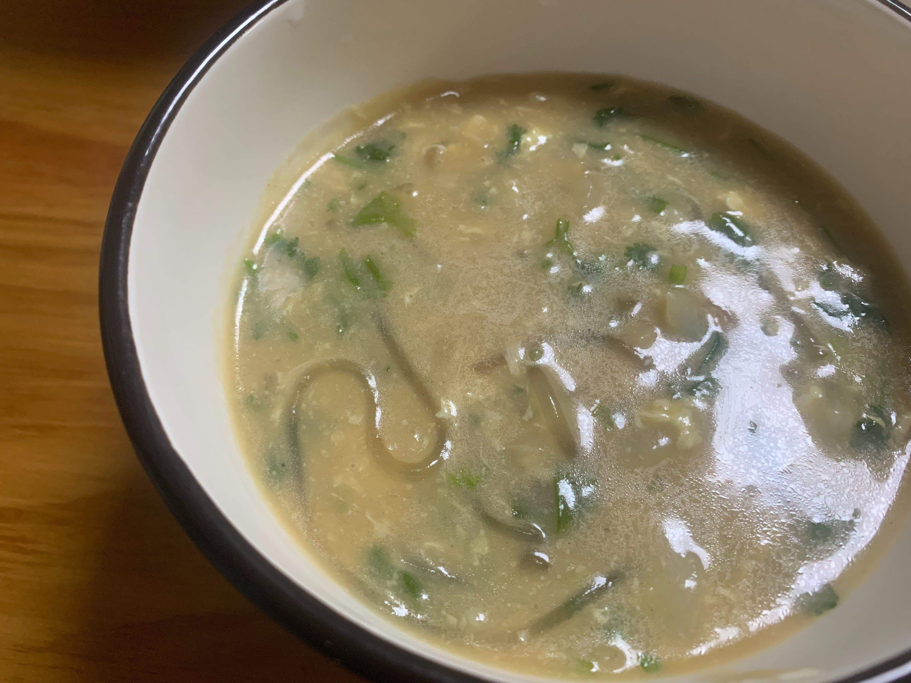

# 山东咸汤——鲁菜前三之一

脱口秀两位鲁菜大师可能只是开开玩笑，但我当真了，复刻了这道咸汤。结果——味道好极了，好汤就应该是这个味道！这个味道也应该是鲁菜第一。我检查了一下，这道汤的碳水不多，减肥人士也可以喝，喝个三四碗感觉很饱，其实吃下去的实物有限。

做法很简单。

白萝卜（不要削皮不要削皮，削皮屁股疼）切丝，两瓣蒜切片，放在锅里一起炒。

萝卜炒软的时候，加入清水，大火煮。

在等待水开的时候，拿一些提前泡好的红薯粉丝，放锅里。不用等开锅，直接放就可以。

洗一些香菜（河南可以用荆芥）切小段备用。用一个碗先拌一些面糊，稠一点。为了增加风味，我加了蛋白粉（过期的没有吃完），没有蛋白粉可以加一些玉米薄面，目的是增加粗糙的口感。

等锅里水开了，先蒯一勺热汤到碗里，搅拌搅拌面糊，然后倒进锅里。这个碗不用刷，打两个鸡蛋，打散，再蒯一勺热汤到碗里，搅拌搅拌，在锅上转圈淋在锅里。采用转圈的方式，据脱口秀鲁菜大师说，是为了鸡蛋分布均匀，使每一人都能吃到鸡蛋。

等汤再次烧开，加入切好的香菜，加适量的盐，点少许酱油调色——使汤不至于太白，最后再淋点香油，就可以出锅了。

注意：加水的时候，为了使风味更浓郁，可以用厨房里现有的高汤，例如鸡汤、牛肉汤、羊肉汤等。我刚刚炖了清水羊蝎子，清水是用羊肉汤代替的。

说一下口感和感受吧。整个汤像液体果冻，感觉很稠，可以像粥一样转着碗喝。白萝卜是甜的，与咸味刚好和谐；粉条是软的，与最后加入的有点脆的香菜，正好和谐统一。饥饿的人喝上两碗，马上有饱腹感；但过了一两个小时又饿了，对减肥的人也没有负担。

2025年8月9日

## 鲁菜第一汤——山东咸汤

**调料：**
盐、酱油、香油

**原料：**
白萝卜、蒜、红薯粉丝、香菜、白面、鸡蛋、高汤（如鸡汤、牛肉汤、羊肉汤）、蛋白粉（可选）、玉米薄面（可选）、辣椒（可选）、花生（可选）

**步骤：**

1. 起锅烧油，白萝卜切丝，蒜切片，炒软后加水。
2. 加入提前泡好的红薯粉丝，大火烧开，煮至软烂。
3. 拌入面糊（白面加水调制，稠一点），淋入打散的鸡蛋，转圈搅拌均匀。
4. 加入香菜、盐、酱油、香油调味，出锅即可。

**说明：**

- 可选材料（如蛋白粉、辣椒、花生）可根据个人口味调整。在炒白萝卜的时候加入花生碎，可以丰富口感层次；加入辣椒，就是豫菜第一汤——辣糊涂。
- 高汤可替换为鸡汤、牛肉汤或羊肉汤，以增加口感风味。
