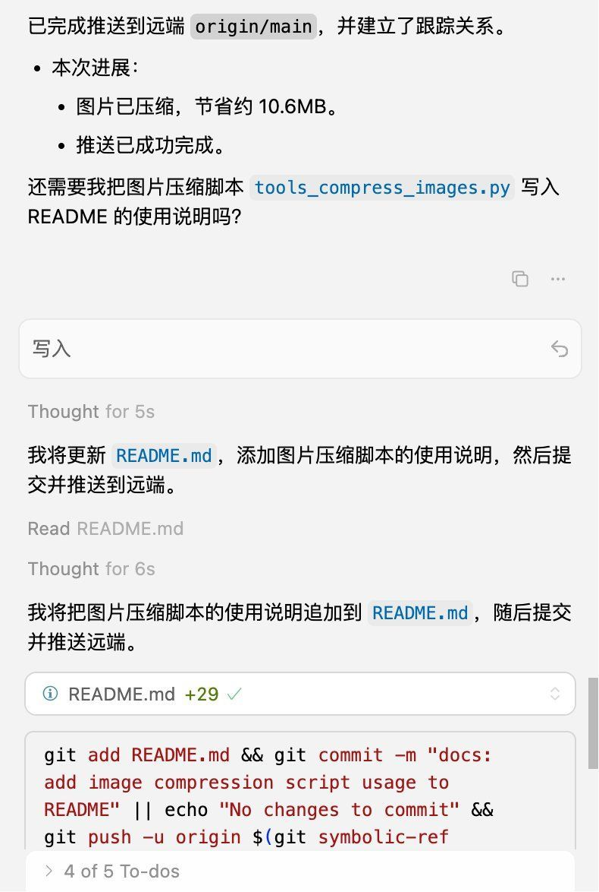

# 我喜欢这个时代

这是程序员最好的时代，也是最差的时代。由于就业低迷，程序员职业貌似已经不像五年前那样炙手可热了，但我还是喜欢这个时代。有了 AI，我只需要有一个想法，AI 就可以自动帮我完成。我有一台电脑，就相当于拥有一名员工，有十台，就相当于有十名员工。我其实也不需要在家里摆十台电脑，我只需要在云厂商哪里购买十台云主机，在我散步或骑车的时候，都可以让它们为我劳动。

之前说一个有经验的老程序员抵上 100 名新手，这种话多少是有一些夸张的，现了有了 AI，还真是这样，以一敌百真不是问题。

上周，和一个朋友聊天，她现在的公司竟然还有架构师、前端、后端、测试这样的分工。我不明白为什么还要有这样的分工，是活不够分，一分工要像印度阿三那样，要拆开分给几个人一起干吗？中国的私企老板什么时候这么慈善了？明明一个人+五台电脑就可以搞定的事，为什么要多雇五个碳基生物？

匪夷所思，不可思议。
