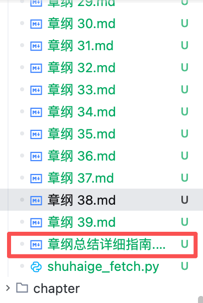

# 关于 AI 提示语我有一个不成熟的想法，SOLO会流行起来，目录本地化也会

就是将提示语放在目录下的一个（最好以点开头）文件内，在这个目录内，有原材料（例如原章），有加工品（例如章纲），而提示语就相当于是一个生产线上的智能 NPC。

这样做的好处是，即使换了 AI IDE，即使换了 AI 大模型，生产仍然可以照常进行。并且，由于生产资源和产出，还有生产规则都在各自的目录内，这样，即使是一个很庞大的项目，也没有问题。

\---

我管这个叫目录本地化或去中心化，另外还有两个原则也很重要：

1，工程结构化，做任何任务，先有一个结构/一个计划。这个原则流行起来，大模型都可以划分子任务了，这种行为被普遍接受了已经。

2，身份标识化，例如“你是一个富有经验的全栈工程师……”，这条经验最早流行，在浏览器 AI 单页互动年代就流行起来了。

现在 TRAE 的 solo 模式发布了，本质上它是在单个自动化 Builder 模式上建立的工作室，充许定义多个 Agent Builder 角色，然后这些角色作为一个团体协同工作！！！这是工程化结构化的延伸！牛逼啊，一个电脑就是一个团队。

这或许真的就是未来的方向，SOLO 模式会流行起来的。此处，我上面提到的“目录本地化”我相信也会流行起来。

11月 14 日

