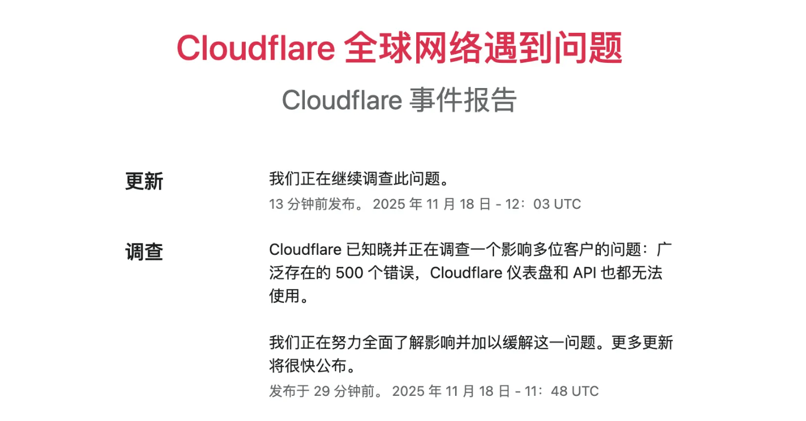
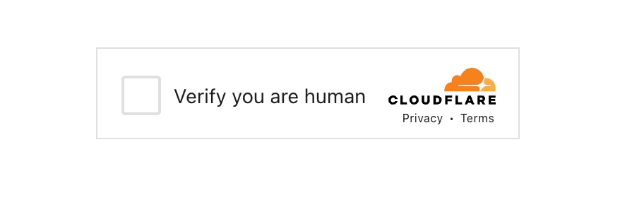

# Cloudflare 是一个伟大公司！

11 月 18日发生了两件大事：第一件，谷歌发布了 Gemini 3 pro 模型，一举打败了 GPT 5.1和 Claude 4.5 Sonnet。我就说嘛，谷歌这么庞大的一家公司，人才济济，数据庞大，奖金雄厚，怎么可能永远甘居人后？要知道最早的用于 AI 的 Transformer（谷歌团队论文《Attention Is All You Need》）关键模型是人家谷歌开源出来，其他家后来才迅速跟上的。钱、人、数据，人家都没有短板，有此高光时刻早有所料。

第二件，就是伟大的 Cloudflare 公司，它的服务器在全球范围内大规模宕机了，出现了 500 错误。据说每分钟损失几亿元，一共宕机了 6 小时，保守估计损失了 500 亿人民币。已经得到确认的，金融经纪商们损失了 15.8 亿美金。了不得，现在这个世界，连接太紧密，一个部分停转几小时，就造成了十几亿美金的损失。特别对于占据全球 20% 安全流量的 Cloudflare 尤其如此。



宕机是怎么发生的？为什么它是一家伟大的公司？对我们写代码的有什么启示？接下来主要聊这些。

有人可能对 Cloudflare 这家公司不了解，不知道它是干什么的。可以将它理解为一家全球互联网安保公司，专门为网站或 App 提供安保服务的。具体服务内容比如出示个验证码，让你输入，还有识别和抵挡非授权高速数据抓取这些。这类服务程序实现起来不复杂，但它需要的特征库却是需要积累的。比如说，某黑客经常用他的服务器向外做恶意嗅探或攻击，一旦他的服务器被 Cloudflare 标识上，所有使用 Cloudflare 安保服务的网站都安全了。如果你要自己实现，那只有等他攻击你了，你才能获得防御能力。Cloudflare 就相当于全球互联网的安保网关，存储了可能全球最全的恶意程序信息特征。

你可能见过下面这张图，这是 Cloudflare 怀疑你是机器人，要求你进入生物验证流程了。



Cloudflare 的业务范围非常广泛，事实上目前 X（twitter）、ChatGPT、Shopify、Meta、亚马逊等企业都在购买和使用它的服务。

下面说一下这次事故爆发的原因。

## 灾难如何发生的

这次事故被称为 2025 全球最昂贵的配置失误，源于 18 日当天，Cloudflare 数据库工程师对线上系统进行了一次全球的最高权限的配置升级。工程师需要往线上推送最新的 1000 条防火墙规则——也可以理解为 1000 条犯人犯罪记录，不一定是 1000 条，这里只是形象比喻方便理解。他写一条 SQL语句：

```sql
SELECT r.rule_body, p.permission_setting
FROM firewall_rules AS r
JOIN permission_groups AS p
ON r.group_id = p.id;
```

这条语句的作用，就是将新规则从相关策略组中查询出来，稍后将打包、编译为二进制包，向线上广为推送。

许多数据库操作员，包括程序员，都有一个使用注释的习惯，对于 SQL 语句中暂时不需要的条件，会使用两个连字符（--）注释掉，于是这条 SQL 语句在线下测试环境可能就变成了：

```sql
SELECT r.rule_body, p.permission_setting
FROM firewall_rules AS r, permission_groups AS p
-- WHERE r.group_id = p.id;
```

程序员朋友不妨反省下，自己是不是也有这样的习惯。注释掉条件，目的就是为了下次使用时反注释掉方便。

没有了条件，这条 SQL 语句查询出来的结果变成了两个表（table）的笛卡尔乘积。原来只是 1000 条，二进制压缩后区区 5MB 的大小，现在可能变成了 5GB。

为什么要进行二进制压缩？这是为全球传输的的高效及安全考虑，这属于常规操作，Cloudflare 如果用明文JSON 文本传输就真是草台班子了。

得益于 Cloudflare 这家公司在全球拥有非常卓越的分发能力，区区 5GB 的大小，也被工程师在数秒内分发完毕了。如果是小破公司小破网格，半天分发不成功，工程师很快就会发现异常。因为网速太优秀，灾难在产生时被略过了。要不说 Cloudflare 是一家伟大的公司。

在全球的服务器节点，上面运行的是 Cloudflare 自己写的 Pingora程序。这是一个用 Rust 重写的 Nginx 程序，是一个反向代理程序。在此程序中有一段 Rust 代码负责接收控制中心发来的二进制配置包：

```rust
fn load_firewall_rules(payload: &[u8]) -> Config {
    // 1. 接收二进制数据
    // 2. 尝试反序列化 (使用 serde_json 库)
  
    let config: Config = serde_json::from_slice(payload)
        .unwrap(); // <--- 凶手就在这里！！！
        
    return config;
}
```

凶手就在 Rust 语言的 unwrap 这里！这也是这两天 Rust 被喷的原因。

二进制配置包（Blob）已经被网络下载，放在了硬盘上，硬盘倒是够用。程序使用serde_json 库将 Blob 解析为 JSON 格式，为接下来的读取和使用做准备。serde_json 是一个知名的且被广泛使用的 Rust 库，它也支持大数据的读取，它是流式操作，它的瓶颈在于服务器的内存，不在于它自身。但因为 Cloudflare 给节点服务器分配的内存或给 Pingora 程序分配的内存不足，或者数据包太大超过了分配的内存，所以这里解析失败了，serde_json 返回的不是 Ok，而是 Err，开发人员在这里没有区别对待，相当然地以为一定是 Ok，使用了 unwrap操作。而 unwrap操作的语义是：

> “我确认这里一定成功（Ok），如果这里出现错误（Err），别废话，直接抛出 panic 异常炸掉整个程序！”

这是这两天 Rust 被喷的原因。但其实不能怨 Rust，Rust 是冤的。早期 Rust 没有 unwrap，程序员抱怨写代码取个结果像剥笋子，一层一层剥，太麻烦；于是，Rust 更新了一个 unwrap 方法，尤其程序员认定返回的结果（Result）一定是 Ok(value) 值，直接开箱，将 value返回，这相当于其他语言直接返回结果，避免了 Rust 返回 Result 带来的负面效果。

经此一役，我相信 Rust 团队很快会出一条新规则：为了安全考虑，默认情况下程序员不能直接调用 unwrap，尤其在生产环境中.在 release 编译时禁止直接使用，除非程序员在编译时加一条 Allow_Unwrap=1这样的显式开关。我刚开始学习 Rust 语言时，就觉得这个 unwrap 方法太飘逸，不符合 Rust 严谨的作风，果然几年后有人因为它捅了篓子。

现在 Rust 没有更新，在生产环境中，我们一般怎么实现同样的逻辑呢：

```rust
fn load_firewall_rules(payload: &[u8]) -> Result<Config, ConfigError> {
    // 1：先作常规检查，例如看一眼数据大小，太大了可能是黑客捣鬼，直接拒收
    const MAX_CONFIG_SIZE: usize = 100 * 1024 * 1024; // 100MB
    if payload.len() > MAX_CONFIG_SIZE {
        // 记录日志，返回错误，而不是崩溃
        error!("Config payload too large: {} bytes", payload.len());
        return Err(ConfigError::PayloadTooLarge);
    }

    // 2：解析时使用 match 处理错误
    match serde_json::from_slice(payload) {
        Ok(config) => Ok(config),
        Err(e) => {
            // 即使解析失败，也只是这一次更新失败，放弃更新，节点还能用旧配置继续跑
            error!("Failed to parse config: {}", e);
            return Err(ConfigError::ParseError(e));
        }
    }
}
```

除了使用 match，正常对 Result 结果作 Ok、Err 模式匹配，分情况处理；还要在前面做一个常规检查，例如数据包 size 太大，则放弃更新，且向控制中心发出异常警告。这叫 Sanity Check，属于编程中的常规操作。

## 程序内三类错误及处理策略

接下来，我们扩展一下，说一下软件程序中都有哪些错误，分别怎么处理。

**一、可预见的用户输入错误（User Input Error）。**

这类错误永远不可信任，永远要怀疑用户也可能是一名黑客或一名十分刁钻的测试工程师，他在输入年龄时可能输入-1，在输入姓名时可能输入 Drop Database。对这类错误要耐心进行数据检验，不符合要求则软性拒绝，回退状态至输入前，允许用户再次输入。用户可能是黑客、测试工程师，也可能是一名笨蛋，输入检验要足够宽仁。

**二、可能预见的网络下载或接口请求错误（Network Error）。**

这类操作一般要限时，例如 30s，预知 size 大的限时还要延长。有时还要设置容量限制，例如将Content-Length 设置为 100MB，防止恶意 DDOS 攻击。在首次请求失败后，还要进行重试，但重试也不能一直重试，要有次数限制，在等待间隔上还要降级延时，例如第一次请求失败等待 1s，第二次等待 2 秒，第三次等待 4s。降级是指数级的，避免对目标服务器造成负担。如果不降级，所有拉取失败的机器同时重试拉取，甚至更频繁地拉取，很快就会被目标服务器拉爆；即使有多活，有灾备，有负载均衡也没用，雪崩式的流量很快会把所有节点拉爆。

为了避免雪崩式灾难，还要有熔断和降级。例如节点在尝试拉取 10 分钟后，不要再拉了，立马停止重试，并立即向控制中心报警，最高级别警告。然后节点进行降级使用，例如在上面的代码中，当解析出错时，放弃本次更新，记录日志，继续使用旧配置继续运行 Pingora 程序。

**三、不可预见的系统或模块错误。**

例如请求分配内存，在大多数时候不会发生，但并不是完全不可能。一个函数它有一个参数，它知道自己需要什么样的参数，它也做了编译期验证，只要参数不合规则，就抛出 panic 异常；问题是，调用它的函数，可能不知道它会抛异常，可能在测试时传送过来的参数都是正常的，但在个别非正常情况下，调用者函数也接收到了非法数据，它稀里糊涂地传了过来，这种错误是很难防范的。特别当我们使用了第三方类库时，我们很少会通读类库的代码，一般都是直接使用，这时候它里面有没有 panic，什么时候 panic，我们程序员也是不清楚的。

在 java 或 js 语言中，有一招 try catch 可以应对这类情况，对于不放心的第三方操作，用一个 try catch 包括起来，如果出错，按照错误的情况处理，这样可以保证程序一直是正常运行的。

在 Rust 语言中，也是有办法的，例如使用 catch_unwind：

```rust
use std::panic;

fn load_firewall_rules(payload: &[u8]) -> Config {
    return serde_json::from_slice(payload).unwrap();
}

fn main() {
    let result = panic::catch_unwind(|| { // catch_unwind 相当于 try
        load_firewall_rules();
    }); // 闭包中的代码相当于 try 块

    // 处理 catch_unwind 的结果
    match result { // 相当于 catch 块
        Ok(_) => println!("操作成功！"),
        Err(payload) => {
            // 捕捉到了 panic，并处理它
            println!("一个 Panic 被捕捉了，程序没有崩溃。原因: {:?}", payload);
            // 可以在这里记录日志或返回 500 错误
        }
    }
    
    // 程序继续运行，没有被终止
    println!("主程序运行结束。"); 
}
```

这个 catch_unwind 就相当于其他语言的 try catch，如果 Cloudflare 对第三方类库（serde_json）操作不放心，在每个操作的外层加一个 catch_unwind，或许就能避免 500 亿的损失。

还有代码管理，也有问题。一般而言，为了工程安全，配置和代码是等同对待的——许多公司不是这样，代码纳入版本管理，但配置逍遥法外——Cloudflare 不是的，它的配置不在仓库内，没有版本控制，直接由工程师手动分发至全球，并且是最高权限的。可能也因为如此，这次灾难才能绕过灰色发布而成为全球灾难。我想说，如果将来 Cloudflare 接管了全银河系的安管服务，它是不是也敢一键分发至全银河系！

配置也是代码，一定要和代码等同视之，也要接受版本管理和权限控制。有人觉得，配置里好多私密信息，不能放在代码里，呵呵，看你刚学写程序，我不跟你计较。想做，方法有得是，但不做，原因只有一个，就是懒惰。

最后说一下这家公司为什么伟大。

## Cloudflare 为什么伟大

我没有看到这家公司处理它的工程师。按照美国法律，员工在履行职务时造成的损失，责任主体是公司（Cloudflare），而不是个人。在美国，这位工程师可能面临被调岗或解雇，但不会被要求承担 500 亿的赔偿。我顺便查了一下，在中国不是这样，中国法律规定，员工给公司造成直接损失的，要赔给公司，员工没有钱，可以将工资的 20% 拿出来抵扣。但法律也有“人性”的一面，劳动法规定，扣除 20% 后，余下的 80% 不能低于当地最低工资水准。什么样数据库工程师，哪个厂子里的工程师，工资只比最低工资高 20%？想想可能还真有。所以，反观 Cloudflare，它是伟大的。

为什么 Cloudflare 伟大？它的工程师就是个草台班子，有可能技能是跟街上的业余编程爱好培训班学习的，直接拿 demo 里的 unwrap 用在生产环境/企业环境里；它的工程管理方式老旧及土，中国 10 年前都不是这样的工程管理模式了；它的控制中心连个预警机制都没有，一个配置文件大了十几上百倍都没有人发现异常……但，又能怎么样，人家的员工在给公司百亿损失后，不用承担赔偿，人家团队在事故发生后，也是可以一直坐在会议室彻夜找 bug 的，没有埋怨，没有人打小报告，只有集中力量尽快解决问题，所以，Cloudflare 是伟大的。

反观中国，仅是赔偿 20%，我想都足够让程序员心生防备。程序员心想：要使用最合理的架构吗？不，那样太麻烦，代码能跑上线就行，下个月我在不在这家公司还不一定；要用心写最漂亮的代码吗？不，写得再漂亮老板也看不懂，老板要的只是尽快上线尽快挣钱，明天公司在不在还不一定；要不要进行创新呢？创新个头啊，创新伴随着风险，风险意味着损失，损失算在自己身上要扣工资的，还是老老实实写别人写过的代码，用别人用过的方案。

还有，像论文。最近看过一个视频段子。视频中导师说：小伙子你不要较真，你要认清现实。小伙子说：难道我付出的 200 多个日夜就白废了吗，为什么我的研究成果第一作者要署上别人的名字？导师说：小伙子，这就是现实，等你混到导师你就懂了。结果，论文越发越多，也越来越水。如果注定成果要与别人共享，自己为什么要那么努力？

如果多努力一点，多承担一些风险，面临的是工资被扣除，谁还会勇敢直前？

公平，最重要。如果公司让员工为失误承担责任，那么没有人敢再碰核心代码；一旦出错，员工也会想尽办法隐藏错误，直到公司倒闭无法挽回。规定给公司带来损失的员工要承担赔偿责任，表面看起来可以促进员工爱岗敬业，实则恰恰相反。

还有项目的成败，要员工为项目的失败买单，把项目组解散，把成员开除，这和让员工承担经济损失是一样的，都是一样的小气和龌龊。

经此一役，我相信 Cloudflare 会越来越好，线上的 Pingora 程序会被完善，配置分发策略会被完善，控制中心报警机制会被完善，还有最重要的，它的流氓特征库依然是全球最完备的，Cloudflare 仍然是一家伟大的公司。而不能伟大的公司，注定永远不可能伟大。有些小公司原来在购买和使用 Cloudflare 的服务，看人家出事了，就要撕坏合同，甚至换一家安保服务公司；没有必要，你没看到人家的全球快速分发能力吗？几 GB 的大文件也是嗖的一下完成了，有这个实力的并不多。还有，人家能在 6 小时内定位并解决问题，换一家同样体量的公司未必做得到呢。

Cloudflare 是伟大的，还会继续伟大。我们的 Cloudflare 在哪里，何以诞生？

11 月 20 日
