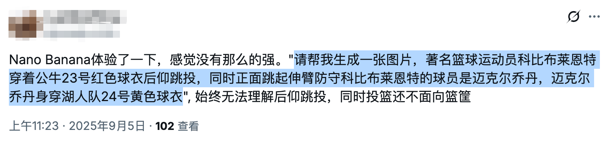
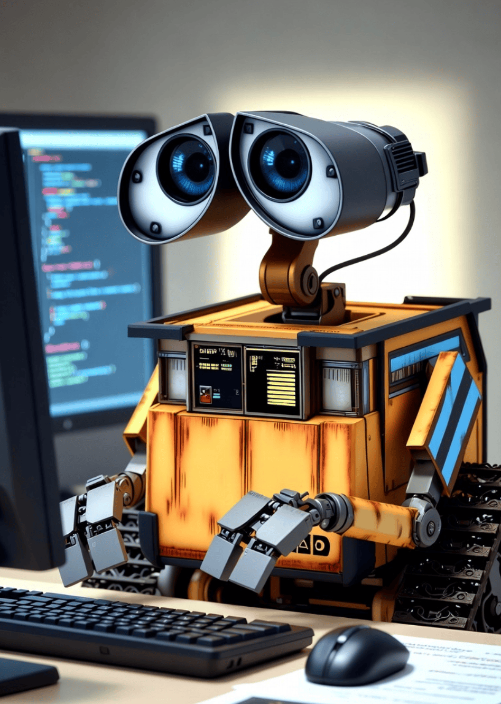

# 未来社会人才结构不是图钉型而是圆锥型，成为专家的机会是更多而不是更少

有人说，AI 通过极端效率切断了人类专业智慧的传承阶梯，初级岗位被消灭，"垃圾时间"被抹平，隐性知识无处传承，社会人才结构将沦为"图钉型"——顶部极少数超级个体，底部海量低技能劳动力，中间层断裂。

我的判断恰好相反：AI 并没有毁掉梯子，而是把梯子直接架到了更高处。社会人才结构不是变成图钉型，而是由金字塔变成圆锥型。专家只会越来越多，留给年轻人成长的机会不是更少而是更多，且年轻人的成长速度不再以年计，而是以月计，以天计。

接下来我针对社交平台上的观点逐一批判。

## 1. AI 是否终结专家养成路径？

有人说，AI 极致追求效率，切断了人类专业智慧的传承阶梯。AI 替代了初级代码、基础文档等工作，短期产能飙升，但这使专家成长所需的低效训练与痛苦试错过程被连根拔起，最终引发"智力断代"。

以前底层工程师要想成长，不仅要学习书本知识，还要有进入大厂的机会参与中大型软件的设计开发，学习行业顶尖的软件工程经验，在实践中锻炼成长。这样的机会一个萝卜一个坑，给了 A，B 就没有了。现在不同了，即使不进大厂，有了 AI，初级工程师可以自己做为独立开发者，做为一人团队/公司独立面对社会、面向经济体，开发付费软件或开源软件，所接触到的仍然是行业顶级经验，并不比厂里差。所以说，今后技术专家只会越来越多，不仅软件行业如此，其他行业也一样。

## 2. "垃圾时间"不必留恋

有人说，实习生清洗数据、修补 Bug ，这些低效劳动实际上是新人"成长的土壤"，正是通过这些重复劳动，人类才建立了对业务的直觉和手感，才培养了隐性的专家技能。现在有了 AI，这样的土壤没有了。

清洗数据未必是垃圾时间，AI 未必做得好，看清理的是什么数据。修补 Bug 也未必是垃圾时间，看修补的是什么级别的 Bug。在企业里或许没有了继续提供这些工作机会，但人类专家未必失去了成长的土壤，因为现在，人类自己就可以制作这样的土壤，自己就可以给自己这样成长的机会。

## 3. 波兰尼悖论

波兰尼悖论指出，人类会的总比能说出来的多。有人说，AI 擅长前者，但人类必须通过痛苦的"试错"过程才能掌握后者。AI 给出了完美答案，剥夺了初学者"百思不得其解后顿悟"的痛苦过程，导致年轻一代获得"隐性知识"的机会。

其实不对，能用 AI 直接得出的成果必定是没有竞争力或竞争力弱的，即使使用 AI，只有通过 Debug AI 付出精力和时间的劳动才是有价值的。商品的价值由它所包含的劳动所决定，马克思的理论在 AI 时代也不过时。人类在 Debug AI 时，也要经受"百思不得其解后顿悟"的痛苦，也会得到锻炼，只是锻炼的层次不太一样。原来是在城墙下锻炼，要用梯子才能爬上城墙；现在梯子被人拿走了，直接上城墙就可以了，现在城墙就是原来的地面。现在人类要习惯在城墙上行走与生活。

## 4. 人才结构畸变

有人说，过去人才结构是"金字塔"结构，底层通过历练向上流动。现在变成"图钉"结构：顶部是极少数利用 AI 的超级个体/终产者，底部是大量数据标注员，中间承上启下的中层岗位被 AI 掏空。这意味着通往顶层的通道断了。

顶部是使用 AI 的超级个体这没有错，但这些人未必是原来的那些人。原来的所谓专家，如果他们不接受 AI，不接受时代的变革，他们也将成为长大的方仲永。未来的社会人才结构，不是图钉型，而是圆锥型，将有更多的专家产生。AI 时代社会的效率会更大，进步速度也会更快。

## 5. 初级岗位消失与用人观念革新

有人分享他在面试时向 Anthropic 面试官提出一个问题："如果不再招聘初级工程师，未来的资深专家从何而来？"连 AI 领域的顶尖专家也无法给出令他安心的答案。又有人讲，当下科技行业"Senior + AI > Team"已经是共识。资深工程师利用 AI 效率倍增，不再需要初级工程师打下手，导致初级岗位消失，新人失去了入行的"练习场"。从很多行业趋势来看，企业确实在通过引入 AI 来冻结初级 HC（Headcount），并没有多少老板愿意支付薪水给实习生去"犯错"和"学习"。

许多旧时代的专家未必看得懂未来的问题，这种情况很常见。提出创新性方案的往往是新时代的新人。老板不应该雇佣资深工程师去从事在咖啡馆里写测试用例这样的工作，这样的工作招聘初级工程师就可以完成了。相反，资深工程师应该去做创新型项目，去做开拓型项目，去探索未知领域，这是他们的价值所在。

在今天，在企业里，成长阶梯依然存在，人力梯队依然存在，只是人力总监和老板要被培训一下，至少要读一下这篇文章，要革新自己用人的思想，不要把钢用错地方。这些老板的用人观念需要革新，他们公司资深专家干的活，用初级工程师就能干，而资深专家应该去干别的活。如果在公司内，没有创新型项目，那么资深专家也会慢慢死亡，在这样的公司他们应该辞职，然后才有充足的时间去写开源软件，去做真正有创新性的项目。

## 6. 学习方式变革

有人指出，AI 填平了坑，让人类失去了"在坑里仰望星空"的能力。有人说，未来的教育可能需要从"学习如何做（Doing）"转向"学习如何评判（Critiquing）"。建议人为制造"困难"：像飞行员模拟器一样，刻意脱离 AI 环境进行高强度思维训练，以锻炼大脑肌肉。

这与学习方式有关。初级阶段无法跳过，因为有一些知识和技能需要工程师切实掌握，例如对于 C 语言工程师，C 语言的底层运行机制，C 语言的语法，C 语言的编译原理，计算机的底层运行机制，等等，这些东西都是一个 C 语言工程师要了然于胸的。没有这些，就无法成为一个真正的资深 C 语言工程师，其他岗位和行业也是一样的。

无论是如何做，还是如何评判，都需要对事物的底层运行机制和运行原理了如指掌。原来这些东西只能在一行一行的代码练习中完成掌握，现在不但可以在预置的习题项目中练习，还可以在实际项目中通过 Debug AI 学习。在以前，初级问题的坑要由工程师自己平掉，在这个过程中，工程师锤炼了宝贵的隐形技能。现在，初级问题由 AI 平掉了，上城墙的梯子被 AI 拿掉了，初级工程师直接上到了城墙上，现在的城墙就是原来的地面，原来在坑里仰望星空，现在直接在城墙上仰望星空。需要劳作的时候，人类在地里种田以锻炼身体；不需要种田的时候，人类在健身广场锻炼身体。锻炼机会总是有的，隐藏的技能总是有办法锻炼的，有了 AI，只有不想进步的懒人，不存在没有机会成长的人。

教员说，不要学完了再干，而要先干，干就是学习。现在正是实践教员干与学辩证思想的大好时代。我认同通过一些特制的 PBL 实战项目，达到对底层机制和原理的掌握。而掌握根本，正是 Debug AI 进行创新型工作的关键。

## 7. 创新才是生命的意义

有人说，预警未来社会可能由少数"旧时代培养出的专家"统治，而新一代是在 AI 喂养下长大的，缺乏处理系统性崩溃的"内功"。

人类切不可安于现状，对于个人也是如此，不要重复自己，不要重复昨天，要敢于创新，敢于搜索，敢于突破，只有这样才能练好内功。而竞争，会促使初级工程师成长。

生命的意义就在于创新。当你感觉到困难的时候，那不是你感觉困难，而是整个人类都感觉困难，因为你使用的是为全人类服务的 AI，这时候你更应该迎难而上，你前进的一小步，可能就是人类的一大步。AI，第一次使人类在智力上更像一个大蚁群，AI 是服务全人类的蚁后，我们每个人都是工蚁，我们可以从 AI 汲取力量，利用它的力量，也能把自己创新得到的进步反哺给它。

## 8. AI 有能力边界

有人说，"结果导向"正在扼杀"过程价值"。过去，程序员遇到 Bug，需要读 5 篇文档，浏览 10 个 StackOverflow 帖子，尝试 3 种错解。在这个过程中，他顺便了解了系统的周边机制（这就是隐性知识的积累）。现在，用户把 Bug 扔给 AI，AI 直接给出修复代码。用户复制粘贴，问题解决。问题是解决了，但用户的脑子里没有留下任何"沟壑"。人类正在失去"在坑里仰望星空"的能力，因为 AI 直接把坑填平了。

现在，并不是所有 Bug、所有问题扔给 AI，AI 都能给出一个满意的答复。AI 能否做好人类交给它的工作，取决于它有没有做好，甚至有没有做好过。AI 是面向全人类的，它像全人类的数据蚁后，是为全人类服务的。它的服务能力也有边界，人类知识触达的边界，即 AI 的边界。

我们可以反向思考一下，如果 AI 是万能的，是无限创新性的，那么人类迄今所有难题，什么猜想，根本都不是问题，它全能解决了。事实上并不能，AI 并不能解决人类面临的前沿问题。在各个领域，在具有创新性的项目中，AI 就会捉襟见肘，这时候 AI 就急需人类的指导，而指导它的人类必须也是领域专家，对该领域的底层运行机制和原理了如指掌。

我在 X 已经看到有人抱怨 Nano Bannana Pro 模型不好用，生成不了他想要的图。这很正常，AI 并不是全能的，虽然有许多人赞美它，对于赞美它的人，我只能说，可能你的提示语太简单了，一点创新性都没有；对 AI 的表现不满意的人，我想说，你的提示语可能很有创新性，你触达了 AI 能力的边缘，但你放弃的精神不足取，你不应该放弃探索，而应该勇敢直前。

## 9. 技能迁移与关注转移

有人提到"梯子断了"，这很形象。但也许人类不再需要爬那把梯子了。计算器出现时，人们担心人类会失去心算能力（确实失去了），但人类把智力转移到了更高阶的数学建模上。AI 时代，人类可能不需要通过"手写 CRUD 代码"来建立直觉，而是需要通过"设计系统"和"Debug AI"来建立直觉。未来的专家，可能不是最会写代码的人，而是最会向 AI 提问、最会鉴别 AI 错误、以及拥有最强系统架构思维的人。

人类历史上，每一次工具革命都引发过类似的担忧，但人类总是能找到新的"阶梯"。

我认可这个观点，计算器出现时，人类不再依赖心算了，传统算盘更是被扔掉了，现在只有菜市场的大妈还在使用心算，大多数人类把智力用在了更高级别的事情上。智力关注的方向被转移了，但并没有消失。现在 AI 时代，工程师不需要手写 CRUD 功能，最需要学会的技能是 Debug AI 的能力，还有就是各领域的底层机制和运行原理，只有学会这些，才能鉴别 AI 错误，才能在创新型项目中拥有强大的架构思维。

## 10. 主动训练自己

有人说，文章提到了"在模拟器中训练"。未来"便利"是给大众的，"困难"是给精英的。普通人会沉溺于 AI 的一键生成，享受免费午餐。真正的未来的专家，会像健身一样，刻意拒绝 AI 的帮助，在沙盒环境里进行高强度的"反人性"训练，以维持大脑的肌肉量。

并不是主动受苦，因为学习也是一种快乐，是主动训练自己。现在有两种活动对人类很重要：一是特制的 PBL 实战项目，AI 辅助人类掌握底层机制和运行原理；二是创新型项目。

什么是创新型项目，怎么判断是不是创新型项目？很简单，凡是 AI 不能很好完成的项目，就是创新型项目，说明整个人类才走到这个地方，你只要付出时间、精力和耐心，往前推进一点点，你就是屹立在世界之颠的那个人。所以，还是那句话，不要怕 AI 的表现不好，表现不好你应该高兴；一切都很顺利，一点磕绊都没有，那才是值得忧愁的事。

## 11. 正确使用 AI

有人说，不要完全信任 AI。当你让 AI 帮你写代码、写文章时，记得问一句："你是怎么得出的？"或者尝试自己先写一个烂版本，再看 AI 的优化版本。不要让 AI 剥夺了你"痛苦"的权利，因为那是你成长的唯一途径。

AI 还是要用的，AI 能写得很好，没有必要放着不用，除非自己在进行特制的 PBL 项目实战培训。如果你是一个管理者，你需要警惕，如果全靠 AI 和资深员工，5 年后你的团队将面临无人接班的窘境。你可能需要建立内部的"飞行员模拟器"机制。像过去那样的人才梯队还是要建立的，只是用人的思想要革新一下。原来是在城下打仗，现在是直接在城墙上打仗，墙下已经被 AI 填平了，现在的城墙就是以前的城下地面。

## 小结

一，AI 并没有那么好。

它的表现并不是我们从周围看到的那样，是一片大好。这可能只是囿于我们的眼界，我们看到的只是简单的、过时的功能，这些事情 AI 已经做得很好。对于 AI 不熟悉的，前沿的事情，它仍然做不好，那里才是资深工程师需要发挥能量的地方。这里我要补充一点，因为你用的模型不强，你的提示语不恰当，你得到的结果不理想，这只能怪你自己。目前，在编程领域，Google Gemini 3、GPT 5.1 Codex High、Claude 4.5 Sonnet 是最强的模型。

二，无论是任何领域，掌握事物运行的底层机制和内在原理都是必要的。

以 C 语言工程师为例，C 语言语法，编译原理，编译机制，计算机运行原理，网络通讯机制，这些东西 AI 懂，但你也要懂，因为它们是根本，是根基。在处理常规大路任务时，AI 信手拈来，毫无负担。但在处理创新型前沿项目时，AI 就犯难了，它不但犯难，它有时候还会不懂装懂胡说八道，这时候，做为资深工程师必须具有鉴别对错优劣的能力，而鉴别靠什么，就靠已经掌握的底层机制和内在原理。以前，掌握这些知识和技能，靠的是在工作实践中积累，有人认为，现在 AI 剥夺了人类实践的机会，没有机会掌握这些底层机制和内在原理了，这是大错特错。现在有了 AI，人类有更多的时间做更多的项目，可以做独立项目，可以写开源项目，机会不是少了，而是更多了。要把思路打开，要做创造型的工作，不要浪费自己的生命。

三，现在社交平台上流行一种思潮，认为前端已死，设计师已死。

其实前端并没有死，只是迈上了更高的台阶。当然，没有迈上来的，或懒于学习更新的，可能真的死掉了。设计师同理。

四，真正的阻碍不是 AI，而是制度。

阻碍专家人才成长的主要因素并不是 AI，相反 AI 是促进专家人才养成的。真正阻碍人的，是制度，是老人坐在旧席位上的屁股。要想培养更多的专家人才，就应该解放制度，不要人为设立这样或那样的门槛要求；以前设定这些门槛或许有理由，但现在 AI 时代不同了，时异事异，制度也要变化一下。中国餐饮业有许多餐馆喜欢把成立时间写在招牌上，例如标榜说成立于 1998 年，好像成立得越早就越有经验；现在不同了，成立得越早没关系，但如果抱残守缺，只意味着脱离 AI 时代越多。以后一人公司一人团队会越来越多，最大阻力就是制度，举个例子，许多经济活动必须是个体工商户或公司才能做，个人不能做，这就是歪规定，是只有一个团队才能做吗，是个人做不了吗？要不拘一格求人才，这一条首先就要改。

11 月 22 日

