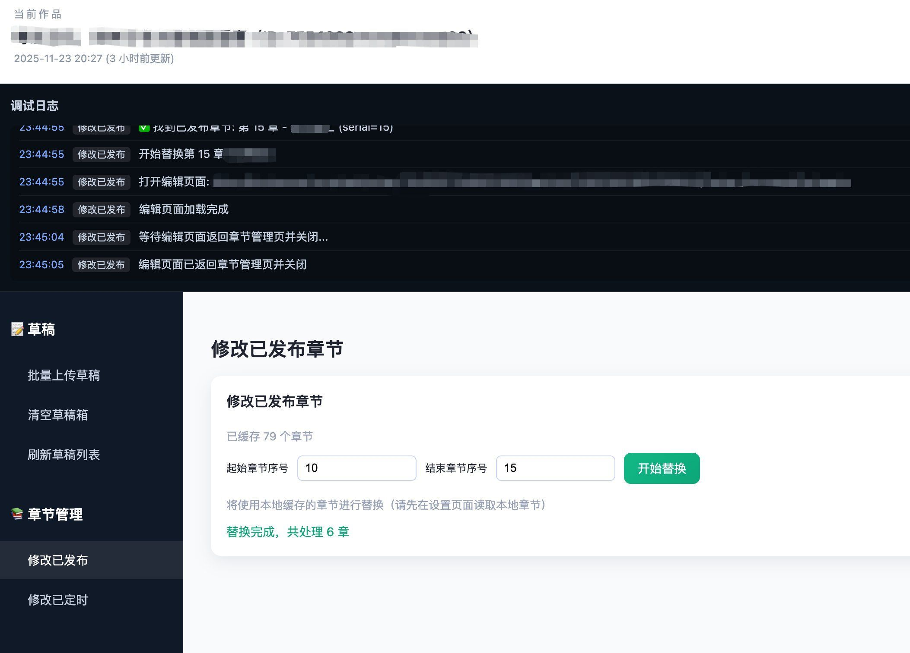

# 没用的软件又搞了一个！

写了一个小插件，可以批量将本地的 md 文稿上传到番茄小说网，可以批量替换线上已经发布的章节（为什么要有这个功能，大概因为我有时候要批量修改），可以批量替换线上已经定时发布的章节。

每天定个闹钟，定时手动从草稿箱发布。也可以全定时发布。我倾向于定时手动发布，觉得这样有议式感，另外如果有哪位读者大大给咱打赏了，要多更一章，将大大昵称贴进标题，以示感谢。如果全定时了就没有这么方便了。

全定时其实也是可以搞的。就是把插件放在服务器的浏览器上，每天定时从草稿箱发布。

11 月 24 日

