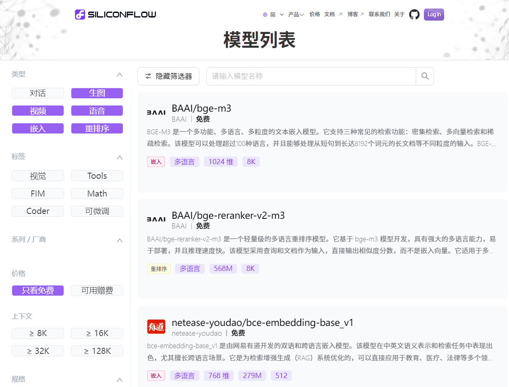
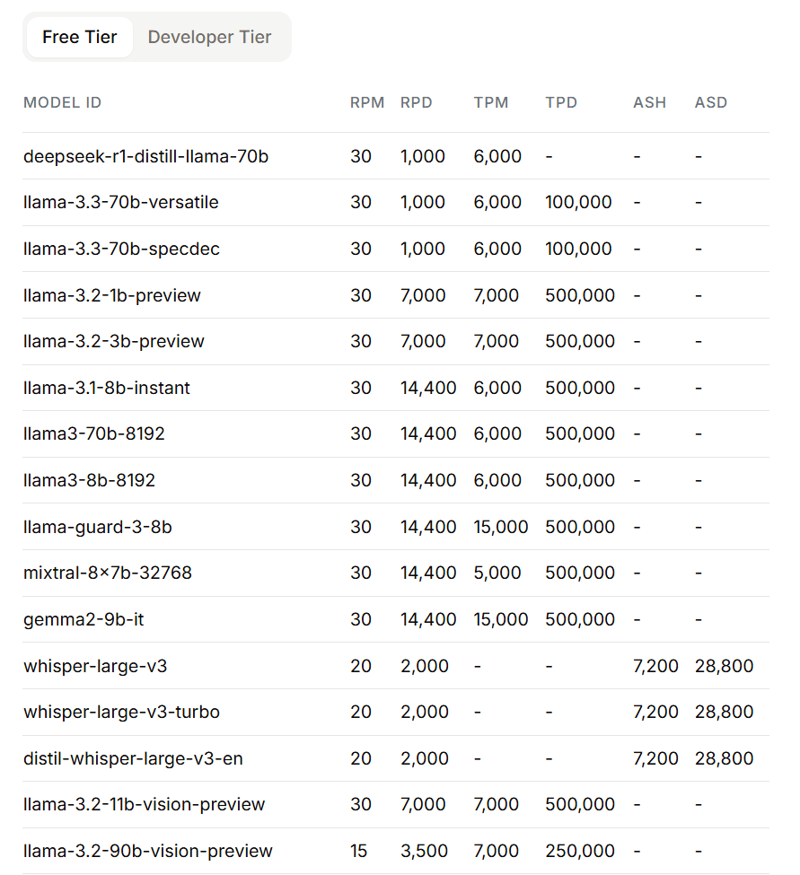
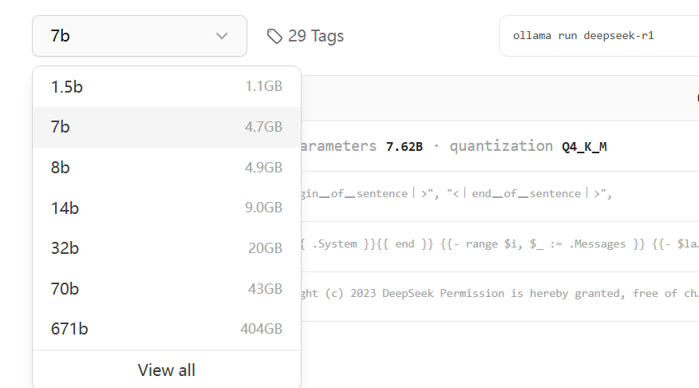
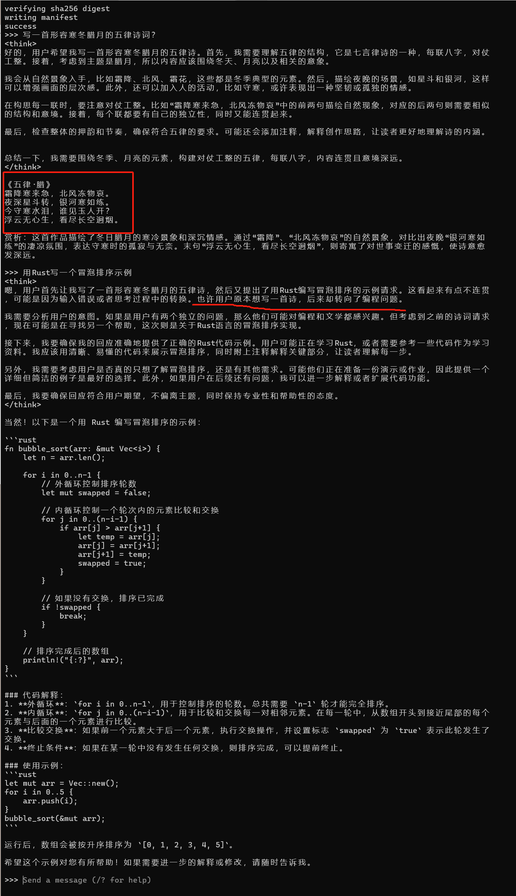
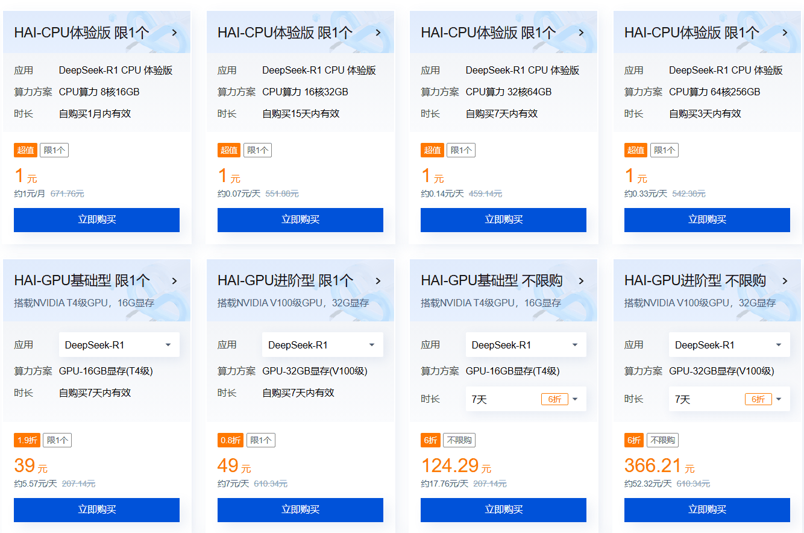

# 普通人该怎么用好DeepSeek呢，除搜索以外？

昨天参加了腾讯的DeepSeek北京研讨会，回来之后写了一篇总结，核心意思说：今年DeepSeek将持续一直是最大热门，目前它已经取得的成绩并不是它最好的成绩，今年大概率它还会带给我们更多更大的惊喜。

换个角度讲，DeepSeek的热度还会持续升高加强。今年DeepSeek就是风口，今年我们普通人在它上面投入多少时间和精力，将直接影响我们每个人有多少收益或收获。

我是程序员出身，我觉察这个现象以后，我能想到的自然就是智能化应用开发，将之前未开始智能化（例如煤炭）或已经开始智能化（例如智慧城市）的行业领域，重新基于DeepSeek大语言模型再智能化一遍。已经做过的应用，就像之前刷过了一层漆，现在出了一个更好看、更环保甚至还能保暖的新油漆，我们再重新刷一遍。

有朋友问我，对于普通人（非传统程序员）除了使用搜索、问答功能之外，还能怎么用好DeepSeek呢？

我也是普通人，也在这个问题覆盖的范围之下。现在有了AI，基本上每个人都可以是程序员。地球上的人大致可以分为两类了：传统程序员和新程序员。无论是哪一类，除了使用搜索、问答以外，都可以使用低代码、SDK API进一步挖掘、使用大模型的潜能。下面一一说明。

## 一、通过App或Web应用

首先我想到的是官方网站（www.deepseek.com），注册就可以使用，在手机上也可以下载对应的App使用。

DeepSeek出世以后，其他厂商陆续已经开始接入DeepSeek了，例如微信在搜一搜页面开始了“AI搜索”的灰度接入，有不少朋友已经体验过了。腾讯元宝App也接入了DeepSeek。腾讯还在这个网站（https://copilot.tencent.com）推出了AI代码助手。据说腾讯这一波对DeepSeek的跟进，是Pony直接发话推动的，动作不可谓不迅捷。

AI刚刚兴起时，老牌BAT之一百度就高调进军了AI领域，大搞特搞文心一言，后来还要搞会员制收费。DeepSeek火爆出圈以后，百度默默放弃了自己的模型，直接接入了DeepSeek，并且还宣布文心一言将在4月1日全部免费。有人嘲笑百度，说它是起了个大早，赶了个晚集，我觉得还好，人家不自矜，不以自己是老牌BAT大厂之一而骄傲，该做什么做什么，拎得很清。风云变幻，世事难料，世界大舞台你方唱罢我登场，谁也不知道下一个唱主角的是谁。

个人基于提示词使用DeepSeek，下载官方App，或腾讯元宝，或百度文言一心都是可以选择的。

## 二、通过低代码使用

字节去年夏天搞了一个扣子（https://coze.cn）平台，据说运营得很不错，用户增长得很快。它让新程序员真正体验了一把用代码掌握世界的感觉。但是，对于传统程序员来讲，这种低代码平台有时候显得特别啰嗦，举个例子，通过拖拽完成一个for循环逻辑都要像摆积木一样拖拽好久，一些七七八八的输入、输出变量需要反复设置，过于繁琐了。

其实除了在页面上拖拽，扣子还提供了SDK，也可以通过API，自己写工程代码完成相关逻辑。但如果这样做，说实话，我为什么要使用扣子呢？我直接使用大语言模型的API不可以吗？

目前在生产环境中使用Copilot类编程辅助工具的很多，但使用低代码工具或平台的很少。无论新老程序员不太建议在这个方向上深入搜索。如果原来学过扣子，喜欢这个平台，习惯了它，也可以继续使用，扣子中文版里的火山引擎目前也已经接入了DeepSeek，在扣子平台上也可以使用到它的能力。

## 三、通过OpenAI SDK亲自动手操作

DeepSeek官方也有一个开发者平台（https://platform.deepseek.com），在这上面也可以申请到API Key，也可以充值、购买Token并使用。

但目前暂时充值不了，因为充值按钮是灰色的。


有人问DeepSeek团队，你们为什么不把你们的平台好好整一整，让大家都能用上你们的大模型能力？DeepSeek说，流量实在太大了！说实话，我们希望有实力的公司帮助我们分摊一下流量，大模型不是开源了吗，也不限制你们部署，希望你们多多部署，多帮我们分摊一些流量！

看，人家根本就不缺流量。为了避免陷于流俗之争，DeepSeek将充值按钮置灰了，关闭了充值功能。只为埋头做事，将来为国民带来更大的惊喜。

那么我们是没得使用了吗？

当然不是。国内外已经有不少推理融合平台帮助DeepSeek分摊了流量。在国内，例如杨攀老师所在的硅基流动（https://siliconflow.cn），就是专门为用户提供在线大模型能力的平台。从这个（https://siliconflow.cn/zh-cn/models）页面进去，选择“只看免费”，就能查到不少模型。



在国外，有Groq，在它的这个页面（https://console.groq.com/docs/rate-limits）我们可以看到，它提供不少大模型的免费使用额度。



RPM 30 是一分钟限制请求30次，RPD 1000 是一天限制1000次，TPM 6000是一分钟限制请求6000个token。对于个人学习者来讲，这个额度是完全够用的。并且它还大方地提供70b的DeepSeek R1蒸馏模型，这是很少见的。b在这里代十亿，70b代表700亿个参数，已经相当强悍了。

上面提到的硅基流动和Groq，它们都有API，都有SDK，都可以在自己的工程中引入并使用。另外，与DeepSeek一致的是，都提供了与原ChatGPT一致的接口，只要下载、安装openai SDK，就可以连接和使用任何一个平台，这意味着，底层的大模型是可以灵活替换的。

## 四、通过Ollama在本地架设自己的大语言模型

有人可能会讲，DeepSeek的源码不是开源了吗？难道我们不能在本地自己搭建一个吗？

当然可以，并且DeepSeek也不禁止这样做，事实上它也是欢迎的。前面提到的Web、App、平台，它们其实就是厂商在自己的服务器上部署了DeepSeek，然后提供给我们使用的。

但是，有一个问题，虽然DeepSeek大大降低了硬件要求，即便如此，个人普通的笔记或PC台机想运行它，还是襟见肘的。

下面我演示一下，通过Ollama在本地安装和运行DeepSeek的一个小模型。Ollama是一个开源工具，可以帮助我们在本地快速部署和运行开源的大语言模型。

首先，我们从这里（https://ollama.com）下载、安装Ollama工具。安装以后它是一个服务，与MySQL是类似的，没有窗口。我们打开终端，输入：

```bash
ollama run deepseek-r1:8b
```

完成后，大模型会自动下载，并在下载完成后启动。启动后，我们在终端里就可以与之进行互动了。但是在输入指令时要注意选择DeepSeek R1具体的版本，如下所示，前面是参数大小，后面是建议的内存大小。



我选择的是8b，那相当于80亿的参数，运行时要求4.9GB内存。没有GPU没有关系，咱们不训练只是运行，只有CPU也可以。如果电脑配置低，冒然选择671b或70b的版本，是运行不起来的。671b版本即是DeepSeek R1的最高版本了，前面提到的Groq慷慨提供的70b版本，仅是比它低一个等级。

下面是我在本地运行8b版本的效果。有思考过程，甚至思考过程还体现了前后问题的相关性，这一点非常棒。但五律诗词写得并不好，这可能与它只有8b参数有关。



我们个人电脑很少能运行671b版本，在线购买云服务器运行它，成本又比较高昂，在学习阶段，适合选择较低的版本。

有人可能倾向于选择本地版本，其实不好，本地版本运行得很慢——尤其是只有CPU没有GPU的机器，基本是一个字一个字蹦出来的，操作体验像20年前的DOS终端机了。如果想提升速度，就要加内存、加显卡、升级CPU内核，这些都需要钱，都是成本，对于个人学习者来说是不划算的。

国内云厂家，例如腾讯云已经提供了低价的大语言模型机器的短期试用，花1块钱就可以体验在线大模型酣畅淋漓的感觉。



## 总结

最后总结一下。

1，App和web每个人都可以使用，这一块以后基本都会向百度的文心一言看齐，既强又免费。App安装上，web收藏上，该用就用。使用基本的提示语就可以帮助自己完成日常文案写作、信息检索等任务，何乐而不为呢？

2，低代码平台不建议使用了。建议直接学习和使用openai SDK，它是通用的，低层接哪个大语言模型都可以。

3，也不要自己在家里攒机通过Ollama架设自己的大语言模型，它是永久免费的，看起来很好，但是电也是要花钱的，购买硬件更是要花许多钱，尤其是英伟达的显卡还很不好买。前后折腾下来花费的钱，够自己在线上购买服务器、购买token时长玩很久的了。况且大语言模型现在正在飞快地进步着，不要试图圈住某一个老版本死守着它，那是抱残守缺，我们都要向前看。

4，初学者就先从推理平台开始，例如国内的硅基流动、国外的Groq，先从使用它们的免费模型开始。并且使用方式是通过openai sdk进行，方便以后切换更强大的模型。在学习阶段，我们要进行业务逻辑的设计和优化，要完成产品的初期迭代。

5，等我们把业务逻辑代码写好了，接下来就可以试用云厂家的试用品了，花1块钱购买顶格的在线大模型，跑一跑我们的代码，看看是不是相比旧工具提升了生产力。并不是每个应用都需要最强的大语言模型，够用就好。最后我们再根据实际情况选择用哪个模型。

对于非传统程序员，可能觉得自己没有写过代码，害怕学不会以使用openai sdk的方式使用大模型怎么办？不用担心，用vscode安装上Copilot，或用Cursor，在AI的辅助下学习和进行编程实践，一点也不困难。没有基础，在AI的帮助下，成为新程序员是没有问题的。

不知道我表达清楚没有，欢迎讨论。以上方案，可以让我们以最小的成本、最稳妥的方式、最高的效率，快速进行各个行业的应用智能化实践。可以做小程序开发、小游戏开发、Web开发、PC软件开发等等，凡是有传统需求的地方都值得重新做一遍。春天来了，春风吹过的地方都会变绿。在风口吹着的地方，到处都是机会，

2025年03月02日


