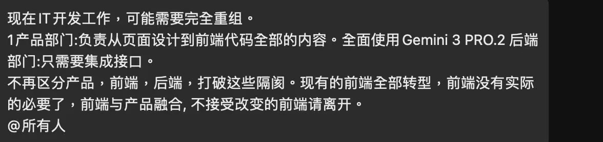

# 浏览器插件开发经验分享二：如何处理日期控件

今天搞定了小插件的“定时新章节”功能，我的浏览器小插件又有了小小更新。

定时新章节页面里用到了 Arco Picker 组件，处理这个组件 AI 一开始也是一头雾水。由于浏览器插件开发是将 js 注入到别人的 html 页面之内，所以我们不能引用类库、用常规的前端方法去设置日期/时间控件的值。

怎么办？

直接设置是行不通的，设置完之后还会恢复成默认值。

像这样的情况，我在一篇文章分享中提过了，这是属于 AI 不熟悉的业务逻辑。当然现在我熟悉了，我指导 AI 完成了正确的开发，这是因为我懂前端开发，我懂 html/js/css 及浏览器插件接口这些东西。如果我不懂呢？我知道什么提示语能让 AI 做出正确的行动吗？我可以，并不代表别人也可以。如果我不共享我的项目数据、不提供给 AI 作为训练资料，别人遇到类似情况也要像我一样从头摸索。

今天我在 X 上看到一篇帖子，说某公司计划把前端部门裁掉，只保留产品部门和后端部门，后端部门提供接口价值，产品部门负责起所有 UI 和前端工作。



我想问问这位公司老板，产品部门的工作包括前端的 Debug 吗？

你把前端部门解散了，等产品部门 Debug 搞不定的时候，你就只能抓耳挠腮了。Gemini 3 Pro 在大多数项目上可以，但不代表在所有项目上都能顶用，尤其在创新业务上。除非你的项目没有创新，话又说回来，项目没有创新，产品部门和后端部门也可以砍掉，只留一个全栈工程师就够了。希望这个帖子只是一个段子。

最后说一下，在浏览器插件开发里面，Arco 日期/时间控件怎么处理？

一共分两步。首先，先用下面这个通用的工具函数设置控件的值：

```rust
function setReactInputValue(inputElement, newValue) {
    if (!inputElement) return;

    // 1. 获取原生 input 的 value setter
    // 这是为了绕过 React 对 value 属性的劫持
    const nativeInputValueSetter = Object.getOwnPropertyDescriptor(
        window.HTMLInputElement.prototype, 
        "value"
    ).set;

    // 2. 调用原生 setter 设置值
    nativeInputValueSetter.call(inputElement, newValue);

    // 3. 构造并触发 input 事件 (React 监听的是 input 事件来更新 state)
    const event = new Event('input', { bubbles: true });
    inputElement.dispatchEvent(event);
    
    // 4. 有些组件可能还需要触发 change 或 blur
    inputElement.dispatchEvent(new Event('change', { bubbles: true }));
    inputElement.dispatchEvent(new Event('blur', { bubbles: true })); // 触发失焦关闭面板
}
```

设置完以后，控件处于打开状态，接着再分别单击子控件确认。对于日期控件，就是选择当前被选中的那个值所在的控件，点击它即可。对于时间控件，就是单击一个小“确定”按钮。

11月 25 日
