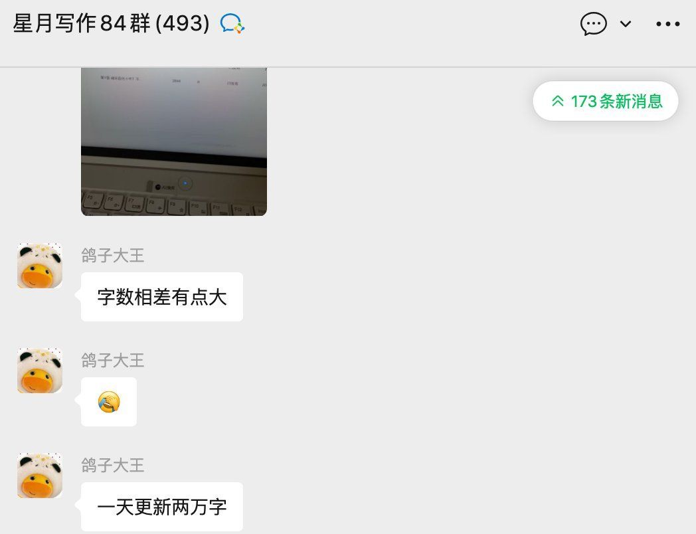

# 一次群内分享 AI 的经历

昨天，我在一个作家群内提到了 AI 与星月，星月是一个 AI 辅助创作软件，我提到抖音上讲有人用它实现了日 2k 月 15 万的小说创作收入。我还把该星月平台的兑换券分享给他们，我以为他们会拥抱 AI，积极学习，搜索新事物。

结果，群里炸锅了。不止一个人跳出来说，不能直接使用 AI 进行创作，压根就没有人讲 100% 使用 AI 替换人工，一直在说的是 AI 辅助创作。但部分群友的反应就是很大。这些人的负面反应简单归纳，可以分为：

一、AI 无用论，坚决不用 AI；
二、AI 有限论，AI 只可以辅助生成配色人物名字和进行环境描写；
三、AI 是洪水猛兽论，一旦使用了 AI，番茄平台小说账号权重会下降，甚至账号会被官方封号；
四、使用 AI 就是交智商税论。我问这位智商税论者，你交了智商税没有，有没有用过星月？他说没有。

整个 200 多人的群，平常都是日几十几百进账的小神作者，甚至有多人都卖出了短剧改编版权，就没有一个人对 AI 的态度是正常的，没有一个人肯认真坐下来仔细研究一下 AI 如何能促进写作，以及星月到底有什么利用价值。人家崔神把番茄后台都以视频的形式拍出来了，还直白讲了使用星月的方式——辅助，难道人家就是骗子，还是说我这个分享者是骗子？

昨天我进了星月的官方作者群。在星月软件的官方群里，却有大量小说创作者诚实得很，我进的是 84 群，我刚进群时，群员还不到 100 人，结果一天时间就快满员了。

为什么抵制 AI 的顽固者都在我在的那个作家群里呢？还是说，他们是 AI 的既得利益者，表面上公开反对 AI，其实是害怕大家都用 AI，导致他们的个人优势丧失？

11月 26 日
