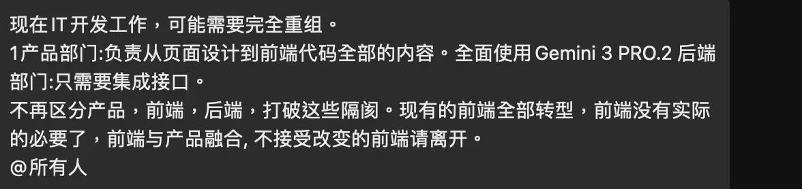
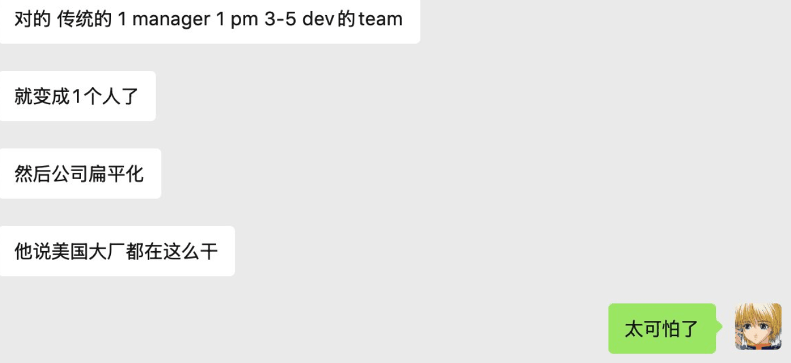

# 专家团队+N 模式

昨天我在 X 上看到某君分享，一个公司老板把公司前端部门裁撤了，只保留了产品部门和后端部门。我说，这两部门你也没必要留，只留一个全栈工程师就可以了。很多人在后面跟帖点赞。

今天又在 X 上看到有人分享微软的做法。以前微软一个项目组是一个项目经理+一个产品经理+三五个技术开发，其他设计和测试资源是公司内共享的。很多国内公司也是这种做法。现在微软的项目管理变了，变成一个人，一个项目组就是一个人。

说实话，微软的做法更现实，一个项目一个人，这个人就像现在的我一样，既是前端程序员，又是后端程序员，既是测试工程师，又是数据库工程师，既是产品经理，又是 UI 设计师，是项目需要的任何角色。有 AI 加持，一个人足够了。

在微软这样的公司，其实保留一个覆盖尽可能多细分领域的技术专家团队就足够了，任何搞定不了的 AI Debug 工作都能由这个专家团队兜底。其他一切项目，从发起，到运营，到结束，都只需要一个人。外面是一人公司/一人团队，在公司内，是一人项目。

国内大小厂也应该行动起来，把往日庞大或不庞大的技术团队重组为"专家团队+N 模式"。N 是 1，即许多一个人主导的、基于公司资源创建和运行的一人项目。原来的技术员工都进专家团队，一个细分领域的专家也不一定只需要留一个人，可以多留一两个，专家团队里的专家可以等待别人点他请他支援工作，也可以自己发起做一人项目，自己在公司内创业做老板。

我目测以后国内还会诞生不少这样的一类公司，这类公司里面只有技术专家，以外包的形式把专家派出去。中小公司就没有必要养技术专家了，直接从这类公司租赁就可以了。也就是说，这类公司只有技术专家，没有项目，而中小公司只有 1，只有项目。或许只有部分传统独立大厂是专家团队+N模式。

11 月 26 日
