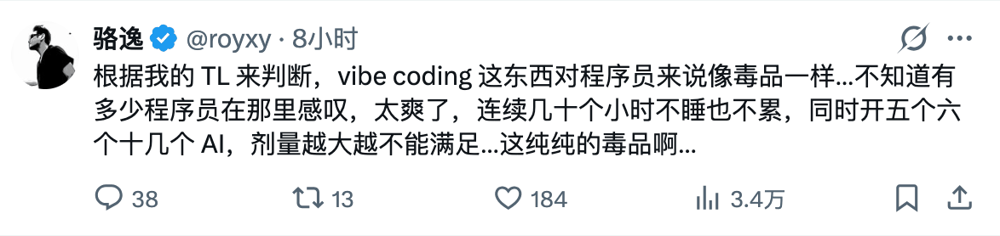
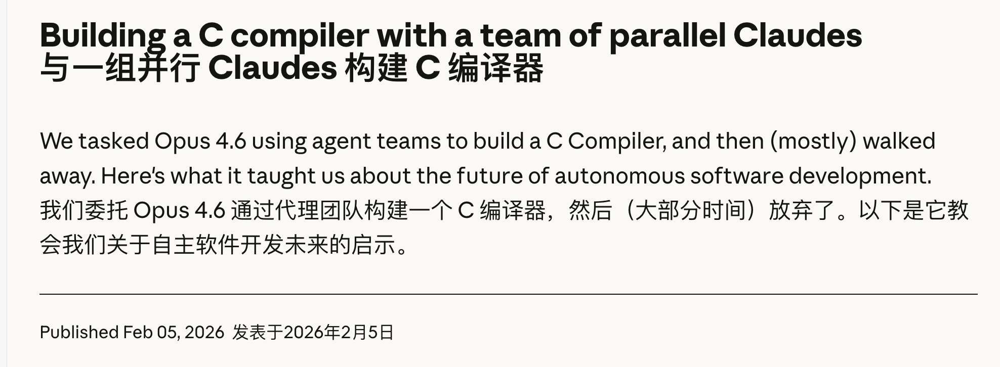

# 有一个家伙说 Video Coding 上瘾

我丝毫不怀疑这个家伙说的，我还看到另一个家伙说，要 AI 厂家限制每天 token 只能用 8 小时，目的就是为了让上瘾的人休息！

这与我在社区，以及一些群中看到的情况完全不同。社区里有些人反对，我不明白为什么反对。明明社区里大部分都是程序员，他们理应像我一样上瘾才对。难道他们看到 AI IDE 突然有了如此强大的生产力不手痒吗？难道他们不想夜夜指挥 AI 编程，想同时开发十几、二十几个项目吗？这种像搭积木一样的创造快乐，难道他们不想要吗？

还有在某个群，是一个写作群，之前我写过，当我抛出 AI 时，一帮人出来反对，说 AI 有害，还说 AI 无用。他们的观点我不惊奇，他们的态度反而更加能引起我的好奇。难道是他们已经从 AI 中获取了巨大好处，而害怕其他人进来了他们的优势丧失吗？

今天我还看到了另外一则消息，说 Anthropic 公司做了一个实验，用十几个 Agent 组成一个团队，共同编写了一个 C 语言编译器。是用 Rust 编写的，可以编译 Linux 内核百万行代码。这个工作大概只花了 2000 个会话，在很短的时间内就完成了。

这件事吸引我，是因为它是团队作战。简单说一下 Anthropic 是怎么做的，他们的工程师用了很多 Docker，每个 Docker 里面有一个 Claude Code（就是 Agent），它们各自在自己的 Docker 环境中工作，从 Git 仓库中拉取代码，从总任务表中领取任务，放置一个 lock 文件，锁住任务，然后在本地努力编程，编完了，测试，提交代码，删除 lock 文件，给任务打勾。每个 Agent，就相当于公司里或居家办公的一个程序员，他们通过 Git 协同，共同完成了一个编译器编写工程。

Anthropic 用 Docker，可能是他们的机器性能强。其实这与我在云服务器上安装和使用 Anti 原理是一样的。我在一台机器上还安装了 Openclaw（俗称小龙虾）。Openclaw 负责与我沟通，Anti 或 Claude Code 负责干活，多台服务器上的多个 Agent，它们可以共同协作完成一个项目，也可以一人搞一个项目。在搞的过程中，及完成后，由 Openclaw 向我汇报。

同时，这种多 Agent 协作的模式，也不只限于同一种 Agent。一台用 Anti，另一台用 Cursor 或 Claude Code 不可以吗？当然可以！甚至用 TRAE，或 CodeBuddy 都可以。当在同一个项目中合作时，因为 Agent 有高下之分，强 Agent 甚至还可以给弱的 Agent 派发任务！

这样的多 Agent 协作模式，难道不有趣吗？难道身边真的没有人想尝试吗？

#技术·求真·AI

📅 2026/02/07 周六 00:35