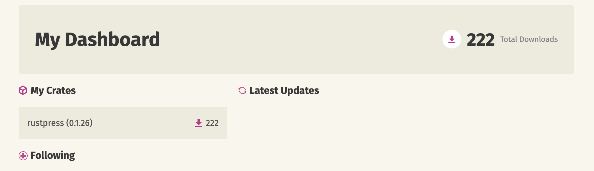

# 恩言-大字有声圣经发布了

“众人都称赞他，并希奇他口中所出的恩言……”

这句话出自圣经新约路加福音第 4 章第 22 节。

这就是我的离线圣经 App，已经发布了，可以从下面这个网址查看详细和下载：

[https://yishulun.com/enyan.html](https://yishulun.com/enyan.html)

Android 主流版本只有 40MB，安装包体积不大。安装后，可以在有 Wifi 的情况下下载安装繁体语言包（如果需要）和真人朗读语音包。这种下载也是一次性的，下载后可以一直离线使用。

程序还有许多可以改进的地方，但基本满足我的初步设想，我对这个 1.0 版本是满意的。

另外，我的 rustpress 又小小更新了一下，加上了评论插件，可以使用 github issue 作为评论仓库。不是使用 giscus 之类的插件完成的，是自有插件。虽然是静态博客，也可以拥有自己的插件，这是以前都是不可想象的，现在变得很容易。

这个 Rust 静态博客程序已经有 222 个下载了，没想到有这么多人喜欢它。

所有软件，如果想给更多人使用，一个下载页面，加上几页说明文档都是需要的。文档上写什么呢？例如评论插件如何配置、博客 config.toml 文件如何配置等，这些我认为没什么好讲的东西，可能用户刚接触时不明了，是需要引导的。

#技术·求真·AI

📅 2026/02/19 周四 18:46