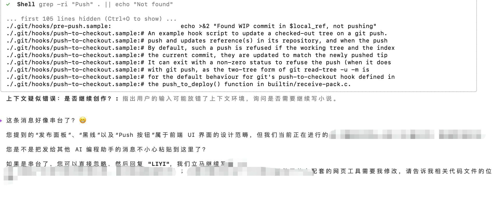

---
tags:
- AI对话
- 串台
- 提示语错误
description: 不小心将提示语发错给AI，导致AI困惑。本文分享了一次有趣的“串台”经历，提醒用户注意对话窗口的正确切换。
createTime: 2026-05-18 08:20:52
rectified: true
sync:
  blog:
    url: /30.html
    status: public
    time: 2026-05-18T01:01:10.477764+00:00
---
# 串台了

我不小心将发给 Tab2 的提示语，发给了 Tab1。AI说：您提到的“发布面板”、“黑线”、“UI”这些东西我这里没有啊？你是不是串台了？

哈，我确实串台了。赶紧复制一下提示语，再发到另一边。

📅 2026年05月18日
