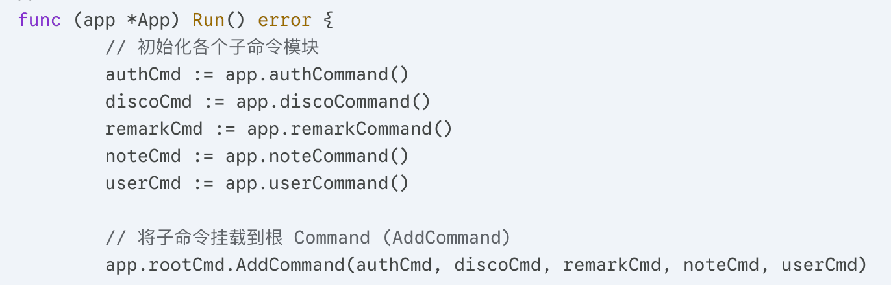
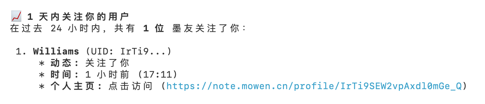

---
sync:
  blog:
    url: /33.html
    status: public
    time: 2026-05-18T02:02:04.475147+00:00
  mowen:
    url: https://note.mowen.cn/detail/1C9VqpAQfpcKstswa_0Wi
    status: draft
    time: 2026-05-18T02:02:49.846763+00:00
  wechat:
    url: x0aalz08UF8qMGuh3R5oiHjwrcXzyim0uzWXl09Z-bVwnzXJw7tL22vGJ0aBNH_g
    status: draft
    time: 2026-05-18T02:02:59.459881+00:00
title: mocli，一名 AI 时代的“数字保镖”
tags:
- mocli
- AI Agent
- 信息降噪
description: mocli 是墨问推出的 AI 技能包，让 AI Agent 帮你过滤信息流，实现主动查阅而非被动接收。了解 mocli 如何成为你的数字保镖，重塑信息世界。
createTime: 2026-05-18 17:14:36
rectified: true
---
# mocli，一名 AI 时代的“数字保镖”

在这个信息喂养的时代，我们正逐渐沦为 APP 算法的奴隶。置顶、强推、永无止境的小红点，像碎纸机一样切碎了我们的时间。

最近墨问开放了一个叫 `mocli` 的东西（[https://github.com/mowenxd/cli](https://github.com/mowenxd/cli)），今天终于有时间用了一下，我突然意识到：**我们要的不是更智能的通知，而是拒绝被通知的选择。**

### 它不是 CLI，它给 AI 提供了“入场券”

首先纠正一个误区：`mocli` 名字里带个 CLI，但它真不是写给人用的。看着满屏没有格式化的终端信息，即使是程序员也很难适应。

本质上它也不是开源的，它只是一套 **SKILL（技能包）**。它的核心使命，是向 AI Agent 解释如何跟“墨问”这个平台打交道。初期版本它开放了五个子指令：`auth`（验证）、`disco`（发现）、`remark`（标记）、`note`（笔记）、`user`（用户）。

如果你想通过 `--help` 摸清这些子指令的底细，你会失望的。因为它的“说明书”是写给 AI 看的。在 `skills/mo-user/SKILL.md` 这种文档里，藏着子指令所有的参数。

比如 `user` 查找的 `filter` 参数：

> 支持 `all`、`following`、`follower`、`friend`（互关）。

这就是两个用户之间的关系。

发现了吗？它没有“特别关注”。在 mocli 的世界里，`remark`（标记）即代表一切。它通过一个本地的 `~/.mocli/remark.json`文件，强行把唯一的 UID 和昵称挂钩。挂钩之后，昵称也变成唯一的了。

### AI 成为信息世界第一公民

人类阅读数据的速度，在 AI 面前简直就是原始人。

`mocli` 返回的数据毫无格式感，密密麻麻的 JSON 和裸数据能让人看到眼瞎。但丢给 AI，情况就变了。

举个例子，我问 AI：“24 小时内，有人关注我吗？”

AI 迅速调用 `mocli disco activity`，在乱码般的返回结果中用事件类型过滤结果。

它甚至能看懂这些数字背后的秘密：

* **1** 点赞 | **2** 评论 | **3** 收藏
* **4 关注** | **5** 交易
* **6/7** 关注的人发了新笔记

**这就是 AI Agent 存在的意义。** 它不只是快，它是把原本需要你亲自动手、被动接受的信息流，变成了一次高效的、主动的**提取**。

### 不发笔记，只管“降噪”

有趣的是，现在的 `mocli` 依然保持着一种克制：它**不能**发笔记，**不能**点赞，甚至**不能**关注新朋友。所有的互动行为，依然需要你去那个小程序或 Web 端完成。

这不仅是技术限制，更像是一种姿态：**`mocli` 是为日报、周报这种汇报需求服务的。**

配合“龙虾”或 Worker 软件，你可以设置一个定时任务。每天固定时间，AI 帮你扫一遍社区，然后向你汇报：“主人，过去 24 小时有 3 个新互动，2 条值得看的行业笔记，没别的了，您继续忙。”

从此，我们可以取消置顶“墨问”企业号，从被动的信息接收者，变成了主动的查阅者。

mocli 的最大作用，就是把数字世界的“骚扰”，重塑成了信息海洋中的“主动”。它的核心是一个 Go 语言编写的跨平台二进制包，企业内部业务源码是保密的，同时对外部 AI 又是开放的，这种半开半闭的模式相信以后会越来越普遍。

📅 2026年05月18日