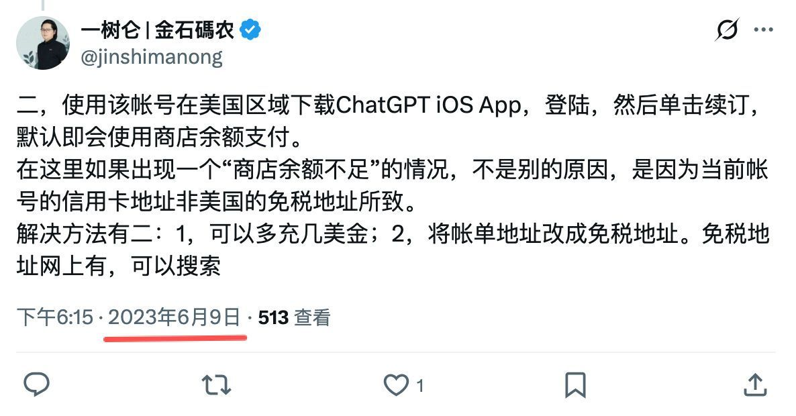

# 都 2026 年了，竟然还有人在翻我 2023 年的“保姆级”旧贴？

说个小事，这两天我被后台的消息弹窗整懵了。

原本以为 GPT 5.5 这种“性能怪兽”横空出世，加上价格直接打到地板上，大家早该在 AI 的世界里“起飞”了。结果倒好，我那篇写于 2023 年、教大家怎么买 ChatGPT 会员的陈年旧贴，居然又被网友点赞激活了。

**这感觉就像是，大家都在研究怎么开曲率引擎飞船了，结果还有一群人在打听哪儿能买到最结实的马车绳。**

## 怎么回事？

最近 AI 圈确实挺玄幻的。首先是 **GPT 5.5**。不仅逻辑推理强得离谱，响应速度快到像是在读你的脑电波，最关键的是：它便宜得不讲道理。

自从 2023 年 OpenAI 开始将代码能力彻底融入大模型后，如今的 GPT-5.5 更是把这种原生写代码的能力推向了极境。原来在本地用 GPT 写代码，和在 Web 里聊天是两种不同花费，要花两份钱，现在 OpenAI 把 Codex 和 ChatGPT 彻底**合二为一**了。这意味着，你买一份会员，不仅能在 Web 或 App 里畅聊，还能直接在 Codex 里让 AI 帮你敲代码，一份钱干两份事，生产力直接爆表。

更绝的是，Codex 搞定了**全平台一体化**。

以前我们要在手机、桌面和浏览器之间来回横跳，割裂感重得像是在用三个时代的产物。现在呢？Codex 与 Codex App 打通了，你在手机上随手发个指令，桌面的智能软件就开始自动跑任务。你在家里的控制终端能看到所有任务进度，这种丝滑感才是 2026 年该有的样子。在浏览器上是 Codex Chrome extension，如果你在开发浏览器插件软件或带插件的软件，一定要安装它。

## 进化方向

我一直觉得，**AI Agent 的进化方向，从来不是要把人类关进黑屋子，而是要消灭一切繁琐的交互。**

未来的桌面软件，可能根本不需要你懂什么复杂的 UI 界面。你是技术大佬，直接在终端里一行代码控制全场；你是软件小白，它就给你一套最傻瓜智能化的 UI。

**核心能力在终端，易用性在表面。** 这种“外圆内方”的逻辑，才是 AI Agent 真正的归宿。

至于那篇旧帖子，既然大家还在点赞，那就说明它提到的方法仍然有效。

还没上车的兄弟，别犹豫了，GPT 5.5 的门票依然值得你拥有。

📅 2026年05月19日