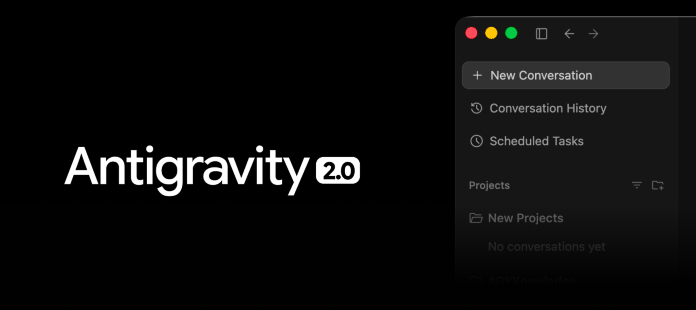
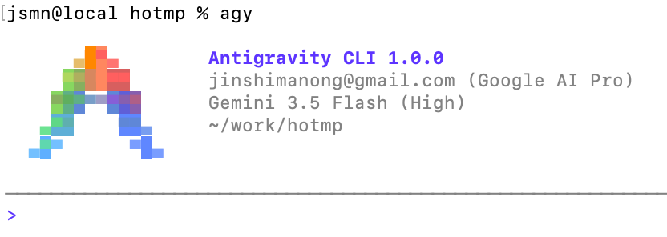
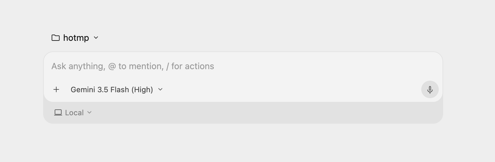

# 谷歌发布 Antigravity 2.0：界面干净了，但我怎么感觉又被“白嫖”了？

我最近对 AI 编程工具有点倦怠了。

今天 520，谷歌发布了它被称为“洪水猛兽”的 **Antigravity 2.0** 及其配套的 CLI 工具 **Antigravity CLI**，缩写叫 **agy**。

这是Antigravity 2.0：

这是Antigravity CLI：

看到 `agy` 这个启动命令时，我第一反应是：这名字起得如此简洁，谷歌设计师难道不怕网民管它叫 `gay` 吗？吐槽归吐槽，当我点开 Antigravity 2.0 干净的界面时，确实被震撼到了。

它已经完全没有了传统 IDE 那种臃肿的影子。如果说 1.0 版本还是在 VSCode 的底座上快速拼凑出的 AI IDE，那么 2.0 已经彻底蜕变成了一个带 UI 的 AI Agent。它干净得让你怀疑自己是不是在跟一个 Web 网页聊天。

这也验证了我之前的想法：IDE 繁琐的复杂性很多时候是冗余的，简洁才是王道。

然而，在被界面惊艳之余，我突然有一股深深的倦怠感。

自去年 11 月发布首版以来，Antigravity 相比 Codex、Claude Code 没少受人诟病。我用得还算满意，但直到最近网络波动，卡得我怀疑人生，我才不得不转向 Gemini CLI。

为什么我们会倦怠？

因为在这个 AI 1.0 的时代，我们这些付费买着会员、自备着梯子的使用者，每天在做什么？我们在调教它的逻辑，我们在写各种 `SKILL` 优化它的流程，我们在网络卡顿、报错时，一遍遍不厌其烦地狂点 Retry。我们自以为是掌握前沿的“消费者”，其实说白了，我们是在给大厂做免费的“模型陪跑员”和“高级数据标记工”。

我们花了钱，花了精力，还要花时间把大厂的模型越训越聪明。难怪我总想隔空喊话：谷歌，什么时候给我打钱？

抱怨归抱怨，要在这个时代活下去，我们必须紧跟前沿。既然谷歌今天带上了这套全新的自动化生产力工具，那我们就必须把它研究透，把它的价值榨干。

来看看这次 2.0 引入的 4 个核心硬核新指令，它们才是 Antigravity 从“聊天编程 IDE”演进为“自动化 Agent”的关键：

1. `/goal`（持续自动执行指令）

* **核心作用**：开启“无人值守”的完全自治模式。
* **具体表现**：平时 AI 跑复杂的任务，总喜欢中途停下来，小心翼翼地弹窗询问：“我可以继续吗？”“这个文件要改吗？”。一旦敲下 `/goal`，AI 就会进入“专注狂飙”状态。它会自主将大任务拆解，然后连续执行，不达目标誓不罢休。
* **适用场景**：适合边界清晰、繁琐但不需要人类做主观决策的流水线任务（比如批量重命名、数据清洗、多文件自动代码生成）。

2. `/grill-me`（深度反问与细节对齐指令）

* **核心作用**：强制 AI 在行动前进行“反向审查（Plan Review）”。
* **具体表现**：这个指令和 `/goal` 完全相反，它的作用是让 AI “慢下来”。在你抛出含糊的任务时，AI 不会急着去胡写乱编，而是化身成严厉的“终极审查官（Griller）”，疯狂向你反问边界条件、技术栈兼容性、潜在安全漏洞等问题。只有等你们俩在方案细节上彻底对齐、达成一致后，它才开始动手。
* **适用场景**：非常适合复杂的架构设计、大型业务逻辑重构，或者开发一个全新、模糊的模块。这能帮你省去 90% 的返工时间。

3. `/schedule`（定时与周期任务指令）

* **核心作用**：给 AI 注入时间维度的调度能力。
* **具体表现**：它能把 AI 变成一个全自动的 `cron job`。你可以设定某项指令在未来的精确时间点触发（一次性），或者按照特定的频次（比如每天早上8点、每隔 2 小时）循环执行。
* **适用场景**：适合定时发送项目进展邮件、周期性抓取前沿资讯、定时监控并清理服务器日志等事务。

4. `/browser`（强制启用浏览器指令）

* **核心作用**：手动控制浏览器工具的“显式开关”。
* **具体表现**：以往 AI 在判断“何时该联网查资料/操作网页”时不够智能，要么用过时的预训练知识瞎编，要么在不需要时过度联网。加上这个指令后，AI 必须严格且优先调用其内置的浏览器功能去访问真实网页。
* **适用场景**：必须获取最新网络信息（如今天刚发布的文档）、验证特定线上网页状态，或者需要 AI 模拟人类浏览网页进行数据抓取（Web Scraping）时。

## 总结一下

这四个新指令分别解决了**执行连贯性（`/goal`）**、**前期严谨性（`/grill-me`）**、**时间调度（`/schedule`）** 和 **工具调用的精确性（`/browser`）**。

再加上谷歌同期发布的 Antigravity SDK，这一整套生态的逻辑已经非常闭环：

**agy CLI 和 Anti IDE 是外壳，SDK 是桥梁，而灵魂依然是大语言模型（目前是 TPU 加持的 Gemini 3.1 Pro Preview）。**

它就像矗立在城市中央的算力大山，时刻帮我们处理洪流般的大数据。

作为真正的创作者，在这个“付费陪跑”的时代，如果你感到疲惫，唯一的解法就是像马老板倡导的那样，尽早实现项目开发的自动化：

1. **尽可能简化流程；**
2. **尽可能让流程自动化；**
3. **尽可能让整个流程持续进化。**

在这个进化的链路中，人类不再做无谓的繁杂劳动，只贡献我们最宝贵的黄金资产——情感、感觉和创意。

真正的程序员，做的事并没有减少，也并没有变简单。内容变了，变大了，也变深了。当 AI 表现不错时，不要以为它无所不能；当我们意欲用新的 SKILL 解决更复杂的任务时，我们仍然要付出足够的精力和时间。

不要拷贝，去创造。把用 AI 挣来的钱，转化为更多更强的算力，以期待获得更多。说白了就是，身为牛马的我们更累了。大家像登山爬长城一样，无论爬到了哪里，抬头前面有人，往下看后面也有人，但无论在什么位置，都要努力继续向上爬。

📅 2026年5月20日
