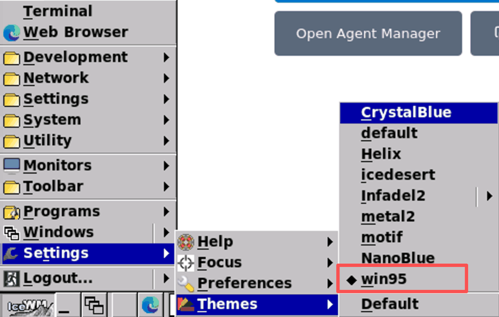
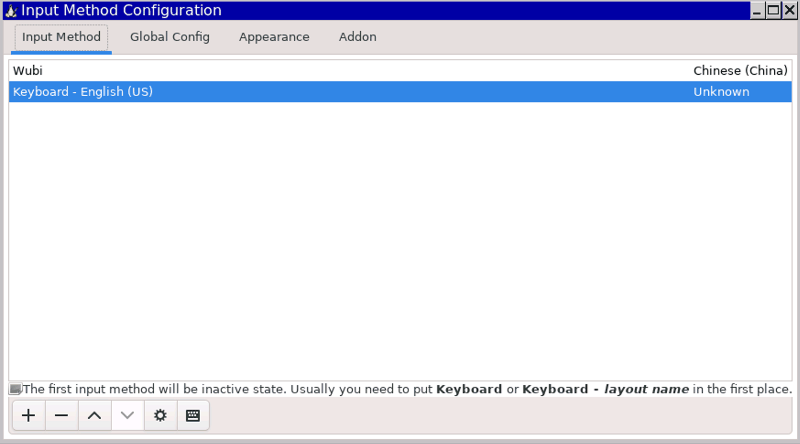
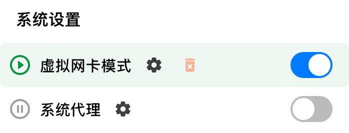
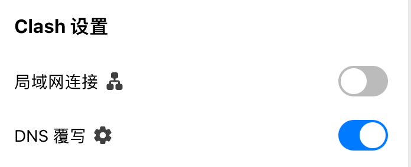
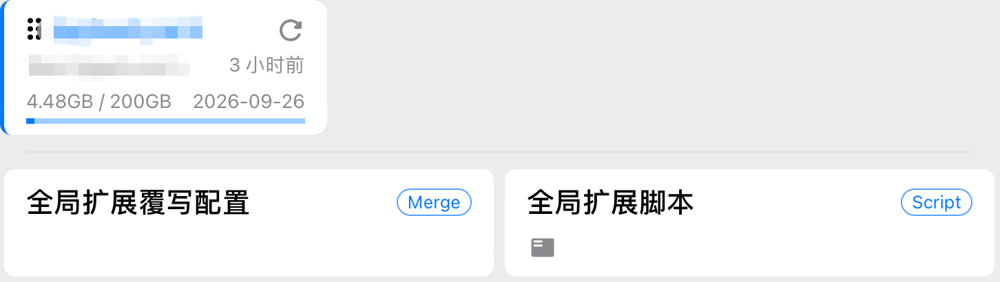
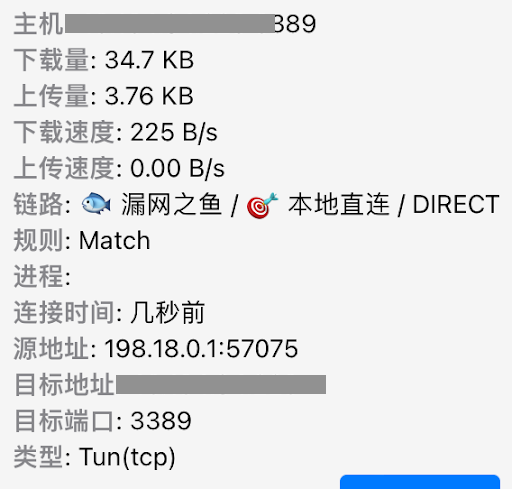
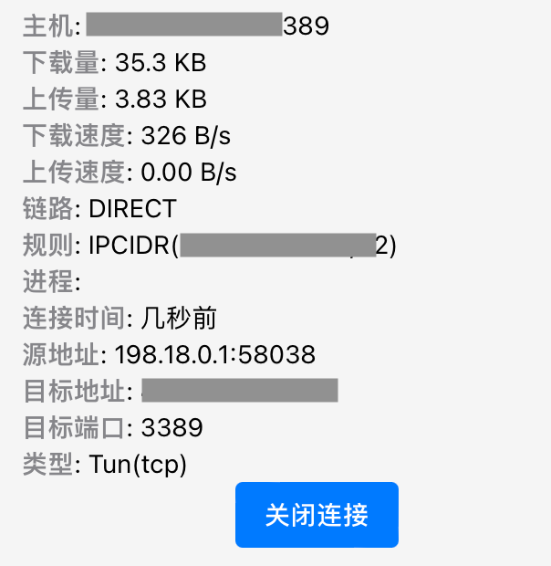

# 🚀 Ubuntu Server 云端开发环境搭建与网络调优全记录（在云上并发使用 Antigravity）

为什么要在云上使用，不在本地使用？

不，本地也在使用，只是同时在云上多使用一份。有多个云服务器，就可以使用多个云上 Antigravity，以此实现 Agent 编程的并发。理解了吗？这是我实现 Lead AI，而非单纯 Debug AI 的一部分。

远程桌面运行要流畅，要像使用本地软件那样，可以在 macOS 系统上当作窗口划来划去。为了实现这一点，兼具省钱，我实践并整理了以下教程，供参考。

## 选择海外 Ubuntu Server

服务器选购的首要原则，是稳定与低延迟。机房建议选择新加坡，因为该区域属于 Antigravity、Claude Code、Cursor 等软件的天然允许区域，不用翻墙即可使用。

服务器硬件配置，至少选择 2 核 4G 内存，带宽至少选择 4Mbps。这个配置的包月费用大概在二百多元人民币。这 4Mbps 的带宽，约 512 KB/s，只是给远程连接用的，它是确保 720P 画面顺滑的最低标准，再低就影响开发心情了。

操作系统，务必选择 Ubuntu Server 22.04 LTS 作为操作系统，不要选择 Windows。Linux 不仅运行性能高，占用的 CPU 和内存小，占用的硬盘空间也小。

在云平台操作时，别忘记在安全组规则中开放 3389 端口，稍后要用这个端口进行远程连接。

## 免密登录

云服务器创建后，拿到 IP、密码就可以登录了。但每次都输入密码太过麻烦，现在为服务器实现免密登录。这一步的目的也是为了让云服务器成为本机的一个远端分机，可以像操作一个窗口那样丝滑操控。

首先，查看本地是否已经存在名为 id_rsa.pub 或 id_ed25519.pub 的密钥文件：

```
ls -al ~/.ssh
```

如果没有，开始生成：

```
# 生成 ed25519 类型的密钥，-C 后面填写你的邮箱
ssh-keygen -t ed25519 -C "your_email@example.com"
```

然后，将公钥上传至服务器：

```
# 将本地公钥拷贝到远程服务器，实现免密登录
ssh-copy-id ubuntu@43.134.99.228
```

这一步需要输入服务器密码，但也仅需要输入这一次，以后就不需要了。

随后，在本地环境的 `~/.zshrc` 文件中配置快捷别名：

```
alias ssh228="ssh ubuntu@43.134.99.228"
```

以后在终端里只需要输入 ssh228 就可以登录服务器。

## 开启 ubuntu 桌面

如果用 Claude Code，我们在终端里编程是不需要开启 Ubuntu 桌面的。或者我们用 VSCode，也可以通过 Remote SSH 进行编程。但现在我们使用的是 Google Antigravity，目前它需要图形化操作，必须开启桌面。

安装极简桌面窗口管理器 iceWM：

```
sudo apt update # 更新系统软件包索引
# 安装桌面环境内核、终端工具及远程桌面协议服务端 (xrdp)
sudo apt install icewm icewm-common
```

有这个 iceWM，ubuntu 才能以可视化的界面呈现。除了 iceWM，ubuntu 还支持其他桌面管理器，例如 kubuntu、gnome、kde 等。但 iceWM 比它们占用资源小，且更适合使用，具体原因稍后有讲。

安装与启动远程桌面连接服务器端：

```
sudo apt install xrdp -y
sudo systemctl enable xrdp # 设置远程桌面服务开机自启
sudo systemctl start xrdp # 立即启动远程桌面服务
```

有这个 xrdp，我们才能在 3389 端口远程连接上服务器。

## 安装终端软件

Ubuntu server 自带有终端软件，但不支持多 tab，可以使用 lxterminal，占用资源不多，支持多 tab 和粘贴（通过右键）：

```
sudo apt install lxterminal
```

## 远程连接

到了这一步，我们可以在 macOS 系统上进行远程登录了。远程登录软件首推微软的 Windows App，图形化远程传输，没有人比得了微软，以前这个软件的名字叫 Microsoft Remote Desktop。

在 Windows App 中创建 PC 实例时要注意，分辨率不能选择默认，本机是 Retina 屏幕，远端桌面默认是 2000 多的分辨率，相当耗带宽。选择 720 的分辨率，即 1152x720 即可，如果没有这个分辨率，可以自定义一个。

还有颜色模式，建议选择 16-bit (High Color)，不要选择 32-bit。选择 32-bit 没有用，我们又不在服务器上看电影。还有打印机、声音等设备，一律不要选择。

只保留双向剪切板，这是开发中是经常用得到的。

设置好了，就可以登录了，默认在全屏下打开云服务器桌面，窗口是最大化的。

## 选择 win95 主题

你怀念 Windows 老系统的风格吗？尤其是 Windows 2000、95、98 的风格。我怀念。远程连接后，按照图示路径即可以设置 iceWM 的主题为 win95。可以选用这个主题，也是我选择 iceWM 的原因之一。



凭心而论，win95 的 UI 并不丑，它代表的是一种简洁的美。平时看惯了 macOS 的高清 UI，看一看这种粗糙简洁的界面，也很有意思。

## 安装 Edge 浏览器

多年以前，微软靠着把 IE 捆绑进操作系统这一招，实现了浏览器市场占有率第一。后来被谷歌开源的 Chrome 赶超了。微软不甘心，学习 Chrome，在其基础上开发了开源的 Edge 浏览器。不得不说，这个浏览器在侧边栏、响应速度等多方面体验都不错。从 2025 年开始，我就把主浏览器从 Chrome 换成了 Edge。

在 ubuntu 上安装 Edge 分三步：

```
# 下载微软公钥并添加到系统受信任密钥库
curl https://packages.microsoft.com/keys/microsoft.asc | gpg --dearmor > microsoft.gpg
sudo install -o root -g root -m 644 microsoft.gpg /etc/apt/trusted.gpg.d/
# 将微软官方稳定版软件源添加到系统源列表
sudo sh -c 'echo "deb [arch=amd64] https://packages.microsoft.com/repos/edge stable main" > /etc/apt/sources.list.d/microsoft-edge.list'
# 更新源并安装最新稳定版 Edge 浏览器
sudo apt update && sudo apt install microsoft-edge-stable -y
```

由于服务器在海外，即使安装大软件，也是嗖一下就安装完了。我们购买服务器时选择的 4Mbps 带宽其实是给远程软件 Windows App 使用的，在服务器上进行网络操作，不与这个带宽冲突，很快。

## 安装五笔

我使用五笔打字，在 ubuntu 上最稳定、占用资源最小的五笔软件是 Fcitx。下面安装它：

```
# 安装五笔输入法及其配置工具
sudo apt install fcitx fcitx-table-wubi fcitx-config-gtk3 -y
```

配置自动启动：

```
mkdir -p ~/.icewm # 创建 IceWM 用户配置目录
echo "fcitx &" >> ~/.icewm/startup # 将输入法启动项写入桌面初始化脚本
chmod +x ~/.icewm/startup # 赋予启动脚本执行权限
```

这是利用了 icewm 的自动启动设置，其它软件或脚本想自动运行的，也可以放在这里。

最后是配置：

```
# 启动图形化配置工具，手动添加五笔输入法并自定义切换快捷键
fcitx-config-gtk3 &
```

安装完了，只是安装完了，还不能马上使用，必须加以配置，以在操作系统中使用它。

在添加五笔输入法时，要反选“Only show current language”，这样才可以看到中文输入法。



看这个配置面板，像不像 Windows 95/98 的风格？

## 安装 Google Antigravity IDE

接下来重头戏来了，我们搞了这么多，目的就是为了安装和运行它。

安装 Anti 一共分三步。一，处理公钥和添加软件源

```
# 创建存储库密钥存放目录并下载官方签名公钥
sudo mkdir -p /etc/apt/keyrings
curl -fsSL https://us-central1-apt.pkg.dev/doc/repo-signing-key.gpg | \
  sudo gpg --dearmor --yes -o /etc/apt/keyrings/antigravity-repo-key.gpg
# 将 IDE 的专有仓库地址写入软件源配置文件
echo "deb [signed-by=/etc/apt/keyrings/antigravity-repo-key.gpg] https://us-central1-apt.pkg.dev/projects/antigravity-auto-updater-dev/ antigravity-debian main" | \
  sudo tee /etc/apt/sources.list.d/antigravity.list > /dev/null
```

二，更新缓存

```
# 更新缓存
sudo apt update
```

Linux 系统安装软件一般都需要更新缓存，这是因为刚添加新的软件源，因为不更新，apt 不认识新的软件名称。

三、安装

```
# 安装智能开发工具
sudo apt install antigravity -y
```

以上安装脚本来源于谷歌官方（https://antigravity.google/download/linux），直接拷贝、粘贴、执行就可以了，没有什么神秘的。

## 配置 Dlash Verge

云服务器配置好了，还剩下最后一个现实的问题：我们的本机因为要资料、要连接 Gemini、要研究，一是需要翻墙的。但是远端桌面软件 Windows App 不需要。由于 AI 领域的地域隔离，我们在使用梯子（例如 Dlash Verge）时，又必须开启 Tun 模式或全局模式，这便导致所有流量都走了虚拟网卡（包括连接向云服务器的流量）。远程连接走了 Proxy，怎么可能快呢？

接下来开始配置 Dlash，解决这个问题。

先更正一个观念，Dlash Verge 如果开启了 TUN 模式，就没有必要开启全局模式了。事实上全局模式也没有必要开启，开启全局时，所有流量都走代理，包括本地流量，这会使我们看腾讯视频或抖音视频很慢。



网上有人说，要通过 Bypass 设置，但在 Dlash Verge 中，这个 Bypass 它在系统代理的小齿轮里，系统代理都关掉了，在里面设置 Bypass 也是没有用的。

另外注意，为了连接稳定，我们还开了 DNS 覆写：



这里面有 fake-ip，有了这个设定，在外面设置 Bypass 也没有用。全局代理与 Bypass 属于旧设置了，在 AI 时代已经不合用了，忘记它们吧。但在 DNS 覆写这里，我们能做的控制也有限，这里的配置最好不要动。

后来，我想到了通过 rules，在订阅 Tab 里面，在订阅配置上，和全局扩展覆写配置上，都可以写入 rules。



于是，我写了这样一个 rules：

```
# Profile Enhancement Merge
profile:
  store-selected: true

# 物理层绕过：强制流量不进入 Dlash 内核
skip-proxy:
  - 43.134.99.228/32
  - 43.135.179.2/32

dns:
  enable: true
  enhanced-mode: fake-ip
  # 关键：防止服务器 IP 被映射为虚假地址
  fake-ip-filter:
    - '43.134.99.228'
    - '43.135.179.2'

# 规则插队：确保直连规则优先级最高
rules:
  - 'IP-CIDR,43.134.99.228/32,DIRECT,no-resolve'
  - 'IP-CIDR,43.135.179.2/32,DIRECT,no-resolve'
  - 'DST-PORT,3389,DIRECT'
```

但是没有效，连接向服务器的连接变成了漏网之鱼。



也不能说没有效，只要我们将漏网之鱼的策略保持为本地直连，那么通过云服务器的连接就是直连的，不走代理的。

这样，连接速度比走代理已经快了很多。

但，这种方式仍有问题。

在直连之前，这部分流量已经进入网络三层（因为我们开启了 TUN 模式），进行了 DNS 解析和 Dlash 规则匹配，它并不是真正意义上的直接，它已经有了延迟！

最后，苍天不负有心人，在我将要放弃的时候，我想到了全局扩展脚本。

直接覆写全局扩展不好使，我们可以写脚本：

```
function main(config) {
  // 设置顶级物理绕过清单，使服务器流量在进入隧道前直接重定向至物理网卡
  config['skip-proxy'] = [
    '43.134.99.228/32',
    '43.135.179.2/32',
    'localhost',
    '127.0.0.1'
  ];

  // 配置 DNS 过滤器，防止 Dlash 对这些服务器 IP 进行虚假的 Fake-IP 映射
  if (config.dns && config.dns['fake-ip-filter']) {
    config.dns['fake-ip-filter'].push('43.134.99.228', '43.135.179.2');
  }

  // 构造直连规则并强制插入到规则列表首位，确保优先级高于任何订阅预设规则
  const directRules = [
    'IP-CIDR,43.134.99.228/32,DIRECT,no-resolve',
    'IP-CIDR,43.135.179.2/32,DIRECT,no-resolve',
    'DST-PORT,3389,DIRECT'
  ];

  // 将自定义规则数组与原有订阅规则数组进行拼接，前置自定义项
  config.rules = [...directRules, ...config.rules];

  return config;
}
```

通过该脚本，去往服务器的流量，彻底实现了直连。



这里的规则，由 Match 变成了 IPCIDR，也昭示着配置生效。至此，配置完成。

这是一台云服务器，它在我的本地占有一个窗口，我还可以配置更多的云服务器，以实现 Anti 的并发使用。我在多个窗口间划来划去，查看各 Anti 的 Agent 工作进展，并分配给它们新的 AI 任务，以此 Lead 它们。

至于为什么我使用 Anti，不使用 Claude Code 或 Cursor，只因为 Anti 便宜，一顿饭钱就可以用一年，简直爽到天际了！

（注：文中服务器 IP 为假 IP，切莫连接尝试。）
