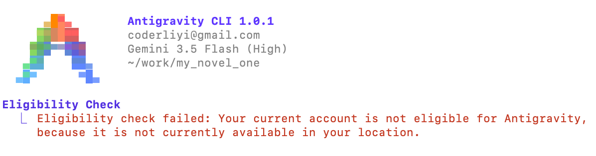
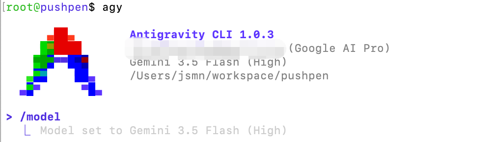
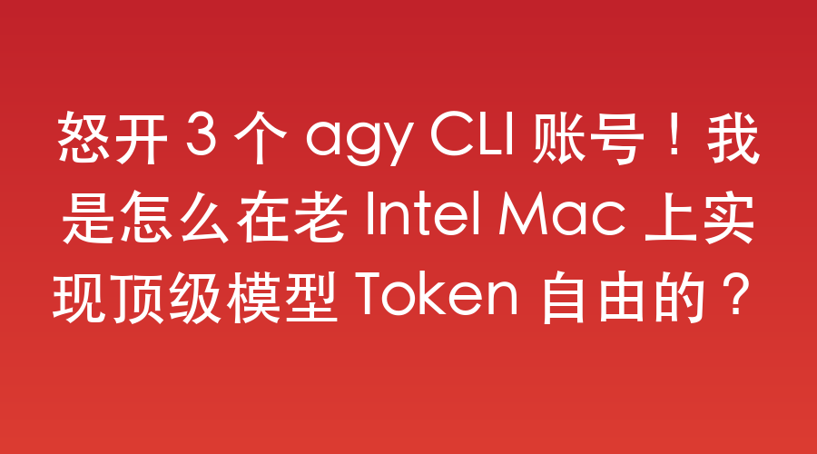

# 怒开 3 个 agy CLI 账号！我是怎么在老 Intel Mac 上实现顶级模型 Token 自由的？

写代码写得正嗨，正处于极客的 Video Coding 颅内高潮中，突然屏幕上弹出一行刺眼的“达到限额”提示——这种被强行中断的痛苦，懂的都懂。



对于高强度开发者来说，一个 Pro 账号的额度根本不够用，两个也紧巴巴，唯有三个账号轮番上阵，才能彻底覆盖我全天的精力和并发任务。

为了实现多开，我最开始动过歪心思。我找了 Muti-Antigravity-CLI 这种软件，甚至尝试去改造过一个开源项目。这类软件无非是两个实现套路：要么创建多个 HOME 目录，要么创建多个 Antigravity 配置目录并临时切换。

但我有严重的系统洁癖，我隐约记得自己在某些地方写死了 $HOME 或 ~/ 环境变量，乱改 HOME 目录极易引发玄学 Bug。于是我硬着头皮选了第二种方案。

结果，第一次启动就当头挨了一棒。账号直接报错，触发了安全提示。如上所示。

看着这行报错，我后背发凉。这种野路子多开方案不仅不稳定，还随时面临封号风险。我当场就把多开软件卸载得一干二净。我必须另外想办法。

## 野路子走不通

我用的是老掉牙的 Intel 芯片 macOS。更让人头疼的是，有些硬核依赖（比如 Antigravity-sdk-rust）在本机 macOS 环境下根本无法编译运行，只能在 manylinux 平台上运行。

难道为了实现 token 自由，我得每次繁琐地退出、登陆账号，顺便把好不容易积攒的 agy CLI session 缓存配置全部丢掉？或者，难道我必须得掏出大几千去换 M 芯片的新 Mac？

不。我需要一种绝对安全、不污染本机环境、能完美继承 Session，甚至还能顺手解决跨平台开发兼容性的终极方案。

我的答案是：用 Docker 容器化进行物理隔离，并用 Colima 进行硬件加速。

## 我的 Docker + Colima 闭眼实操指南

这套方案的核心逻辑极其简单：一个项目绑定一个 Docker 容器，一个容器死死绑定一个专属的 agy CLI 账号。一切都是为了高效便捷。

### 第一步：定制极简开发镜像

我基于原始的 `python:3.13-slim` 改造了一个开发环境。这个基础镜像非常轻量，据说只有几十 MB，极其适合在我这台老旧的 Intel Mac 上运行。

你可以基于它自己写，也可以直接抄我编写的 Dockerfile 配置：
https://gist.github.com/rixingyike/bf92ebc3a7bc3b686f5814907682b115

### 第二步：一键创建与双向同步

为了省去每次手动配置的麻烦，我写了一个自动化脚本。它能直接在本地自动创建并开启 Docker 镜像：
https://gist.github.com/rixingyike/4935bea673fb9f6efce8d46cda98db34

每次开发时，我只需要在本地终端里优雅地敲下一行命令：

```bash
colima start && cd workspace && ./docker_create_and_start.sh pushpen
```

这就直接在 workspace 目录下瞬间开启了一个名为 pushpen 项目的同步镜像开发环境。

最妙的地方在于，我本机的 macOS 与镜像内部的目录结构、路径是完全一致的，且指向同一个物理项目地址。这意味着，我在镜像容器里用 agy CLI 对项目做的任何修改，都会实时、无缝地同步到 macOS 本机中。

### 第三步：干掉 Docker Desktop，用 Colima 注入灵魂

在老机器上跑 Docker，很多人第一反应就是“卡”。我最开始用官方的 Docker Desktop，运行起来真的卡到怀疑人生。

如果你也遇到了这个问题，听我一句劝，赶紧卸载 Docker Desktop，改装 Colima。

在我的老 Intel Mac 上，只要开启了 colima start，启动镜像的速度和在本机开一个小软件没有任何区别。毫无卡顿感，流畅得一塌糊涂。



## 这才是最优雅的 Token 自由姿态

有人可能会质疑：折腾这一大圈，在 macOS 本机跑不也一样吗？

相信我，体验完全是天壤之别。

首先，它完美保全了 Session 的连贯性。agy CLI 这个工具与 Session 是深度绑定的，频繁退登会让你丢失上下文配置，会让你厌烦按 Enter 回车。现在，假设我本机的账号额度用完了，我直接切换到对应的 Docker 终端窗口接着敲回车就行。不退登，不折腾，clear 一下就是新的功能开启，流畅感从未中断。

其次，它顺手解决了环境兼容性的大坑。像前面提到的 Antigravity-sdk-rust，在我的老 Intel Mac 上无法运行，但在我的 Linux 镜像容器里跑得四平八稳。一个目录对应一个 Docker 镜像，虽然多占用了几百 MB 的磁盘空间，但我用极其廉价的空间换取了无价的时间，这笔账怎么算都赚爆了。

通过这套折腾，我完美解决了两个痛点：

1）多账号安全隔离，彻底告别“Token 限额”焦虑；

2）零成本获得了一个全平台的流畅开发环境，老机器重获新生。

如果你也受够了额度限制和环境折腾，不妨也试试这套极客方案吧。

2026年06月11日


