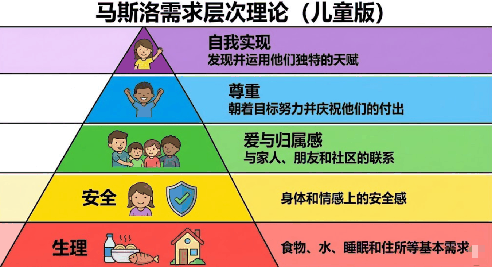

# 那个举了一整天奖状的“坏孩子”，一句话让老师沉默了

以下是一个真实发生的故事，是真实发生的，不是我杜撰的！为了保护当事人我给小朋友用了化名，同时我化身一名小学老师讲述这个故事。

在学校里，我们常说“没有教不好的学生，只有不会教的老师”。但有时候，当我们剥开一个所谓“问题学生”的层层表象，看到的却是一个血淋淋的家庭问题。很多时候是小学生在学校上课，但更需要接受教育的却是家长。

最近，学校二年级转来了一个学生，我们叫他小明。

在很多老师眼里，他是个标准的“麻烦制造者”。但最近发生的一连串事情，让我重新看懂了这个孩子。

### 01 疯狂渴望被看见的“举牌人”

故事的开始，其实很美好。

那天，小明在校园里捡到了一个电子手表，他没有私吞，而是乖乖交到了大队部。为此，他得到了一张“拾金不昧”的奖状。

接着发生了让我印象极深的场景：**他一直举着这个奖状，从早举到晚。**每个来班里上课的老师都看到了，都表扬了他。他就这样一直举着，直到下午放学回家。

那时候我以为，他只是单纯的荣誉感强。直到第二天，事情变得“诡异”起来。

第二天一早，小明又跑到大队部，这次他上交了 **1000 块钱**。

小学生很少有带 1000 块巨款上学的，大队部觉得可疑，直接给他家长打了电话。真相让人哭笑不得——这是小明从家里拿的压岁钱。

**他这么做，没有任何别的目的，只为了再得一个奖状，再体验一次昨天被所有人表扬的感觉。**

### 02 “多动症”背后的假象

小明是刚从其他学校转来的。据说在原来的学校，他是因为跟其他学生打架，被学校开除的。

在我的课堂上，他的表现也确实让人头疼：他经常拿一个空矿泉水瓶敲桌子，故意制造噪音，甚至以此为乐。

还有，他貌似患有严重的“多动症”。考试的时候，他根本坐不住，不做题。

是真不会吗？不是。 有一次，我把他叫到办公室，就坐在我旁边，我单独看着他做。**令人震惊的是，仅仅 10 分钟他就完成了，而且全对！**

这是多么聪明的孩子啊，但就是不做练习，不肯学习。

又有一次，在我的监督下，他终于把数学练习题作业做完了，但有两道题错了。我为了鼓励他，许诺说：“回家把错题改了，明天给你发个小奖状。”

小明的眼睛亮了。

### 03 “妈妈撕了我的练习册”

第二天，小明到了学校，却两手空空。 我问：“练习册呢？” 小明低着头说：“**被妈妈撕了。**”

我当时半信半疑。

直到晚上，微信群里公布了当天“练习题完成者奖励列表”，名单里自然没有小明。 小明妈妈在群里发问：“老师，为什么没有小明？不是改了错题就有小奖状吗？” 我回复道：“是的，但小明不可能有了，因为他的练习题被人撕了。”

屏幕那头，小明妈妈发了一个“尴尬”的表情，轻描淡写地说：“那我明天再给小明补买一个。”

第二天，我把小明叫到办公室，发生了下面这段对话。

> 我问小明：“你妈妈为什么撕你的练习册？” 小明说：“因为妈妈生气了，妈妈经常生气！” 我试探着问：“那你和爸爸妈妈，谁的感情好？” 小明回答得很快：“都不好，都感情一般。妈妈经常动不动就生气，爸爸有时候见妈妈生气打我，也加入进来一起打我。” 他停顿了一下，补充道：“**我一般吃过饭，就赶紧到爷爷家待着，我不喜欢在家里待着。**”

听完这番话，我看着眼前这个才上小学的孩子，陷入了沉默。

### 04 深度分析：他为什么“坏”？

小明真的是个多动、不爱学习、爱打架、随便从家里偷拿钱的“坏孩子”吗？ 

**不，从儿童心理学角度来看，他是一个严重的“情感饥渴症”患者。**

**1. 敲桌子与打架：负面关注也是关注** 

小明拿矿泉水瓶敲桌子，制造噪音，甚至在之前的学校打架，这在心理学上被称为**“寻求注意的行为（Attention Seeking）”**。 对于一个长期被忽视的孩子来说，**“被骂”远比“被当成空气”要好。** 如果他乖乖坐着，父母看不见他；但他制造噪音、惹事，父母和老师就会看向他。哪怕那个眼神是愤怒的，至少，那一刻他存在于别人的眼里。

**2. 举了一天的奖状：极度匮乏的自尊代偿** 

他为什么要把奖状举一整天？为什么要拿自己的 1000 块钱去换一个奖状？ 这是一种**心理代偿（Compensation）**。在家庭中，他从未获得过肯定，他的“心理营养”极度匮乏。那张奖状带来的表扬，对他来说就像给一个沙漠里快渴死的人喝了一口水，他为了留住这种感觉，甚至不惜用极端的手段去换取。

**3. “多动症”的真相：高压下的焦虑逃避** 

小明在办公室 10 分钟就能全对做完题，证明他智力超群，且拥有极强的专注力潜能。 他在教室里的“不做题”、“多动”，其实是对**环境的不安全感**的投射。在家里，父母动不动就生气、混合双打，导致他处于一种高焦虑状态。**他不是不能学，而是他的大脑长期忙于“侦测危险”和“应对恐惧”，无法在非安全环境下静心地学习。** 当老师在办公室“看着他”时，这种关注提供了一种临时的“安全依恋”，他的能力瞬间就释放了。

**4. 破碎的依恋关系** 

妈妈随意撕了他的练习册，爸爸看到妈妈打孩子也“加入进来”。 这是典型的**“混乱型依恋（Disorganized Attachment）”**家庭环境。父母本该是孩子的港湾，现在却成了孩子恐惧的来源。小明说“吃完饭赶紧去爷爷家”，这是孩子的求生本能——他在逃离那个充满了情绪地雷的家。

### 05 写在最后

小明本质并不坏，甚至可以说，他是一个极其聪明、极其敏锐的孩子。 他的“坏”，是他为了在这个冰冷的家里活下去而故意穿上的铠甲。 他的“多动”，是他内心焦虑的呐喊。 他那一整天高高举起的奖状，其实是在向世界发出求救信号：**“求求你们，看看我，夸夸我，爱爱我。”**

有一首歌《爱我你就抱抱我》唱得很好，歌词正是小明的心声：爱我你就抱抱我，爱我你就亲亲我！

如果不是父母的忽视和简单粗暴的对待，他可能根本不会转学，更不会变成今天的“问题学生”。

作为老师，我能做的，是在学校里多给他一些他梦寐以求的“看见”。 而作为读者的你，如果你是家长，如果你的身边也有这样“调皮捣蛋”的孩子，请在责备之前，先蹲下来看看，看看他的心里是不是住着一个焦虑紧张甚至正在哭泣的灵魂。

好了，我想暂时退出教师的视角，最后和你聊一聊，一个家庭中真正的和谐幸福是什么梯子。

我曾在北京火车站看到过这样一个家庭：父母和两个女儿，一家四口在候车大厅里等车。 因为等候时间太长，大女儿很不耐烦，在椅子上动来动去，还不时**发出**埋怨。她的妈妈没有责备她，只是坐在身旁，不停给她扇扇子，**试图**让她凉快点、舒服点。 而小女儿比较乖，她在嗦一根雪糕，时不时还把雪糕**送**进妈妈的嘴里，喂妈妈吃一口。父亲坐在妈妈身后，很安静。

我看到这一家就想笑，因为两个女儿和妈妈长得太像了，不用查户口或自我介绍，就知道他们是一家人。 在我眼里，这一家人就是幸福的典范。他们或许没有钱乘坐更快捷的飞机，**不得已**要在候车大厅忍受漫长的等待。但他家的大女儿不听话时，父母理解了她，没有批评，只是尽力让她舒服点；小女儿很乖，但也并没有给姐姐造成压力。

**理解、包容、不责备，这就是幸福的样子，与贫富无关。**我很遗憾当时没有给他们一家拍照，我真希望所有人都能看到他们一家幸福的模样。

希望所有的家庭，都像候车大厅里的这家人一样，无论穷富，无论美丑，都不要随便生气，对孩子多一份包容，多一份理解。

希望我们周围少一些小明。

📅 2026/01/10 周六
