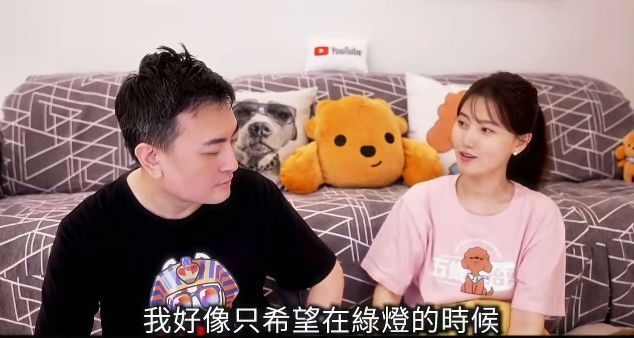
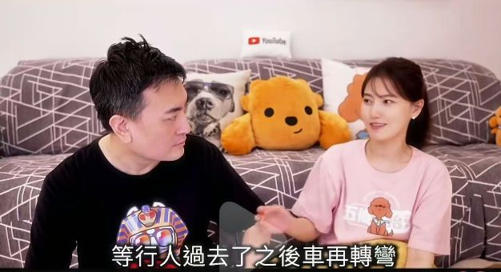
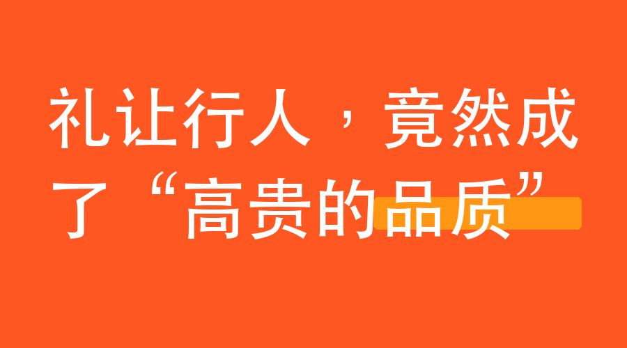

# 礼让行人，竟然成了“高贵的品质”

今天看老高和小沫的视频，谈到了过马路。

小沫说：希望汽车等我们走过去再转弯。

老高回她：这是高贵的品质，绝对高贵的品质！

哈！

我一下子就懂了。原来礼让行人是高贵的品质，怪不得路上那么多司机都不具备。

想起以前看的，一本书里写中国司机的一段——

他们在右转弯的时候，一定要和行人抢。行人是不是老人、小孩、孕妇不重要，全都一样，寸步不让，甚至还要按喇叭催你。幼吾幼以及人之吾？老吾老以及人之老？不存在。传统早丢了，丢传统就是他们的信仰之一。

作者说，这些人之所以不肯让，要按喇叭，急得像他爹妈死了要回家奔丧一样，是因为小气，骨子里的小气。一停下来他就能听见发动机在空转，他的心在滴血——哎哟，空耗油啊，这得费多少钱啊！

作者又说，怕耗油你别开车啊，你可以挤公交或者骑单车啊。不，挤公交骑单车多没面子，只有老百姓泥腿子才挤公交骑单车，老板谁不开车啊？！观念还落后。哈，这就是一群既要面子，又抠门，观念又陈旧的人，且连传统都丢掉的人。

这么串起来看，老高说得太对了。礼让行人真的是一项高贵的品质，尤其在当下这个快速发展的时代，这个快速发展的社会里。

2026年07月04日

