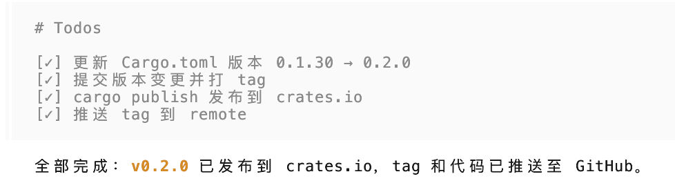
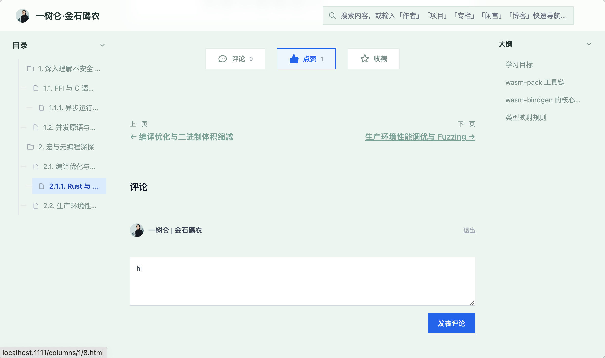
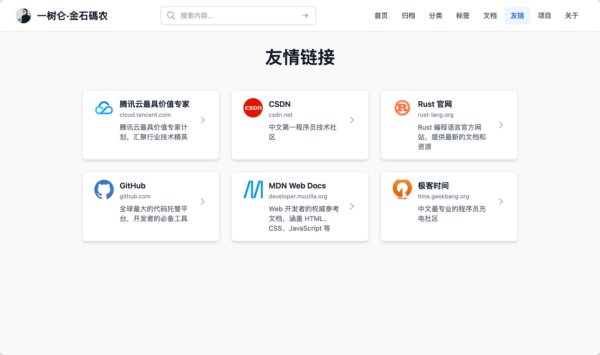
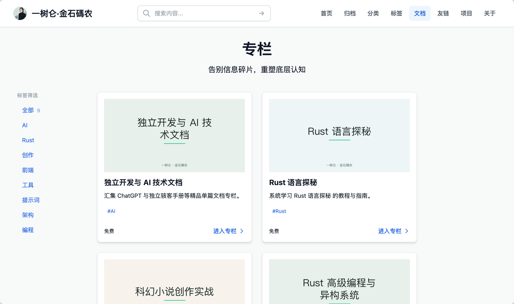
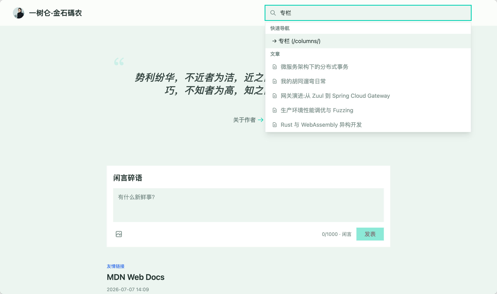
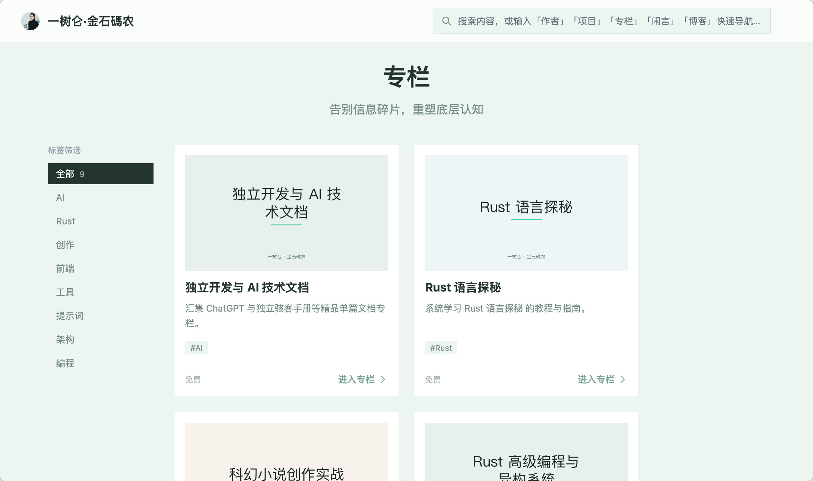
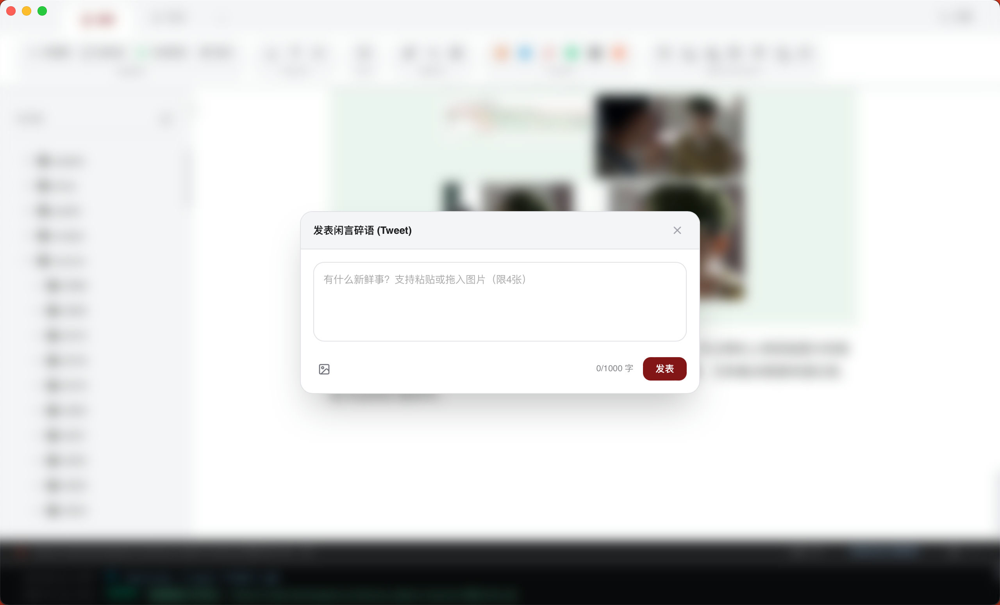
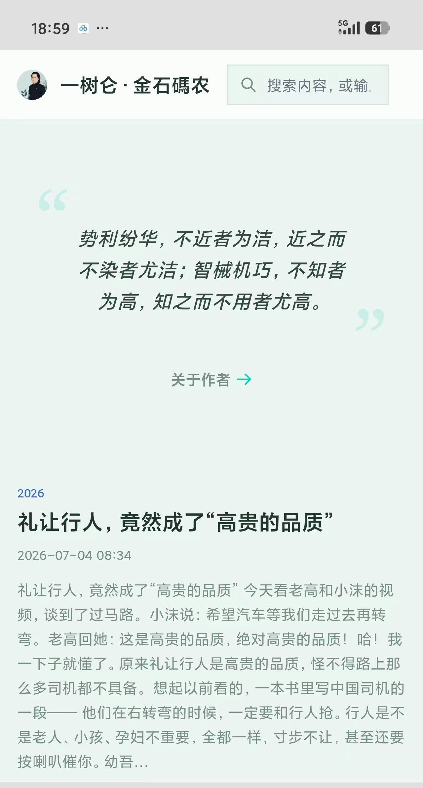
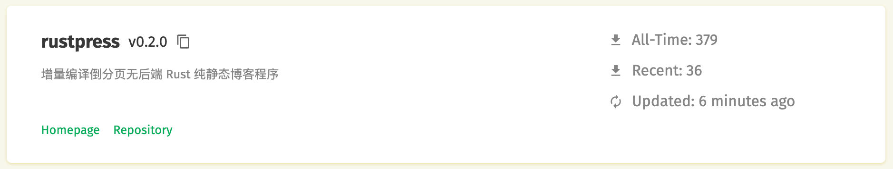
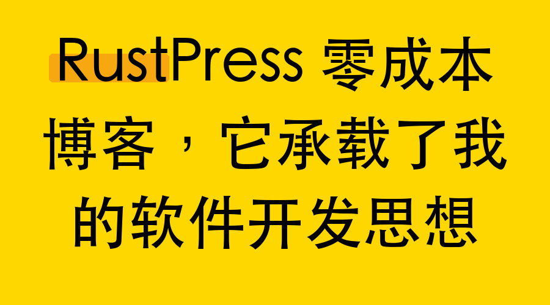

# RustPress 零成本博客，它承载了我的软件开发思想

我写了个叫 RustPress 的静态博客，最近重新整了整。这事本身没什么好说的，但过程中有个细节让我特别想说一下——倒分页。

有人听到“倒分页”第一反应是：这也算特色？很复杂吗，有必要吗？

我在第一次做 RustPress 的时候也犹豫过。后来我意识到一个很实际的问题：如果你的博客列表第 1 页永远是最新内容，那你每次发新文章，第 1 页都得重新编译一遍。文章越写越多，编译时间会慢慢变大。这不合理。

所以我反过来干：让数字最大的页装最新内容，旧的、第 1 页，就永远不动了。加上 RustPress 已经做到了增量编译，意思是，理论上你写多少内容，速度都不会变慢——旧的页面早编译好了，不需要重新编译。

倒分页，就这么一个简单的想法，但它直接定下了这个博客的性格：轻便、快，不为不必要的计算买单。

为什么坚持做成静态博客呢？因为我要把它托管到 GitHub 这样的地方。托管上去之后，存储和流量全部免费用，多好。再加上 GitHub Action 自动编译，我这边只需要把内容写好，一条 `git push`，就上线了。

虽然它全是静态的，点赞、评论这些动态功能一样能做，现在全部都支持了。怎么做的？其实就借了 GitHub 公开的接口，把点赞和评论的数据也存到平台上。

这些东西在我看来，现在已经不算什么难事了。让我更想聊的，是这次重构里，我一直在琢磨的一个想法：

**在 AI 时代，编程不再是一门技术，它已经变成个人表达思想的一种方式。** 以后它甚至会和书法、篆刻一样，变成一门艺术，表达个人思想意趣的艺术。

以前一个人要把脑子里的想法变成能跑的产品，太难了。你得有前端，有后端，有数据库，有设计师，有测试，还要服务器、办公室，一整套下去，钱和人都少不了。中间沟通的环节越多，想法变形的机率越大。最后出来的东西，和你当初想的，可能是两回事。

AI 时代这件事变了。一个人，一台电脑，你脑中的想法可以直接落地，变成可以操作的产品。我这次给 RustPress 升级 0.2 版，就是在这种状态下完成的。

重构中我贯彻了一个朴素的逻辑：**一个网站的信息怎么组织，体现在导航上，关键是看它有没有独立的子文件，需不需要专门的目录去装它，而不是看信息单词是单数还是复数。**

举个具体的例子。像 `projects`（项目）这种内容，在博客里，每个 project 都是一个独立的数字子目录，比如 `projects/1`、`projects/2`。编译完后，它们的页面是 `/projects/1/index.html`、`/projects/2/index.html`。为什么不是 `/projects/1.html`？因为我觉得一个项目下面可能还要放截图、示例代码、或者软件包，它需要自己的目录来承载。

而友情链接就不一样了。

每个友情链接就是一个独立文件，比如 `/friends/1.md`，编译后是 `/friends/1.html`。为什么不也做成 `/friends/1/index.html`？不是因为文件结构本来就这样——文件结构是我自己定的。原因很简单，一项友链数据没什么附件要放，它不需要子目录。一个文件就够，那就保持单页面，简单清爽。

这次我还做了一个新的主题，叫 light，核心还是那两个字：轻便、简洁。

原来的 default 主题顶部有一个导航栏，到处是圆角、阴影。

不丑，但我觉得它不够“轻”。

在 light 主题里，我把顶部导航栏直接拿掉了。

那没有导航栏怎么找东西？用搜索。

我加强了一下搜索框，你输入“专栏”，或者只输入一个“专”，下面专栏的链接就出来了。键盘上下键选，回车就能进去。

在这个专栏主页里，虽然是静态编译的，我还是加上了分标签浏览的功能。这只是个技术上的小把戏，实现起来不复杂。很多时候限制我们的不是静态博客这种技术方案，而是我们自己的老思路。静态博客理论上什么都能做。

另外我还加了一种短内容格式，tweet。少于 1000 字，可以同时放四张图。在首页列表上，它和博客文章、专栏文章一样，也能被评论和点赞。就像 X 的发表框一样，它是用来快速记东西的，想写的时候，打开 PushPen 软件，点一下“闲言碎语”窗口就能发了。

light 主题还有一个大变化：不要分页导航了，改成瀑布流加载。

你可能会觉得奇怪，一个静态的博客，全是编译好的页面，怎么可能往下滑就自动加载？

再说一遍上面那句话：限制我们的永远不是技术方案，是陈旧的想法。瀑布流在 RustPress 里就是一个小技术，不值一提。功夫到了，什么武器都一样使。武功达到臻镜，不会因为你手里拿的是木剑还是铁剑就受限的。

最后再说回整体。light 主题所有方块都是直角，去掉了全部阴影，没有导航栏，一个搜索框能去所有地方。不想搜的时候，就一直往下刷。如果就想找特定东西，搜一下就好。

看看它在手机上的样子：

头像、昵称、搜索框，再往下就是三种内容：tweet 短文、博客文章、专栏文章。手指一直往下划，瀑布流不断加载，最后你会看到一句话：“万物归一的时间线。”

RustPress 是开源的，第一个版本发布以来没写过文档，没做过示例，也没怎么宣传，但已经有了 379 个下载。感谢大家。相信从 0.2 开始，你们会更喜欢它。

如果你也想有一个零成本的博客，欢迎来用，随时提意见：
https://crates.io/crates/rustpress

2026年07月07日

