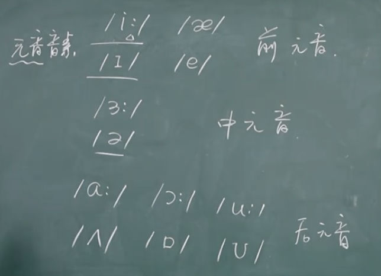
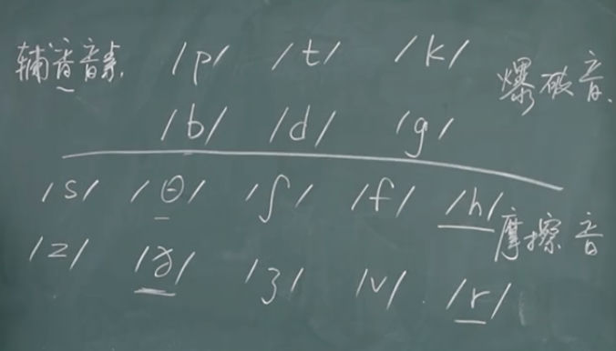

# 48个音标元素

单词 sheep，注音`/ʃi:p/`，这个叫音标，有多少单词就有多少音标，所以一般我们说 48 个音标，其实是不对的，音标里的组成部分叫元素，应该叫 48 个音标元素。

我看过不少音标视频，以张俊杰老师讲得最好。以下音标是国际音标，也称英式音标，是国内教材书上的默认音标。有意思的是，国内教材选的音标是英式，但考试播放的录音据说用的却是美式。大概英式、美式发音区别不大吧，区别主要是美式发音在有 r 的单词中会多一些儿化音，像京片子那样。不要看字典上两者标注的发音许多时候写法都不一样，据说那只是文本标识不同，发音区别其实不大。

张俊杰的视频，用的是英式音标，以下的音标也是英式。

英语发言，按照发音部位、气流急缓、舌头翘直、嘴巴开闭的组合不同，有 48 个音标元素，元音 20 个，辅音 28 个。不管无音、辅音，英语不讲声调，汉语有四声，英语没有，所有音标元素的读法只有二声，所有音标元素在读的时候都应该按二声读。

## 第一部分：元音（20 个）

### 1. 单元音（12 个）

按发音位置，可以分为前、中、后三类。声音是振动产生的，这里的前中后，指的就是声音在口腔的哪个位置振动。

英式音标用两个点表示长音，带点的音标元素发声略长。音标元素，无论元音、辅音，都是成对出现的，一对中的音标一般在某方面是对立的，有的是发声时长对立，有的是嘴巴张得大小对立。

前元音有两对，在口腔前部发音，嘴巴小点是`/i:/`和`/ɪ/`，嘴巴大点就是`/æ/`和`/e/`，其中前者发声还略长，后者略短。你看，英语音标元素的发音，就是不同发音部分、方式的组合。因为人类的嘴巴、口腔长这个样子，决定了英语有 48 个音标元素。如果牛马有了智慧，它们创立自己的音标元素，便不是 48 个了，大概率会比 48 个少。英语发音还有一个特点，不用喉咙，不用腹腔，永远都是阴平一个调，这样发音缺点是比较平，优点是可以说很多时间话都不累。

| 发音部位   | 音标    | 示例单词 (完整音标)      | 单词含义 |
| ---------- | ------- | ------------------------ | -------- |
| **前元音** | `/i:/`  | sheep (`/ʃi:p/`)        | 绵羊     |
|            | `/ɪ/`  | ship (`/ʃɪp/`)         | 船       |
|            | `/e/`   | bed (`/bed/`)            | 床       |
|            | `/æ/`  | bad (`/bæd/`)           | 坏的     |
| **中元音** | `/ɜ:/` | bird (`/bɜ:d/`)         | 鸟       |
|            | `/ə/`  | teacher (`/ˈti:tʃə/`) | 老师     |
|            | `/ʌ/`  | cup (`/kʌp/`)           | 杯子     |
| **后元音** | `/u:/`  | food (`/fu:d/`)          | 食物     |
|            | `/ʊ/`  | foot (`/fʊt/`)          | 脚       |
|            | `/ɔ:/` | door (`/dɔ:/`)          | 门       |
|            | `/ɒ/`  | box (`/bɒks/`)          | 盒子     |
|            | `/ɑ:/` | father (`/ˈfɑ:ðə/`)  | 父亲     |

中元音本来只有一对，是`/ɜ:/`和`/ə/`，`/ʌ/`这个音，与它配对的长元音是`/ɑ:/`，因为发音时嘴巴张得大，所以变成了后元音。基本上发音在前面部位的，嘴巴张得都不大，嘴巴一张大，声音就往后跑。还有一点，声音虽然都是往外发声，气流往外走，但仍然可以从意念上分为向外走、向内走两种方式，像`/u:/`和`/ʊ/`都是像外走，`/ɔ:/`和`/ɒ/`就是向内走。嘴巴张的大小，口腔中振动的位置，气流向外走还是向内走，发声的时间长短，这四组变量，组成了上面 6 组元音。前元音、后元音都有两组，中元间只有一组，这可能是中元音气流向内走的时候，嘴巴一大就变成了后元音（`/ɑ:/`），太相近了不好区分，所以没有那么多。

### 2. 双元音（8 个）

双元音就是两个元音组合在一起，并不是所有元音都能随意组合，从数学集合上讲能组合成多少就级多少，这是不可能的。组成的双元音，一定是不同的，且好拼读。没有两个相同的元音组成在一起的，例如 `/ɪɪ/`、`/ee/`，这是不合理的，`/ɪɪ/`就是`/i:/`，`/ee/`赞同于`/æ/`，重复设计没有意义。

还有，双元音组合都是短元音组合，且都有变化，容易完成的变化。举个例子，元素`/eɪ/`，是嘴巴稍大的+气流向内走的`/e/`，滑向嘴巴变小的+气流向内走的`/ɪ/`，起势在第一个音，嘴巴变小同时气流向外，声音落在第二个音上，这样像咬了一下嘴巴，`/eɪ/`就发出来了。

双元音中最容易混淆的是`/əʊ/`和`/aʊ/`。`/a/`是什么，是哪个单元音？其实就是`/ʌ/`。这两个双元音，是两个中元音与同一个后元音组合。

| 音标     | 示例单词 (完整音标) | 单词含义 |
| -------- | ------------------- | -------- |
| `/eɪ/`  | make (`/meɪk/`)    | 制造     |
| `/əʊ/` | go (`/gəʊ/`)      | 走       |
| `/aɪ/`  | like (`/laɪk/`)    | 喜欢     |
| `/aʊ/`  | how (`/haʊ/`)      | 如何     |
| `/ɔɪ/` | boy (`/bɔɪ/`)     | 男孩     |
| `/ɪə/` | here (`/hɪə/`)    | 这里     |
| `/eə/`  | hair (`/heə/`)     | 头发     |
| `/ʊə/` | tour (`/tʊə/`)    | 旅游     |

---

## 第二部分：辅音（28 个）

### 1. 爆破音（6 个）

| 类别       | 音标  | 示例单词 (完整音标) | 单词含义 |
| ---------- | ----- | ------------------- | -------- |
| **清辅音** | `/p/` | pen (`/pen/`)       | 钢笔     |
|            | `/t/` | tea (`/ti:/`)       | 茶       |
|            | `/k/` | cat (`/kæt/`)      | 猫       |
| **浊辅音** | `/b/` | boy (`/bɔɪ/`)     | 男孩     |
|            | `/d/` | dog (`/dɒg/`)      | 狗       |
|            | `/g/` | go (`/gəʊ/`)      | 走       |

### 2. 摩擦音（10 个）

| 类别       | 音标   | 示例单词 (完整音标)   | 单词含义  |
| ---------- | ------ | --------------------- | --------- |
| **清辅音** | `/f/`  | fly (`/flaɪ/`)       | 飞翔      |
|            | `/s/`  | see (`/si:/`)         | 看见      |
|            | `/ʃ/` | she (`/ʃi:/`)        | 她        |
|            | `/θ/` | think (`/θɪŋk/`)   | 思考      |
|            | `/h/`  | hot (`/hɒt/`)        | 热的      |
| **浊辅音** | `/v/`  | vet (`/vet/`)         | 兽医      |
|            | `/z/`  | zoo (`/zu:/`)         | 动物园    |
|            | `/ʒ/` | vision (`/ˈvɪʒn/`) | 视力/愿景 |
|            | `/ð/` | this (`/ðɪs/`)      | 这个      |
|            | `/r/`  | red (`/red/`)         | 红色的    |

### 3. 破擦音（6 个）

| 类别       | 音标    | 示例单词 (完整音标) | 单词含义  |
| ---------- | ------- | ------------------- | --------- |
| **清辅音** | `/tʃ/` | cheese (`/tʃi:z/`) | 奶酪      |
|            | `/tr/`  | tree (`/tri:/`)     | 树木      |
|            | `/ts/`  | cats (`/kæts/`)    | 猫 (复数) |
| **浊辅音** | `/dʒ/` | jeep (`/dʒi:p/`)   | 吉普车    |
|            | `/dr/`  | dream (`/dri:m/`)   | 梦想      |
|            | `/dz/`  | beds (`/bedz/`)     | 床 (复数) |

### 4. 鼻音（3 个）

| 音标   | 示例单词 (完整音标) | 单词含义 |
| ------ | ------------------- | -------- |
| `/m/`  | man (`/mæn/`)      | 男人     |
| `/n/`  | no (`/nəʊ/`)      | 不       |
| `/ŋ/` | sing (`/sɪŋ/`)    | 唱歌     |

### 5. 舌侧音（1 个）

| 音标  | 示例单词 (完整音标) | 单词含义 |
| ----- | ------------------- | -------- |
| `/l/` | leg (`/leg/`)       | 腿       |

### 6. 半元音（2 个）

| 音标  | 示例单词 (完整音标) | 单词含义 |
| ----- | ------------------- | -------- |
| `/w/` | wet (`/wet/`)       | 湿的     |
| `/j/` | yes (`/jes/`)       | 是的     |
