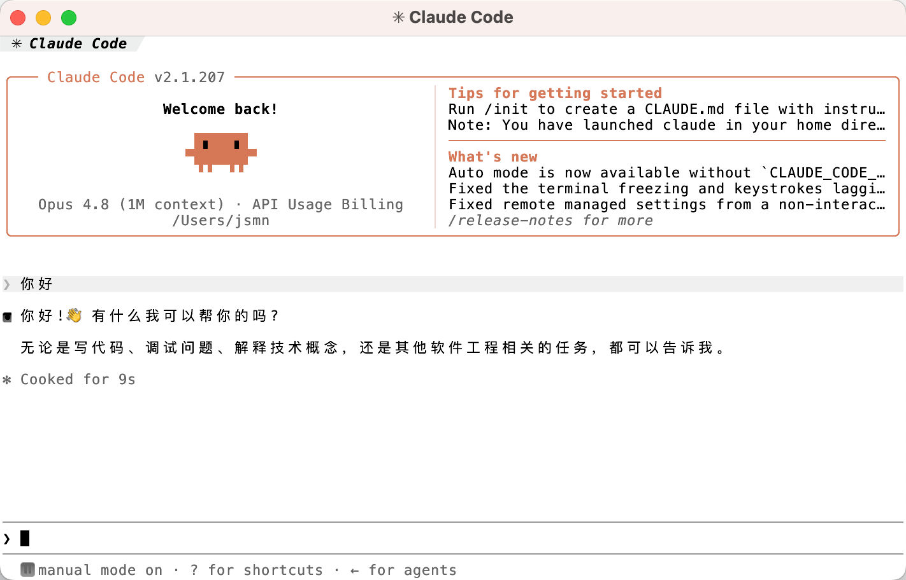
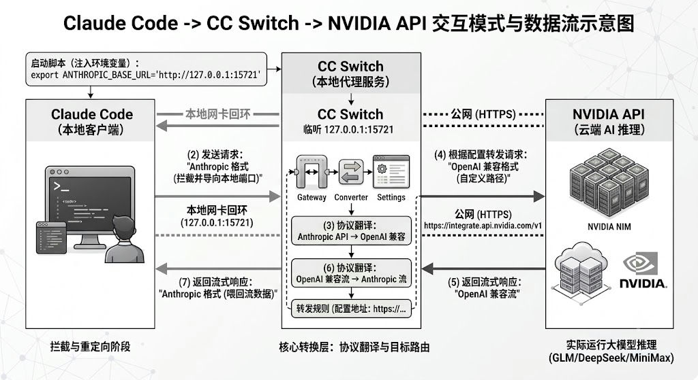
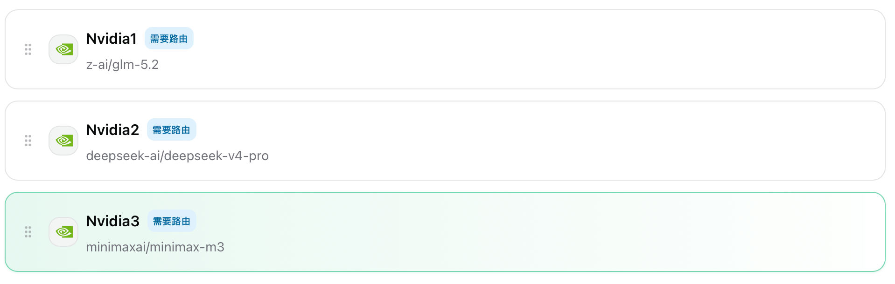
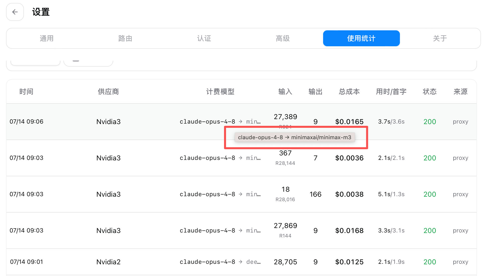
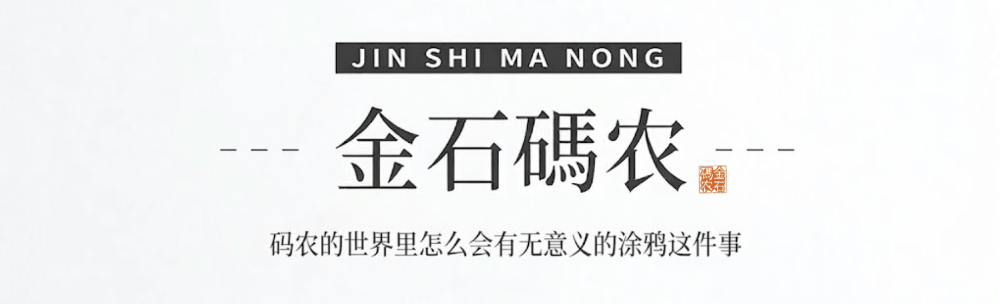

# 不是1M上下文的不用，不是免费大模型不用，全面实现 token 自由

昨天我照着网上的教程给 Claude Code 配 Nvidia 的免费模型，CC Switch 配来配去，怎么都启动不了。真让我火大。为什么？我就是一步步照教程来的。又请谷歌 AI 帮忙，给出的指导中规中矩，配完还是不行。

为什么？

其实就是想白嫖几个质量不错的国产大模型。

## 免费大模型的三种现状

现在大模型已经迈入 1M 上下文时代，一次可以吞吐百万 token，一本 PDF 直接丢进去都没问题。爽是真的爽，贵也是真的贵—— 200 块的会员费，用不了几次就见底。但如果 token 免费呢？是不是就可以放开了搞？

目前免费大致分三种情况：

第一种是过时的旧模型。

别说什么 glm-4.7，现在 glm-5.1 都算旧模型了，因为 glm-5.2 已经出来了。听说华为的 DevEco Code 里有免费的 glm-5.1，已经不太香了，而且据说它还是用 opencode 套壳的。那我为什么不直接用 opencode 呢？自己套一个也行，何必用别人的套壳产品。

第二种是鱼饵性质的免费。

阿里在 Qoder 里把 glm-5.2 免费了，但走的是积分——新人送 2000，学生和教师认证再送 4000，花完了就得掏钱。说实话，天下没有永远免费的午餐，这种送积分的勉强还可以接受。但其实还有更好的。

第三种就是今天要聊的 Nvidia 上的多种免费模型。

Nvidia 可能是目前最值得认真薅羊毛的模型平台。本质上它的免费也是鱼饵性质，但它的鱼饵给的大方，甚至给到吃饱的程度。Nvidia 官网一次性开放了 70 多种模型，其中就有国产一线 1M 上下文大模型，包括 Minimax-3、DeepSeek 4.0 Pro、GLM-5.2。一个平台可以用这么多免费模型，何乐而不为。选择 Nvidia 还有一个原因，它市值足够大，盈利能力足够强，相信它有一直免费下去的能力。

之前我撰文介绍过[在 opencode 里使用 DeepSeek 4.0 Flash 免费模型](https://mp.weixin.qq.com/s/w_KqgLy1NeEptGjs71CIFg)，DS 4 Flash 确实好用，现在 DS 4 Pro 也有人免费了，更值得用。Flash 和 Pro 的区别，大概就是一个更快更敏捷，一个更谨慎更细致。

## 教程为什么跑不通？

但是，在 Claude Code 里用 Nvidia 提供的这三个模型有一个麻烦：Nvidia 的接口（`https://integrate.api.nvidia.com/v1`）是 OpenAI 规范的，而 Claude Code 用的是 Anthropic 自家的规范，两者不兼容，就像拿小米充电器给苹果用，必须加个转接头。

网上有 CC Switch 的配置教程，说最简单通用。我昨天配了半天，根本起不来。有人说要开代理，我开了 CC Switch 代理，还是起不来。我还翻了 CC Switch 官方文档，把版本都升到了 v3.17，仍然没用。

今天，我写了一个启动脚本：

```bash
#!/bin/bash
export ANTHROPIC_BASE_URL="[http://127.0.0.1:15721](http://127.0.0.1:15721)"
claude

```

用这个脚本一启动，Claude Code 就正常了！



为什么？

CC Switch 配置里有一个 `ANTHROPIC_BASE_URL`，启动脚本里还有一个 `ANTHROPIC_BASE_URL`，两个值不一样，偏偏这样就能跑起来。为什么？

## 数据是如何流转的？

道理其实不复杂，一张图就清楚了。



因为 Nvidia 提供的是 OpenAI 规范的数据接口，而 Claude Code 只认 Anthropic 规范，所以我们必须在中间来回翻译一次。

启动脚本把 `ANTHROPIC_BASE_URL` 指向本地的 `127.0.0.1:15721`，就是让 Claude Code 别去请求默认的官方地址，转而向这里发请求。15721 端口是 CC Switch 开启的，它收到请求后，把 Anthropic 请求翻译成 OpenAI 请求，再发给 Nvidia 接口。

要是我们直接在 CC Switch 里也把 `ANTHROPIC_BASE_URL` 设成 `http://127.0.0.1:15721`，那肯定不行，数据就在自己身上转圈，永远出不去。不要觉得这不会发生，网上真有人这么干。

Nvidia 处理完之后，返回数据给 CC Switch，CC Switch 再把 OpenAI 结果转回 Anthropic 格式，通过 15721 端口送回 Claude Code。这就是 Claude Code 能工作的整个数据流。

## 接入更多免费模型

CC Switch 是一个好工具。同样的配置方式，我又把 Nvidia 上免费的 Minimax-m3、DeepSeek 4.0 Pro 全配进了 CC Switch。

三个模型共用一个账号的免费额度，但各有长短，换着用很方便。



在 CC Switch 里能看到真实的数据流动：



我们在提供商后面加个数字，就是为了更好地区分。在设置里可以看到，表面上我们选的是 claude-opus-4.8，实际走的是国产的 minimax-m3 模型。

## 用最小成本验证 MVP

有一点需要挑明，Nvidia 的免费不是永久的，它也有 1000 的额度限制。1000 用完之后，可以在网站上申请上调到 5000，5000 用光了，据说就没有了。但哪怕只有 5000 额度，也够你把一个 MVP 产品打出来。退一步说，一个账号用完了，你再注册一个不就行了？Nvidia 充许用谷歌邮箱登录，只要你有足够多的谷歌邮箱，原理上你就有用不完的 token。之前我还介绍过[在 Docker 里使用多个账号](https://mp.weixin.qq.com/s/NhH_T4Y1JB0Mm__vVZ0OtQ)，免费平台再结合这种技巧，token 想不自由都很难。

当你有了打出去的 MVP SaaS 产品，上了正轨，就不必这么麻烦了，直接充值，尽情享用即可。

2026年07月14日


