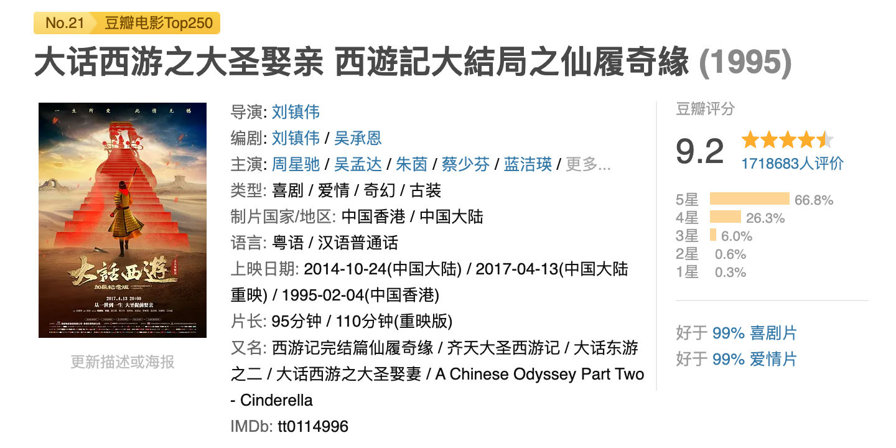

# 《功夫女足》影评撕裂成这样，我看了，给打五星

看《功夫女足》没有？

这片子现在口碑两极分化得厉害。

有人说特别喜欢，有人说狗屁不是，甚至骂星爷打情怀牌，骗了他一张电影票，有人还在网上喊话，问谁还欠星爷电影票，把他的票报销掉。就连一向文艺的墨问社区，我翻了一圈，也只看到一位墨友对它有好感。

我就好奇了，到底烂成什么样，能让星迷分裂成这样？

我去看了，我觉得非常好看。

全程笑点不断，节奏明快，有面子也有里子。表面是喜剧，内核还是悲剧。这个核就是新时代大女主——无论是孤儿还是富家千金，都可能活得差，也都能活得好。片中充满翻转，教练与队长的爱情反转，球队对战的策略升级。姐妹情、爱情、事业、梦想，全讲了，相当全面。

---

它是「漫画式的」，它的节奏快。很多时候一个反转，只是两个画面。看这个电影，你不小心打个哈欠，就可能错过一个梗。片长一个半小时，如果不这么拍，加上超长叙事和人物弧线刻画，大概就会拍成《大话西游》那样，要分上下集了。

听说豆瓣评分只有 6.6。我对星迷为什么讨厌它也特别感兴趣，就去翻影评，重点看了差评。这些差评有三个特点：

一）大部分都是男的打的。

二）只打一星。

三）大部分评论言之无物，主要在表达愤怒的情绪。

这部电影对男人基本没有好评。钰珑是千金小姐，恋爱、结婚又离婚了，快 40 岁回到球队寻找自我。丧彪被渣男抛弃，渣男还带着新欢到现场看她踢球。丧彪变成了双重人格，平时对谁都客客气气，做什么都唯唯诺诺——这其实就是一种悲，喜剧外壳下的悲。渣男们看这部电影，可能被击中。男人观感不佳，由此可以理解。女性观感整体应该不错。孩子只关注笑点，不可能被戳中什么痛点，整体观感也不会差。

---

具体归纳，网上有内容的差评，主要分三方面：

**一）说星爷把《功夫》和《少林足球》缝合起来，炒冷饭，卖情杯。**

这个理由有点生硬。《功夫》和《少林足球》我都看了，《功夫》不止看了一遍。我觉得这电影和那两部没有必然关系。影片里有功夫，讲足球，又是女足比赛，它就可以叫《功夫女足》，一点毛病没有。20 年了，网上一直有人说欠星爷一张电影票。咋，到你真还票的时候，开始挑剔了？我就想问问：到底是你欠星爷一张电影票，还是星爷欠你一场好电影？

**二）说主演不是星爷自己，说张小裴和迪丽热巴没演出真正的无厘头，演技差。**

演无厘头风格，确实没人演得过开山祖师。但祖师今年 65 了，演不动了。再者，星爷从上世纪 80 年代就一直想自己当导演，主导一部电影的诞生，或许才是他真正想做的工作。还有一点，成名演员都有影像包袱，观众接受了他们之前的形象，就很难在新片里再接受他们。星爷可以像以前一样大胆启用新人，新人没有包袱，但新人也意味着要付出更多时间和精力，这样拍电影也更累。说理解星爷，为什么不能从这点上多理解一点呢？

**三）说特效差。**

什么特效才算好？非得做到《阿凡达》那样吗？本来就是为达到喜剧效果，没必要逼真到那个程度。现在的效果是彩色漫画式的，我觉得刚刚好，胜过大多数短视频作品，作为喜剧效果，完全可以接受。

---

最后说点扎心的。

星爷在全面演电影之前，据说主持了 6 年儿童节目，他主持的儿童节目很有喜剧效果，也挺不错。《功夫女足》笑点密集、节奏快。因为夸张，有些逻辑并不严密科学，也因此被冠以「无厘头」风格。如果你年龄比较大了，在社会上摔打久了，失去了孩童的天真和纯粹，那八成你笑不出来，只会觉得尴尬。而那些十一二岁的孩童，今年看《功夫女足》开怀大笑的，长大后他们或许又会说：欠星爷一张电影票。

这世界就是一个轮回。

据说当年《大话西游》就是这样，先被成年人冷落，十年后，当年十岁的小孩长大了，他们看懂了，《大话西游》开始雄起，到今天豆瓣评分爬到了 9.2。

《大话西游》是解构名篇，《功夫女足》在叙事上没那么高。但十年后，长大的小孩，尤其是女生，将它的评分从 6.6 拉到 8.0 甚至 8.5，还是有可能的。

2026年07月15日
