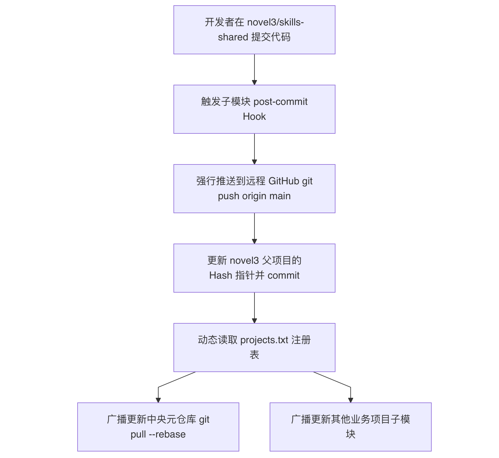
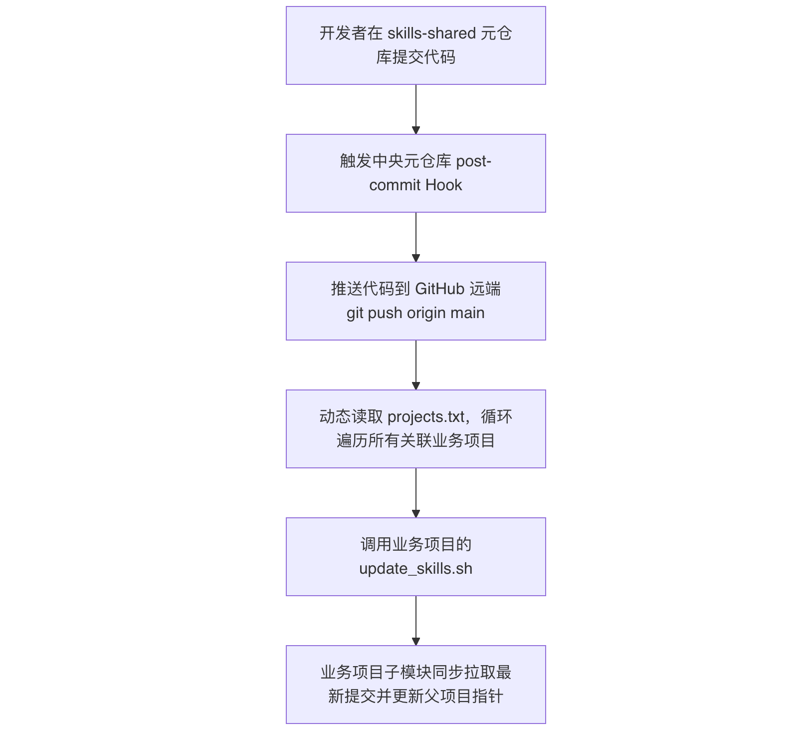

# 用 Git Submodule + Hook 让 skills 仓库自动同步，再也不用手动拉取了

（这是篇技术笔记，不喜欢可以跳过）

在多项目并行开发时，你是不是也经常碰到这种事：中央 skills 仓库一改，好几个业务项目都得挨个手动 `git pull`；或者在某个子项目里改了一个 SKILL，中央库毫不知情，其他项目更是纹丝不动。

能不能只正常写代码、正常 commit，剩下的同步活儿全部自动搞定？

我试过软链接。把不同项目的 skills 目录直接 `ln -s` 指向同一个真实的 skills 文件夹，本地用起来没问题，可一进 Docker 就有问题了——容器里只挂了一个项目目录，跨项目的软链接直接失效。这条道有瑕疵。

折腾一圈，最后落回到 Git 本身的能力上：**Submodule + post-commit Hook**。

这套组合让同步彻底不用再操心，改代码、提交，后面的推送、广播、指针更新、文件落地全由 Hook 自动完成。下面把整个方案拆开说一下。

## 一、基本结构与目录

整个自动广播体系就这几样东西：

- **中央元仓库 (Central Repo)**：`/Users/jsmn/workspace/skills-shared`
- **业务项目 (Parent Projs)**，例如：`/Users/jsmn/workspace/novel3`
- **各业务项目里的子模块 (Submodule)**：`<业务项目>/skills-shared`
- **全局注册表 `projects.txt`**：放在中央元仓库根目录，写明所有业务项目的绝对路径，避免硬编码。
- **几个脚本**：
  - `deploy/central_repo_post_commit_hook.sh`（中央仓库的 post-commit 模板）
  - `deploy/submodule_post_commit_hook.sh`（子模块的 post-commit 模板）
  - `deploy/update_skills.sh`（拉取更新并重置子模块指针）
  - `update.sh`（用来在中央仓和子模块之间自动区分上下文拉取内容）

## 二、子模块改了，自动推到中央仓库、再同步给所有项目

### 场景

在 `/Users/jsmn/workspace/novel3/skills-shared` 里改了一个 SKILL，然后执行 `git commit`。

### 发生了什么

子模块的 commit 会触发它自己的 `post-commit` Hook（实际位置在 `<业务项目>/.git/modules/skills-shared/hooks/post-commit`）。Hook 被唤醒后，自动做完下面几件事：



### 脚本做了什么 (`submodule_post_commit_hook.sh`)

**第一步，先把这次的 commit 推到远程。**

```bash
# 自动推送到远程 GitHub，这样其他项目要去远端拉取时能找到这个 commit
git push origin main
```

**第二步，更新“当前这个业务项目”的子模块指针。**

子模块版本变了，父项目的 `git add skills-shared` 如果不做，指针就会一直处在未提交的脏状态。Hook 会顺着路径找到父项目根目录，替你把指针提交掉：

```bash
cd "$PARENT_DIR"
if ! git diff --quiet skills-shared; then
    git add skills-shared
    git commit -m "chore: 自动同步 skills-shared 的最新 Hash 指针"
fi
```

这步相当于告诉父项目：“子模块现在该指向这个新版本了”。不更新指针的话，其他同事 pull 父项目时子模块代码还是旧的。

**第三步，照着 `projects.txt` 里记的业务项目列表，把更新广播到中央元仓库以及其他所有项目。**

这里有个细节：Hook 里默认会带上父 Git 进程的 `GIT_DIR`、`GIT_WORK_TREE` 等环境变量，如果直接切到别的仓库做 git 操作，会报 `index.lock: Not a directory` 的错。所以广播前必须把那些环境变量清掉：

```bash
unset GIT_DIR GIT_WORK_TREE GIT_PREFIX
```

然后遍历 `projects.txt`，跳过当前项目自己，对中央仓库和其他项目逐个拉取最新并重置指针。（完整代码见脚本。）

## 三、中央仓库改了，自动推送给所有业务项目的子模块

### 场景

直接在中央元仓库 `/Users/jsmn/workspace/skills-shared` 里改某个 SKILL，然后 `git commit`。

### 发生了什么

中央仓库的 post-commit Hook（`.git/hooks/post-commit`）被触发：



### 脚本做了什么 (`central_repo_post_commit_hook.sh`)

**第一步，先推到远程。**

```bash
git push origin main
```

**第二步，遍历 `projects.txt`，挨个业务项目执行一遍本地的 `update_skills.sh`。**

```bash
while IFS= read -r proj || [ -n "$proj" ]; do
    if [ -f "$proj/skills-shared/deploy/update_skills.sh" ]; then
        (unset GIT_DIR GIT_WORK_TREE GIT_PREFIX && cd "$proj" && ./skills-shared/deploy/update_skills.sh)
    fi
done < "$PROJECTS_FILE"
```

这里的 `unset xxx` 同样是为了防止跨仓库操作时环境变量污染。

**第三步，业务项目那边的 `update_skills.sh` 做硬重置，保证能干净落盘。**

因为可能会碰到 macOS 生成的 `.DS_Store` 或者其他未追踪文件导致合并冲突，脚本在拉取前会先强制对齐远端的 main 分支：

```bash
# 进入到子模块目录，强制重置到远程 main
cd "$SUBMODULE_DIR" && git fetch origin main && git reset --hard origin/main

# 回到父项目，如果子模块指针变了就自动提交
cd "$PARENT_DIR"
if ! git diff --quiet $SUBMODULE_DIR; then
    git add $SUBMODULE_DIR
    git commit -m "chore: auto-update skills submodule to latest"
fi
```

## 四、踩过的两个坑

全自动广播听着爽，但跨仓库 Hook 调起来确实有小坑，下面两个稍微留意一下就行。

1. **环境变量 `GIT_DIR` / `GIT_WORK_TREE` 污染**

   - **现象**：你在 Hook 脚本里 `cd` 到另一个 Git 仓库做操作，Git 突然报 `fatal: Unable to create '.../skills-shared/.git/index.lock': Not a directory`。
   - **原因**：当前 Hook 进程继承了上层 Git 命令的 `GIT_DIR` 等变量，导致 Git 误以为子模块的 `.git` 文本文件是个目录。
   - **处理**：所有跨仓库 `cd` 后执行的子 Shell 里，必须 `unset GIT_DIR GIT_WORK_TREE GIT_PREFIX`。
2. **post-commit 死循环**

   - **现象**：A 项目的 Hook 自动提交了 B 项目的指针，B 项目的 Hook 又被触发，再跑回来改 A 项目，没完没了。
   - **处理**：遍历 `projects.txt` 时，加一条判断跳过当前项目自己 `if [ "$proj" = "$PARENT_DIR" ]; then continue; fi`。

## 五、收尾

整个方案就靠一张注册表 `projects.txt`、一对初始化脚本，加上中央与子模块的双向 post-commit Hook，日常维护中你只需要正常 commit，其他的推送、广播、指针更新全在几秒内自动跑完。

如果你也想用这套，只需要把我仓库的 setup 脚本克隆过去，把下面两行改成你自己的本地中央仓库路径和远程地址：

```bash
CENTRAL_REPO="/Users/jsmn/workspace/skills-shared"
SUBMODULE_URL="[https://github.com/rixingyike/skills-shared.git](https://github.com/rixingyike/skills-shared.git)"
```

然后一行命令安装自己的 skills 子模块：

```bash
curl -sSL [https://raw.githubusercontent.com/rixingyike/skills-shared/main/deploy/setup_submodule.sh](https://raw.githubusercontent.com/rixingyike/skills-shared/main/deploy/setup_submodule.sh) | bash
```

如果仓库不能访问，所有脚本可以从这里取：

> skills-shared_deploy
> https://www.alipan.com/s/vVWjh6U7LTu 提取码: n39q

*2026年07月27日*
