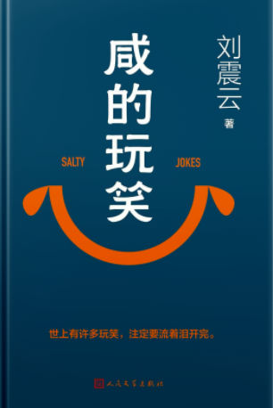

# 推荐一本书《咸的玩笑》

最近，我读到了一本书，叫《咸的玩笑》。它是刘震云的作品，已经获得了茅盾文学奖。可能很多朋友都读过，但我还是忍不住想说说我的感受。

我才读了正文一，甚至刚看了开头两段，就觉得写得好。好的作品就该这样，一点不拖沓。能用一句话表达的，绝不用一段话。

书里写长顺的舅妈不喜欢长顺，只用了一句话：“炸馃子先人还没有吃，都让你们吃了。”她是对自己的孩子说的，却是说给长顺听的。就这一句话，什么都写明白了。

长顺恨他的后爸，但书中没有写一个恨字。直到后来他成为智明主持，顿悟人生，放下了恨，也没说过恨。佛家讲善，不讲恨，这个思想我一下共鸣了。

书中关于他恨后爸，留下了许多细节。比如，他妈让他吃枣，他说不喜欢吃枣，还把那枣扔到了院外。一个“扔”的动作，把长顺心里的恨，还有他的倔强性格，全写出来了。

再说说书名，它为什么叫《咸的玩笑》？我的理解是：一个有哲学道理的故事。咸指的就是人生道理，那些带着哲学味道的东西。

书里有个小道理，我读到时共鸣特别强烈。作者和朋友来到寺院，和智明禅师聊天。讲到1942年饿死了三百万人，智明禅师说：“不是死了三百万人，是一个人，死了三百万次。”作者说他懂了。我读的时候，也一下懂了。中国民间，真的有很多高人。

2026年07月31日
