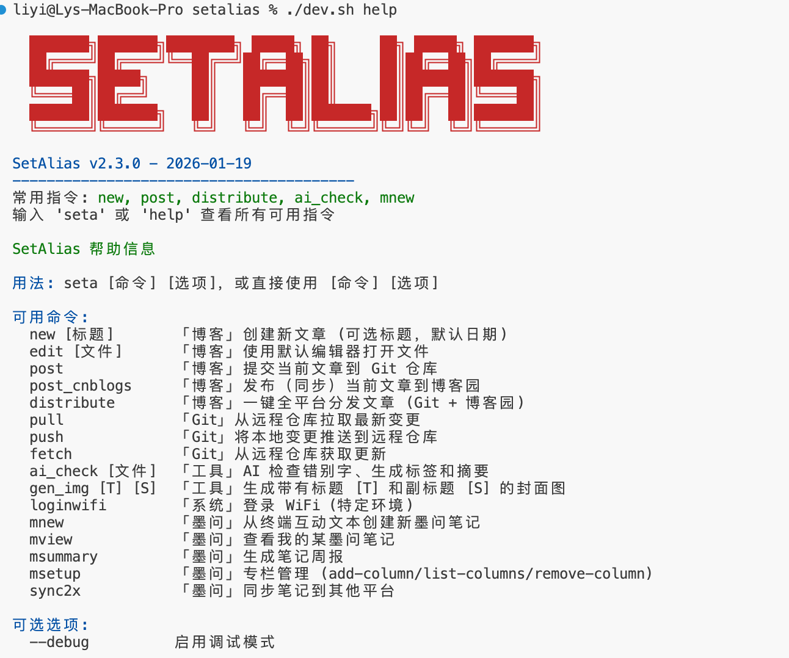
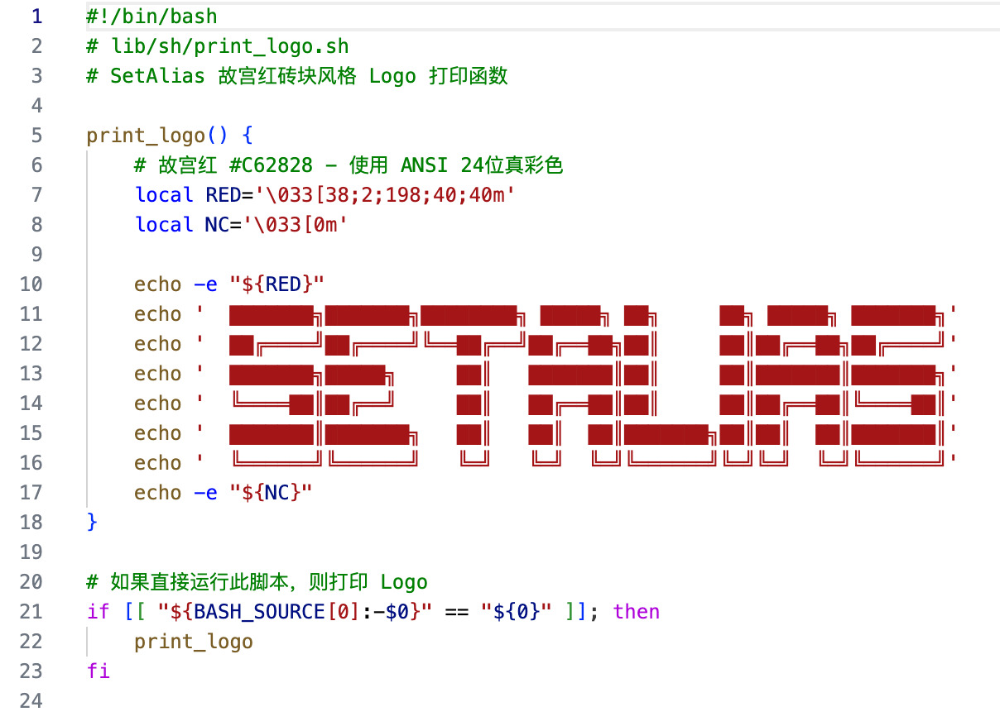

# 社区终端发布新版，进一步去掉枷锁，让使用更简单

根据社区朋友@万码千钧的反馈，做了本次修改：

- 去除了博客园强制发布流程，如果不需要，从配置开始置空即可。
- 发表周总结时，也不再强制使用 Edge 浏览器，有哪个用哪个。
- 添加了参数控制是否公开发表，添加--no-public 与将常量 SETA_MOWEN_NOTE_PUBLIC 设置为 0 效果等同。
- 修正墨问笔记行首空行及其他已知问题。

另外，我修改了 logo 的样式：

logo 变成了红色，它是由一个 bash 函数打印出来的：

我最推崇的代码写法就是这样的，简单、简洁，一个函数只干一件事，一个文件只干一类事。代码尽量不依赖环境及外界条件，尽量不产生执行副作用，能不能做到这一点，关键看自己的业务架构能力和经验。像上面这个 print_logo，它就很好，它不依赖环境变量，也不依赖外界条件，引用它就可以执行，独立测试也可以，它是自足的。

新版本已经发布，在下面链接下载：

[https://github.com/rixingyike/homebrew-setalias/releases/tag/v2.3.1](https://github.com/rixingyike/homebrew-setalias/releases/tag/v2.3.1)

继续欢迎提出宝贵修改意见！

#技术·求真·社区笔记终端

📅 2026/01/19 周一 18:07