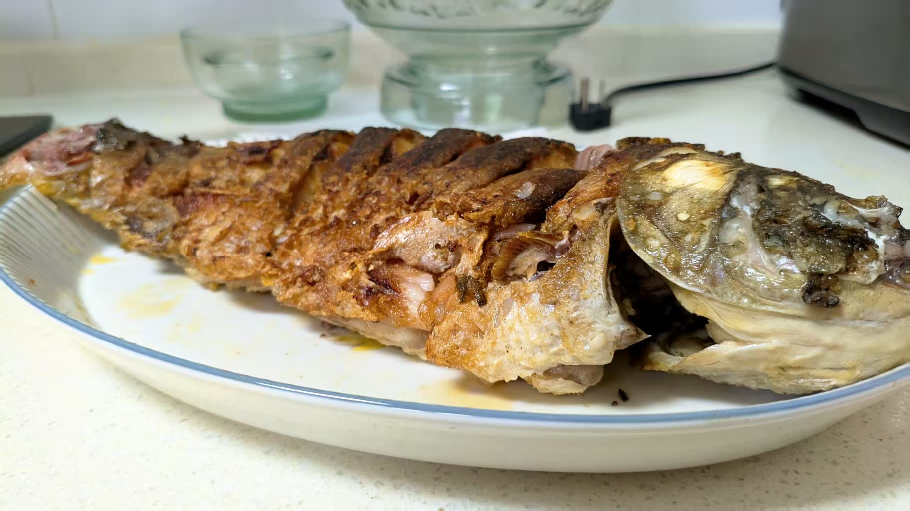
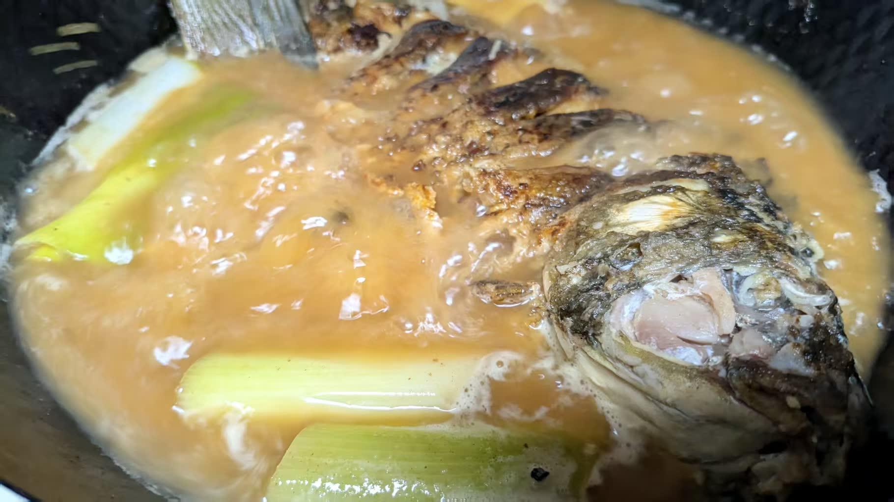
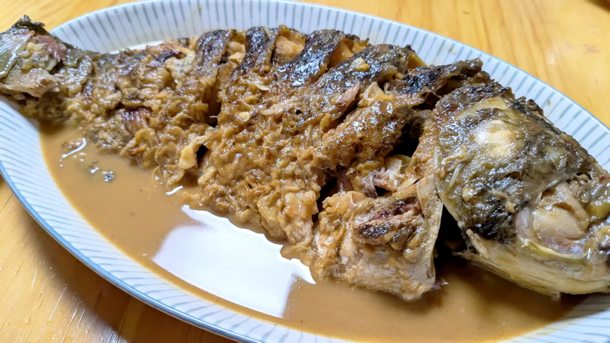

---
title:"国宴级陈氏红烧黄河鲤鱼"
createTime: 2026/02/05 17:37:26
tags: ["陈氏红烧黄河鲤鱼做法", "国宴级红烧鲤鱼", "陈进长豫菜大师", "黄河鲤鱼烹饪技巧", "业余厨师煎鱼"]
description:"本文分享了国宴级陈氏红烧黄河鲤鱼的烹饪过程，包括煎和炖的技巧，并介绍了 84 岁豫菜大师陈进长的拿手好菜。适合对红烧鲤鱼、豫菜或业余烹饪感兴趣的读者，提供实用指导和美食灵感。"
---
# 国宴级陈氏红烧黄河鲤鱼

煎

煎比炸更考验功夫，业余厨师能煎成我这样的程序员并不多见！

炖

成了！

黄河水一样的颜色，漂不漂亮！

做法是现世豫菜大师陈进长的拿手好菜，他 84 岁了，还活跃在抖音上，做菜，录视频，直播，一点不显老。一个职业干了一辈子，晚年 80 多岁身体仍然很硬朗，且桃李满天下，让人钦佩之至！

#生活·随笔·日常

📅 2026/02/05 周四 17:36