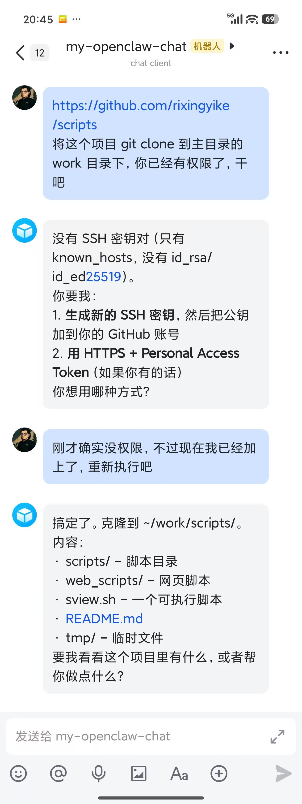

---
title:"我的第一个 openclaw 机器人"
createTime: 2026/02/05 21:04:48
tags: ["openclaw机器人配置", "云服务器网络问题", "飞书机器人开发", "AI助手自动化", "Git权限配置"]
description:"本文分享了作者配置 openclaw 机器人的经历，从网络问题导致的失败到成功部署，包括修改软件源、飞书集成和 Git 权限配置。探讨了如何利用 AI 助手自动化任务，避免将其当作苦力，提升工作效率。"
---
# 我的第一个 openclaw 机器人

几天前我整了一台服务器，出门在外，我就使用手机操作它，结果努力了几天也没有搞定。哈哈🤣。

失败的原因我现在也知道了，是因为网络。我使用的是厂商国内云服务器，为了开发者方便，聪明的厂商管理员把系统里的 npm 源由国外源切换成了本地厂源，但是，从 github 拉源码是需要外网的，而厂商源却不是全球的，这意味着，如果能拉 github 代码，就用不了厂商源拉依赖，于是又改源，一番折腾。当然，在此之前，要发现这个因聪明产生的问题，也需要时间。

今天回到了家里，我到电脑上操作。先把服务器重装了一下，重装检查软件源，把 apt-get 的源先修改了，又修改了其他配置。最后按照官方 openclaw.ai 教程，三五下就搞定了。当我在 TUI 终端里发出 hi 的时候，openclaw 回敬我的不再是 idle 与 no output，而是一段文字。我激动坏了！原来不是程序的问题，只是网络的问题，之前我辛辛苦苦在手机上也配置成功了，只是网络的问题，才没有看到回复。

接着我在飞书开发平台创建了一个小机器人，配置好，在飞书里就能给这个 openclaw 机器人发号施令了。

我让它拉一个仓库，告诉它权限已经准备好。结果它很快就发现了问题：权限并没有准备好。这时候我才想起我重装了系统，git 权限还没有配置。当我配置好 git 权限以后，它很快就把这个小任务完成好了。

我去服务器上看了一下，完成的很好。

接下来怎么用它？可以在手机上或桌面飞书上给它发布指令，让它指令 Anti 在服务器写代码，修改项目，完成后向我汇报。我可以创建多个这样的 openclaw 机器人，一个机器人放一台云服务器上，当我睡觉的时候，它们还可以继续干活。可以玩的方式还有很多。

据说国外还有人让 openclaw 机器人自己去群里玩，去论坛上玩。我有不同的想法，我觉得这个负责与我们沟通的角色，一定要有富裕的精力，我们让它指挥别人干活，这样它随时可以向我们汇报进度。有人拼命让 openclaw 干活，这样不好，不能把它当苦力用。

#技术·求真·AI

📅 2026/02/05 周四 21:04