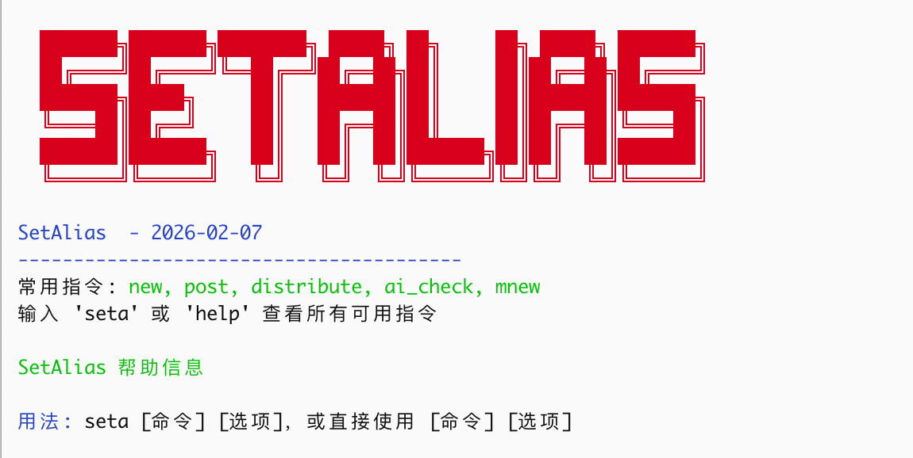

---
title:"论狂"
createTime: 2026/02/07 12:34:20
tags: ["狂的两种境界", "年轻时的狂与老年的狂", "人生修行节奏", "谦卦六爻大吉", "苏轼老夫聊发少年狂"]
description:"探讨狂的两种境界：年轻时因认知局限而狂是陷阱，需谦恭藏巧；老年时面对命运不屈而狂是生命张力。结合金庸武侠、曾国藩、王阳明等例子，揭示人生修行节奏——前半生减法谦恭，后半生加法狂放。"
---
# 论狂

人往往在年轻时意识不到自己狂，年纪大了却要故意展现出狂的一面。我年纪还没有大，只是精力感觉不如从前，但也时常故意展示出狂的一面。

孔子说，少年戒之在斗；苏轼说，老夫聊发少年狂，这两种状态其实是狂字的一体两面，今天我想和朋友们聊一聊这个字。

在金庸的武侠世界里，杨过被冠以“狂侠”之名。若是细究这个“狂”字，颇值得玩味。杨过的狂，带着几分凄凉与悲愤，是娶师父为妻的离经叛道，是在英雄大会上对峙天下群豪的桀骜不驯。当时，幸好金庸大师安排了金轮法王来中原闹事，不然，杨过横七竖八乱打一通，名声怕是好不了。杨过的狂，是一种受伤刺猬的自我保护，因为出身卑微，因为敏感，他必须把刺竖起来，告诉全世界：你们来吧，我不怕你们！

相比之下，《天龙八部》中乔峰的“狂”更胜一筹。乔峰的狂不叫狂，叫豪更贴切。聚贤庄里“虽千万人吾往矣”，那是气吞山河的威势，明知山有虎，偏向虎山行，而且目的仅是为一个小姑娘寻医治病。他的爆发并非为了私欲，是为了大义。如果说杨过的狂是“我要证明我不比你差”，那么乔峰的狂则是“我原本就不在乎你们怎么看，我爱干什么就干什么。”

小说中的这两种狂，映射了我们真实人生中关于狂的两种境界。年轻时的狂，往往是人生最大的陷阱。

大凡年轻聪慧的人，或是家道殷实、路走得太顺利的人，最容易生出一股狂气。这种狂，本质上是认知的局限——因为路走得顺，便误以为世界尽在掌握；因为脑子转得快，便容易对笨拙的人失去耐心。

曾国藩曾言：“傲为凶德，慢为衰气。”王阳明更是直指人心：人生大病，只一傲字。

年轻人的下巴待人接物若是抬高了一寸，哪怕你心里并没有真的瞧不起谁，但在旁人眼中，就是一种冒犯。尤其是那些处于底层、生活不如意的人，我们更需懂得谦恭。

弱势群体的自尊心往往最脆弱、最敏感。你年少时的一个无心的眼神，或许都会被解读为傲慢与轻视。这种情绪不但发酵，还会化为阻力。很多人在职场或社会中莫名受到挫折，被小人掣肘，不是因为能力不足，恰恰是因为能力太足。

在《周易》中唯有谦卦是六爻大吉。年轻时，才华需要像宝剑藏在鞘中，要懂得藏巧用晦。这时的不狂，不是因为怯懦，只是为了避开无谓的消耗，是为了走得更顺更远。苏轼年轻时才气纵横，讥讽时弊，结果遭遇乌台诗案几近丧命，直到贬谪黄州，洗尽铅华，才有了后来温润儒雅的东坡居士。

然后，人生步入下半场，逻辑便要反过来了。

随着气血渐衰，社会对你的期待也在降低。这时候如果一味顺从天命，人就容易枯萎。所以，年纪大了，反倒要刻意狂一点。

这种狂，不再是针对他人的傲慢，而是直面命运的不屈和不甘。正如苏轼在密州所写：“老夫聊发少年狂，左牵黄，右擎苍。”那时的他，已经不再年轻，鬓如霜，却依然要“亲射虎，看孙郎”。这是一种何等的生命张力！

老年的狂，是精神上的不屈与倔强，是曹操笔下的“老骥伏枥，志在千里；烈士暮年，壮心不已”；是辛弃疾的“凭谁问：廉颇老矣，尚能饭否？”；更是黄宗羲的“大丈夫行事，论是非，不论利害；论万世，不论一生”。好一个论万世，不论利害，黄宗羲真丈夫也！

人这一辈子，修行的节奏大抵如此：

前半生，要做减法，把锐气收一收。对众生懂得慈悲，所以谦恭；后半生，要做加法，把暮气扫一扫。对命运和不公怒目而视，因为不甘沉沦，所以狂放。

所谓成熟，不过是懂得了何时该低头看路，何时该昂首看天。这种大道的成熟，与年龄无关，有些人即使老了还是个小孩，别人无意间瞥他一眼，他就跳起来了。

这可不是狂，是蠢、是愚。

关于狂就聊到这里。

对了，我写的 setalias 支持向 X 同步了。现在每写一篇文章，会同步到我的博客、博客园、莫问、X。以后还会同步更多。

#生活·随笔·日常

📅 2026/02/07 周六 12:33