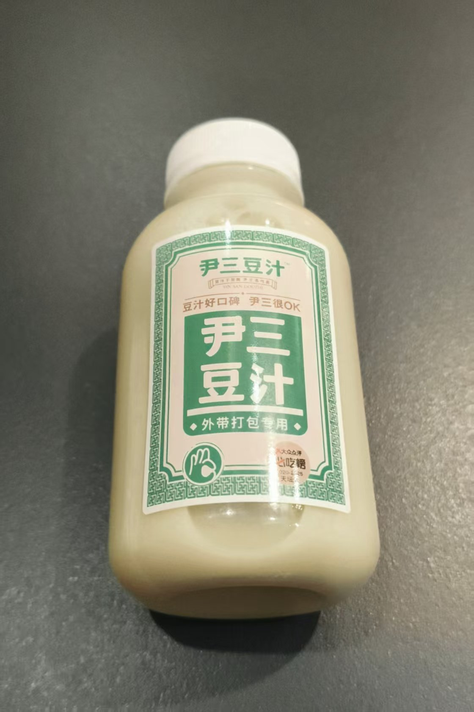
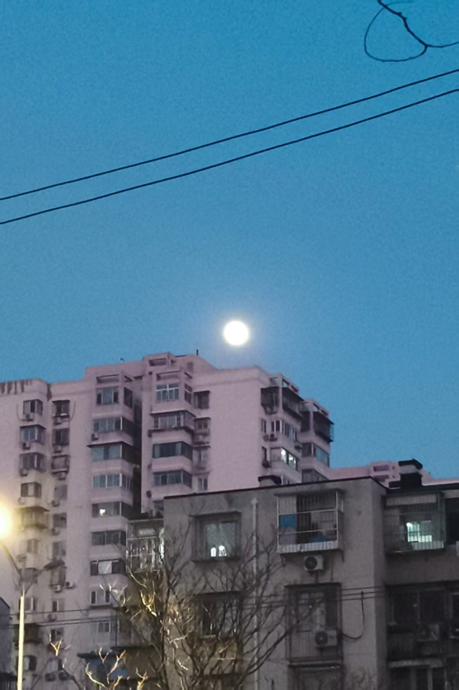
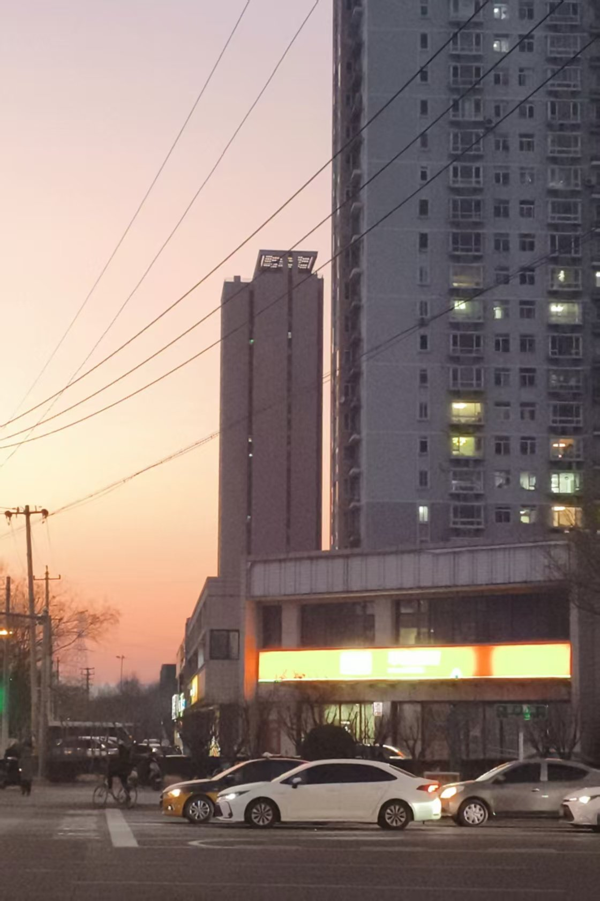
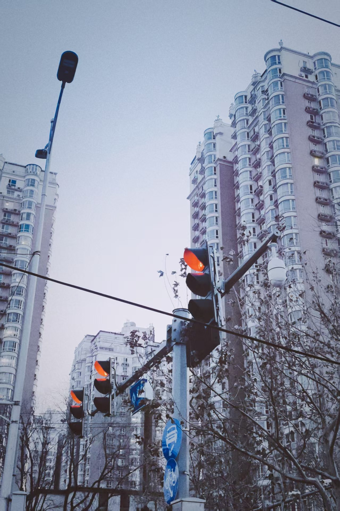
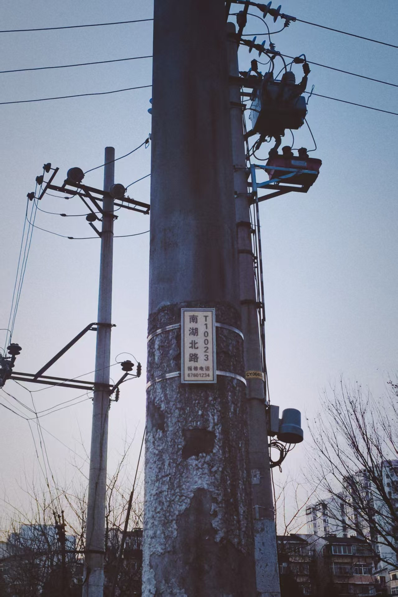
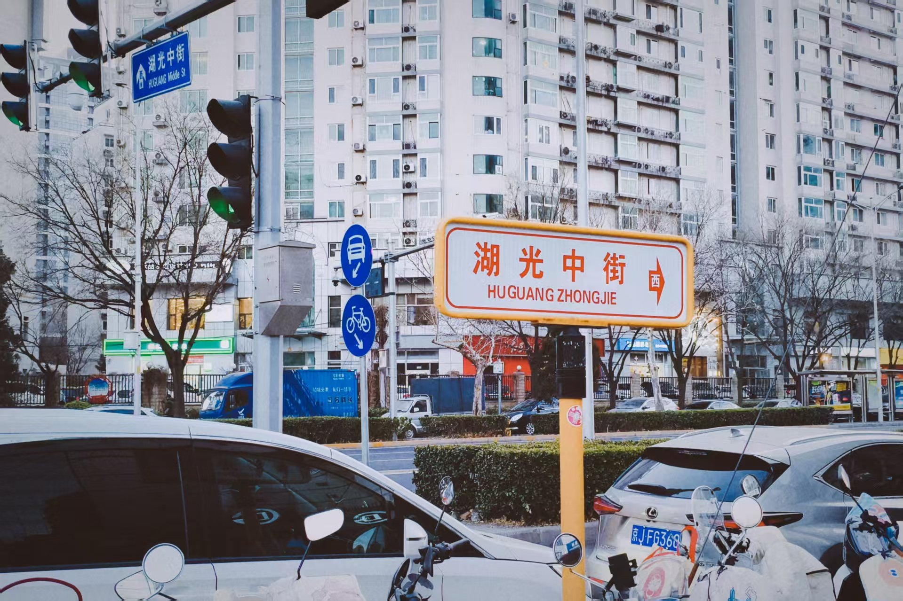

---
title:"手机和相机的区别是什么？"
createTime: 2026/01/03 00:55:10
tags: ["手机摄影", "相机", "街头摄影", "摄影技巧", "生活记录"]
description:"文章探讨了手机和相机在拍摄时的区别，指出手机拍摄常需解释，而相机则更自然。作者分享了在胡同遛弯时拍摄的街角照片，并描述了一次拍摄经历，强调手机拍摄的便捷性。"
---
# 手机和相机的区别是什么？

是手机拍摄需要解释，而相机拍摄无须解释。

这个豆汁我 20 年前第一次喝的时候，就感觉它会进化，进化出大众宜喝口感。果然有了。

下面都是今天遛弯拍摄的街角照片，实现了之前说节假日到胡同里逛逛的想法。

我说的就是这张照片，我拍了一张，师傅问：你干啥？我解释说：我不修东西，只是拍个照。师傅：噢。也没说什么。你看，我如果是举着长枪短炮拍摄的，师傅都不会多此一问。

这次拍的不多，下次多拍一些。

📅 2026/01/03 周六 00:54