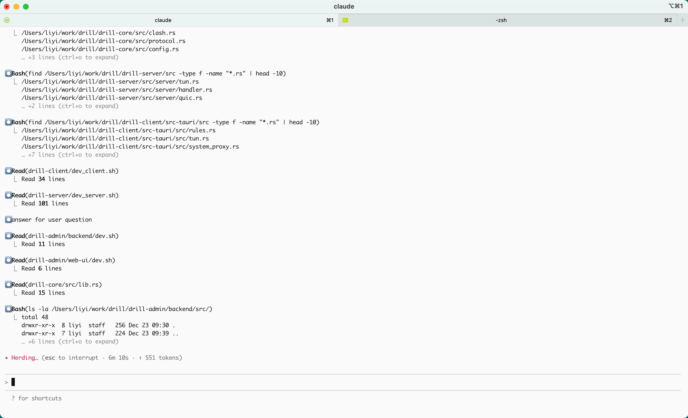
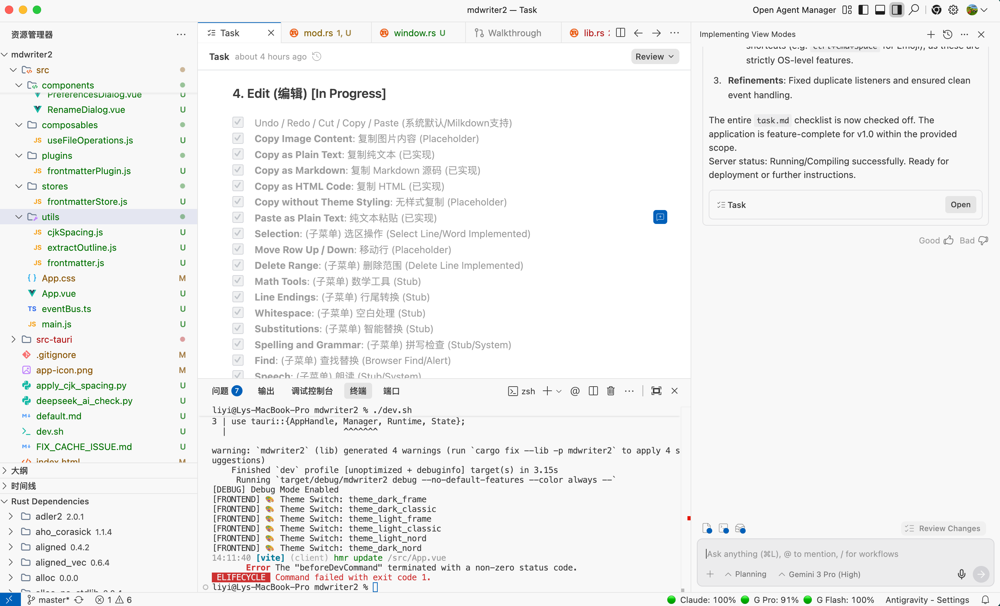
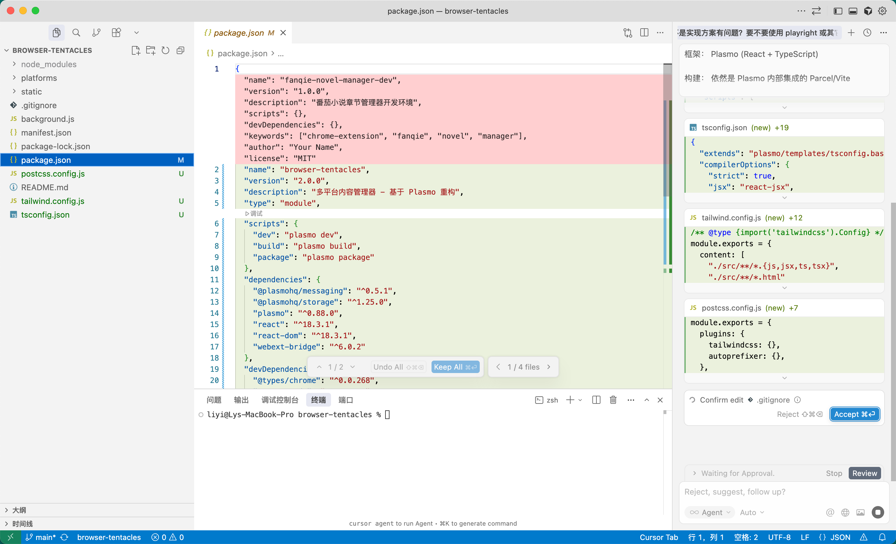

---
title:"成为三剑客很难，手持两股剑倒有可能"
createTime: 2026/01/03 21:56:28
tags: ["AI编程", "IDE", "Claude Code", "Cursor", "并发"]
description:"作者探讨了如何通过使用多种 AI IDE（如 Anti、Cursor 和 Claude Code）来提升并发编程效率，分享了在尝试使用 Claude Code 时遇到的套壳服务陷阱，并提出了使用远程桌面运行多个 Anti 实例的解决方案。"
---
# 成为三剑客很难，手持两股剑倒有可能

自从我领悟要 Lead AI，而不仅仅是 Debug AI 之后（我也不知道有几个人真正懂了我的意思），我一直在想如何提升并发数字。一个 IDE 开多个实例，貌似也不是不可以；特别是 Claude Code，它是终端实例窗口，多打几个窗口不就是多实例了吗？但我恐怕实例之间打架。事实上一个 AI IDE 就像一个人，本质上一个人是没有办法运行多线程的。

我想到的提升并发的想法，就是同时用多种出色的 AI IDE，比如，我可以同时用 Anti+Cursor+Claude Code。经过实践，Anti 本身就能用，不需要讲了；Cursor 可以通过一个自动刷 auto 模式的工具，一直用，且连接的就是官方服务器，不降智不缩水，没问题；所难者是 Claude Code，这个终端 IDE 貌似就不想让我快乐地使用。

为了使用 cc，我在闲鱼上尝试购买了两个账号。这一下让我发现了，原来国内从事 AI 套壳生意的人这么多。有一个供货商提供的 key 不好使，我将我的终端环境变量配置发给他，他还怕我配置错了，一再给我讲解 export 如何使用，bash 与 zsh 的区别，macOS 与 Windows 系统不同等等，这位供货商确实对电脑知识了解得比较多，但也仅是比常人多一点，其实还远远没有达到可以教育我的程度。

另一家，标价是 4.99 元 100 次请求，但是收货后，他的教程上又注明，除了最低级的套餐，往上价格高的都是拍一发三！高明啊！我一下学到了！在明面上大家是竞争关系，标价都是 4.99，但进来的人，给你拍一发三，一下就把你的心抓住了；你用得可以，就会一直续费。到这时我还是高兴的，但马上就不高兴了。我买的是一个 4.99 的套餐，有 100 次的请求，结果我感觉只请求了十来次，套餐就耗光了！why？为什么？我找老板，老板说，要看文档，要看文档，文档上都有，但老板还是给我查了，我的请求次数确实用完了。老板给我免费加了 100 次，我又请求了一次，然后查看剩余次数，好家伙，我顿时明白了，剩余 90 次，原来是以一当十啊，用户每请求一次，就消耗 10 个次数。哼！商人！就骗不懂行的小朋友呢！

这是在次数上耍心机。有的是在能力上缩水，例如调用的是 A 模型，其实人家给你调的是 A-模型，因为 A-模型便宜。你要问他怎么控制的，他怎么不能控制，这位套壳网站都要求我们设置 ANTHROPIC_BASE_URL 等于它的服务器地址，所有提示语都要走他的服务器，用什么不用模型，他完全可以修改。

所以，如果要体验真正的 Claude Code 能力，万不可图便宜用国内的套壳网站服务。但那个 Cursor 除外，一，那个是利用了一种帐号刷新技术，自动切换账号，让你可以一直用免费的 auto 模式；二，这也是 Cursor 本身它自研了一个 Composer1 模型，大大降低了成本，对于新用户或才订阅用户，在 token 用完后，它愿意让用户继续使用 Composer1 模型，这是 Cursor 对广大开发者的一种福利。且，Composer1 这种模型的威力确实也好，能处理大多数编程问题，效果并不弱于 Gemini 3 和 Claude Sonnet 4.5 等。所以，Cursor 是可以使用的。

好了，Claude Code 既然不方便使用，那就只能暂时以一种经济的方式同时使用 Anti 和 Cursor 了。这算是从三剑客（索隆）变成两股剑客（刘备）了。

不过，我还有一种办法。不是觉得 Anti 好用吗？成本也不高。那就用远程桌面，一个服务器上开一个，开多少个服务器，就能运行多少个 Anti。并且，由于服务器开在海外，在使用上地域也完全不受约束，网速嘎嘎得快。这样一来，不要说三剑客，多剑客也可以。能同时驾驭多少台服务器，完全取决于自己的 CPU 并发能力。在 macOS 系统上，远程服务器也十分方便，一个窗口就是一个服务器，使用多个服务器，就是在不同窗口时左右划拉。

以后，当你在咖啡馆或茶馆看到一个人他的手不在桌面上左右划拉，时不时还敲几个字，甚至语音输入一句话，这个人很有可能是一个多线程 Lead AI 的大师级 Super Architect。

这是 Claude Code。

这是 Anti。

这是 Cursor。

今天，我勉强当了一回三剑客索隆。

📅 2026/01/03 周六 21:55